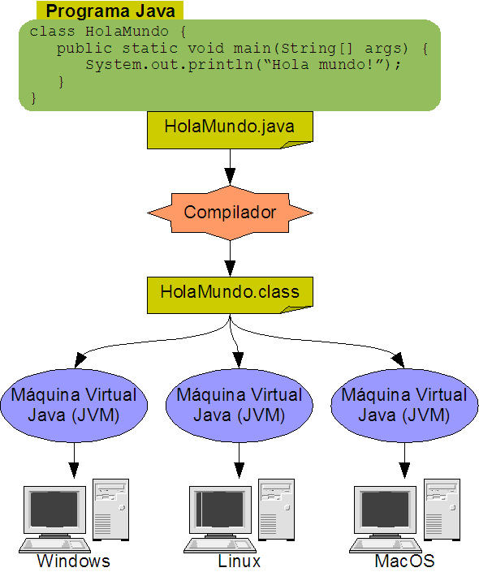

# UNIDAD 1.  ELEMENTOS DE UN PROGRAMA INFORMÁTICO

## INDICE

- [UNIDAD 1.  ELEMENTOS DE UN PROGRAMA INFORMÁTICO](#unidad-1--elementos-de-un-programa-informático)
  - [INDICE](#indice)
  - [INTRODUCCIÓN](#introducción)
  - [LENGUAJE JAVA Y ENTORNO DE DESARROLLO](#lenguaje-java-y-entorno-de-desarrollo)
    - [Ejecución de programas en Java](#ejecución-de-programas-en-java)
      - [JRE y JDK.](#jre-y-jdk)
      - [Entorno de desarrollo](#entorno-de-desarrollo)
  - [TAREA PARA REALIZAR EN CASA](#tarea-para-realizar-en-casa)
  - [PROGRAMACIÓN EN JAVA](#programación-en-java)
    - [Nuestro primer programa](#nuestro-primer-programa)
    - [Paquetes en Java](#paquetes-en-java)
    - [Variables en Java](#variables-en-java)
    - [Tipos de datos](#tipos-de-datos)
      - [Tipos de datos: Enteros](#tipos-de-datos-enteros)
      - [Tipos de datos: Números en coma flotante](#tipos-de-datos-números-en-coma-flotante)
      - [Tipos de datos: booleanos](#tipos-de-datos-booleanos)
      - [Tipos de datos: caracteres](#tipos-de-datos-caracteres)
      - [Conversión entre tipos (casting)](#conversión-entre-tipos-casting)
      - [Ámbito de las variables](#ámbito-de-las-variables)
    - [Operadores](#operadores)
      - [Aritméticos](#aritméticos)
      - [Incrementales o unarios](#incrementales-o-unarios)
      - [Relacionales](#relacionales)
      - [Lógicos](#lógicos)
      - [De asignación](#de-asignación)
      - [Ternario](#ternario)
    - [Constantes](#constantes)
    - [Expresiones](#expresiones)
    - [Escritura por pantalla](#escritura-por-pantalla)
      - [Orden printf](#orden-printf)
    - [Lectura por teclado](#lectura-por-teclado)
    - [Tipos enumerados](#tipos-enumerados)
  - [HOJAS DE EJERCICIOS](#hojas-de-ejercicios)

## INTRODUCCIÓN

¿Qué es un **programar**?

Programar es hacer programas. Obvio, ¿verdad? por supuesto.

La siguiente pregunta sería entonces: ¿Que es un programa?

Un **programa** es una secuencia de instrucciones escritas para realizar una tarea específica con un ordenador.

Se plantea un problema, se idea una solución, se traduce a un lenguaje de programación y el ordenador lo ejecuta.

**Algoritmo** es un esquema para resolver cierto tipo de problema. Un algoritmo son los pasos que hay que dar para resolver un problema.
Un algoritmo se puede traducir en un programa para que el ordenador pueda entenderlo y ejecutarlo.

Un algoritmo está compuesto de:

* Entrada: datos del problema a resolver
* Salida: el resultado de la resolución
* Proceso: pasos a seguir para la resolución

Y un algoritmo se caracteriza porque ha de ser:

* Preciso: orden estricto + expresiones precisas 
* Definido: con la misma entrada, siempre resulta la misma salida
* Finito: número finito de pasos

Pasos para la resolución de un problema con ordenador:

* Diseño de un algoritmo
* Codificación de un programa
* Ejecución y validación

Será más fácil si lo vemos con un ejemplo:

Imagínate que el problema que se plantea es que tenemos que sumar dos números para averiguar el resultado. En primer lugar tenemos como datos de entrada los dos números concretos que queremos sumar, el proceso será realizar la suma de ambos números y la salida será mostrar el resultado de dicha suma.

Resumido en un esquema sería así:

- Problema: Sumar dos números
- Solución: 
    - Entrada: dos números
    - Salida: guardar la suma en la memoria y imprimirla por pantalla
    - Proceso: 
        - Pedir los dos números 
        - Calcular la suma y guardar el resultado en la memoria
        - Imprimir el resultado por pantalla

## LENGUAJE JAVA Y ENTORNO DE DESARROLLO

El lenguaje que vamos a utilizar es Java. Java es un lenguaje de programación que se desarrolló para satisfacer las nuevas necesidades que requería la creación de aplicaciones a principios de los 90. 


El lenguaje en sí mismo toma mucha de su sintaxis de C y C++, pero tiene un modelo de objetos más simple y elimina herramientas de bajo nivel, que suelen inducir a muchos errores.


Se buscaban principalmente dos cosas:

* Fácil de aprender:
    * Simple
    * Similitud de sintaxis con C y C++ pero más sencillo al eliminar características como punteros.
* Trabajar de forma eficiente
    * Orientado a objetos
    * Robusto y seguro
    * Arquitectura portable: gracias a la máquina virtual de Java
    * Multitarea

### Ejecución de programas en Java

#### JRE y JDK.



Para poder ejecutar un programa Java es necesario tener instalado en el equipo una máquina virtual Java. Se trata de un programa que traduce las instrucciones compiladas del programa Java al lenguaje máquina que corresponda, según la plataforma bajo la que se ejecute el programa. 

Sun proporciona de forma gratuita una máquina virtual Java con el nombre Java Runtime Environment (JRE) que puede descargarse desde la web de Java, buscando la versión correspondiente al sistema operativo sobre el que se desea ejecutar el programa.

Os dejo un enlace por si queréis consultar un poco de la historia de Java y consultar las versiones.

[Enlace a la wikipedia](https://es.wikipedia.org/wiki/Java_(lenguaje_de_programación))

Tenemos que distinguir entre el JRE de Java y el JDK de Java. Para ello vamos a echar un vistazo al siguiente enlace:

[Enlace a la página de Java](https://www.java.com/es/download/help/techinfo_es.html)

Una vez que nos ha quedado clara la diferencia entre JRE y JDK, vamos a instalar el JDK, que ya incluye el JRE. La versión que tendríamos que instalar es el último JDK LTS, es decir, la versión que Oracle asegura que va a tener soporte durante más tiempo. Para ello tenemos que ir a la siguiente página, descargar el archivo elegido, e instalarlo en nuestro equipo.

Muestra las últimas versiones
[Enlace a la página de Oracle](https://www.oracle.com/java/technologies/downloads/)

En nuestro caso vamos a instalar el JDK 18.
[Enlace a la página de Oracle](https://www.oracle.com/java/technologies/javase/jdk18-archive-downloads.html)

#### Entorno de desarrollo

Para que un programador pueda llevar a cabo su tarea, dispone de herramientas para llevar a cabo su tarea. Lo más básico es tener un editor de texto donde escribir las instrucciones y un compilador que transforme el fichero de texto, con las sentencias de Java, en un fichero escrito en un lenguaje especial, capaz de ser interpretado por la Máquina Virtual de Java (JVM).

También hay entornos de programación más sofisticados que proporcionan una enorme cantidad de funciones: editor de texto, ayuda, compilador, depurador y, en general, casi cualquier cosa que se nos pueda ocurrir. Estos entornos se conocen como IDE, las siglas en inglés de "entorno integrado de desarrollo".
Tenemos varios entornos disponibles, algunos de código abierto y gratuitos. Un ejemplo puede ser NetBeans, o Eclipse. En este curso vamos a utilizar Netbeans 13 y la página de descarga es la siguiente:

[Enlace a la página de Netbeans](https://netbeans.apache.org/download/)

## TAREA PARA REALIZAR EN CASA
Debéis instalar el JDK que estamos utilizando en clase, y el Netbeans en el equipo de casa. Tendréis que hacer capturas de pantalla donde se vea la fecha y hora para comprobar que la instalación está hecha, del estilo a estos dos recortes:


## PROGRAMACIÓN EN JAVA

El código Java se escribe en documentos de texto con extensión .java. Al ser multiplataforma se pueden utilizar sin problema símbolos como la eñe o las vocales con tilde a la hora de poner nombre a las variables, aunque yo no os lo recomiendo.
Consideraciones previas a tener en cuenta al escribir nuestros programas:
* Hay diferencia entre mayúsculas y minúsculas
* Cada línea debe terminar con ;
* Una instrucción puede abarcar más de una línea
* Los comentarios de una línea deben comenzar con // y si ocupan más de una línea deben comenzar con /* y terminar con */
```java
/* Comentario
de varias líneas */
//Comentario de una línea
```
* A veces se marcan bloques de código, es decir, código agrupado. Cada bloque comienza con { y terminar con }
```
{
	...código dentro del bloque
}
código fuera del bloque
```
### Nuestro primer programa

Los pasos a realizar son:

1. Abrir el entorno NetBeans
2. Selección la opción crear un proyecto nuevo, elegir la categoria "Java with Maven" y proyecto "Java Aplication"

3. una vez seleccionado daremos nombre al proyecto,asignaremos un directorio donde estará el código que generemos 

4. el código generado es:
```java
public class PrimerPrograma
{
     public static void main(String[] args)
     {
          System.out.println(“¡Mi primer programa!”);
     }
}
```

La primera línea *public class PrimerPrograma* declara el nombre de la clase del código. Más adelante se explicará que significa el concepto de clase por ahora entenderemos que el nombre de la clase es el nombre del programa.

La línea *public static void main String args* sirve para indicar el inicio del método main. Este método contiene las instrucciones que se ejecutarán cuando el programa arranque.

La instrucción *System out println* sirve para escribir en pantalla. Como lo que escribimos es un texto, se encierra entre comillas.

Además, el archivo debería llamarse PrimerPrograma.java. Es recomendable que el nombre del programa (en realidad el nombre de la clase) y el del archivo coincidan.

También es aconsejable que el nombre del programa comience con una letra mayúscula y le sigan letras en minúsculas. Si consta de varias palabras no pueden utilizarse espacios en blanco.

### Paquetes en Java

En cualquier lenguaje de programación existen librerías que contienen código ya escrito que nos facilita la creación de programas. En el caso de Java no se llaman librerías, sino paquetes. Los paquetes son una especie de carpetas que contienen clases ya preparadas y más paquetes.

Para programar en Java se necesita instalar el kit de desarrollo de Java (la JDK). Este contiene los programas necesarios para compilar y ejecutar código Java. Pero además se incluyen miles de clases dentro de cientos de paquetes ya listos que facilitan la generación de programas.

Algunos paquetes sirven para utilizar funciones matemáticas, funciones de lectura y escritura, comunicación en red, programación de gráficos...

Por ejemplo la clase *System* está dentro del paquete *java.lang* (paquete básico) y posee el método *out.println* que necesitamos para escribir fácilmente por pantalla.

La sintaxis de esta instrucción es *import paquete.subpaquete.subsubapquete.clase*. Esta instrucción se coloca arriba del todo en el código.

### Variables en Java

Las variables son contenedores que sirven para almacenar los datos que utiliza un programa.  Ocupan un espacio en la memoria RAM del ordenador para almacenar el dato al que se refiere. Cuando utilizamos el nombre de la variable estamos haciendo referencia a un dato que está en memoria.
Las variables tienen un nombre (un identificador) que sólo puede contener letras, números (pero no puede empezar el nombre con un número) y el carácter de subrayado. 

**Declaración:** Antes de poder utilizarla es necesario declararla:
```
tipo nombreVariable;
```
Donde tipo es el tipo de datos que almacenará la variable (texto, números enteros,...) y nombreVariable es el nombre con el que se conocerá la variable. 
Ejemplos:
```java
int días; // días es un número entero, sin decimales
boolean decisión; //decisión sólo puede ser verdadera o falsa
```
También se puede hacer que la variable tome un valor inicial al declarar:
```java
int días=365;
```
Y se puede declarar más de una variable a la vez del mismo tipo en la misma línea si las separamos con comas:
```java
int días=365, año=23, semanas;
```
Al declarar una variable se puede incluso utilizar una expresión:
```java
int a=13, b=18;
int c=a+b; //es válido, c vale 31
```
Java es un lenguaje muy estricto al utilizar tipos de datos. Es un lenguaje fuertemente tipado: cada variable debe tener un tipo declarado.

**Asignación:** Una vez que tenemos la variable declarada, hay que darla un valor. Para ello se utiliza el símbolo =.
```java
int x = 7;
```
Pero la asignación se puede utilizar en cualquier momento (tras haber declarado la variable):
```java
int x;
x=7;
x=x*2;
```
En Java siempre se asigna una valor inicial a las variables en cuanto se declaran. En el caso de los números es el cero.
```java
int x; //x ya vale cero
```
### Tipos de datos

Como ya hemos visto, para declarar una variable hay que indicar de que tipo será la información que esa variable va a guardar. Cuando indicamos el tipo de dato de una variable indicamos que tipo de dato puede guardar, y cuanta memoria se reserva para esa variable. Cuanta mayor sea la memoria interna que utiliza, mayor es el rango de posibles valores.

En Java tenemos 8 tipos de datos primitivos:

- 4 tipos para enteros: byte, short, int, long.
- 2 tipos para coma flotante: float, double.
- 1 tipo para booleanos: boolean.
- 1 tipo para carácter: char.

| Tipo | Tamaño | Rango |
| ------------- | ------------- | ------------- |
| byte  | 8  | -128 a 127 |
| short  | 16  | -32.768 a 32.767 |
| int  | 32  | -2.147.483.648 a 2.147.483.647 |
| long  | 64  | -9.223.372.036.854.775.808 a 9.223.372.036.854.775.8087 |
| float  | 32  | +/- 3.4E+38F (6-7 dígitos importantes) |
| double  | 64  | +/- 1.8E+308 (15 dígitos importantes) |
| boolean  | 16  | conjunto de caracteres UNICODE ISO |
| char  | 8 | True o False |

En este momento estamos en condiciones de hacer nuestro primer ejercicio en Java. Haremos el ejercicio 1 y el ejercicio 2 apartados a. y b. de la siguiente hoja de ejercicios:

:computer: Hoja de ejercicios 1

#### Tipos de datos: Enteros

Los tipos byte, short, int y long sirven para almacenar datos enteros. Los enteros son números sin decimales. 

Los números enteros se escriben tal cual, salvo si es de tipo long, que debemos poner al final la letra L mayúscula.

No se acepta en general asignar variables de distinto tipo. Sí se pueden asignar valores de variables enteras a variables enteras de un tipo superior (por ejemplo asignar un valor int a una variable long). Pero al revés no se puede:
```java
int i=12;
byte b=i; //error de compilación, posible pérdida de precisión
```
La solución es hacer un cast. Esta operación permite convertir valores de un tipo a otro. Se usa así:
```java
int i=12;
byte b=(byte) i; //El (cast) evita el error
```java
Hay que tener en cuenta en estos castings que si el valor asignado sobrepasa el rango del elemento, el valor convertido no tendrá ningún sentido ya que no puede almacenar todos los bits necesarios para representar ese número:
```java
int i=1200;
byte b=(byte) i; //El valor de b no tiene sentido
```

#### Tipos de datos: Números en coma flotante

Los decimales se almacenan en los tipos float y double. Los decimales no son almacenados de forma exacta, por eso siempre hay un posible error en la representación. Es más preciso el double que el float puesto que utiliza más bytes para representar un número. El separador decimal que tenemos que utilizar es el punto y no la coma.
```java
x=2.75;
```
A un valor se le puede añadir al final una f indicando que es un float. Se añade una d en caso de querer un double. En caso de no añadir nada se entiende que es un double.
Lógicamente no se pueden asignar valores decimales a tipos de datos enteros:
```java
int a = 7.5; //error
```
Si podríamos mediante un cast:
```java
int a = (int) 7.5;
```
Pero se perderían los decimales. En el caso anterior a valdría 7
El caso contrario sí se podría hacer:
```java
int x = 9;
double y = x; //correcto
```
Al declarar números (sean del tipo que sean), si no se indican valores iniciales, Java asigna el valor cero.

#### Tipos de datos: booleanos

Sirven para indicar si algo es verdadero (true) o falso (false). 
```java
boolean b = false;
```
Si al declarar un valor booleano no se le da valor inicial, se toma como valor inicial false.

#### Tipos de datos: caracteres

Los valores de tipo carácter sirven para almacenar símbolos de escritura.
```java
char letra;
letra=’C’; //Los caracteres van entre comillas
letra=67; //El código Unicode de la C es el 67. Esta línea hace lo mismo que la anterior
```
También hay una serie de caracteres especiales que van precedidos por el símbolo \, son estos:

| Caracter | Significado |
| ------------- | ------------- |
| \b  | Retroceso  |
| \t  | Tabulador  |
| \n  | Nueva linea  |
| \r  | Retorno de carro  |
| \"  | Dobles comillas  |
| \'  | Comillas simples  |
| \\  | Barra inclinada  |

#### Conversión entre tipos (casting)

Ya se ha comentado la necesidad de uso del operador de casting para poder realizar asignaciones entre tipos distintos. Como resumen véanse estos ejemplos:
```java
int a; 
byte b=12;  
a=b;
```
El código anterior es correcto porque un dato byte es más pequeño que uno int y Java le convertirá de forma implícita. Lo mismo pasa de int a double por ejemplo. Sin embargo en:
```java
int a=1; 
byte b; 
b=a; //error
```
El compilador devolverá error aunque el número 1 sea válido para un dato byte. Para ello hay que hacer un casting. Eso significa poner el tipo deseado entre paréntesis delante de la expresión.
```java
int a=1; 
byte b;
b= (byte) a; //correcto
```
En el siguiente ejemplo:
```java
byte n1=100, n2=100, n3;
n3= n1 * n2 /100; //error
```
Aunque el resultado es 100, y ese resultado es válido para un tipo byte; lo que ocurrirá en realidad es un error. La multiplicación 100\*100 da como resultado 10000, es decir un número de tipo int. Aunque luego se divide entre 100, no se vuelve a convertir a byte; ya que ante cualquier operación el tipo resultante siempre se corresponde con el tipo más grande que intervenga en la operación. Lo correcto sería:
```java
n3 = (byte) (n1 * n2 / 100);
```
#### Ámbito de las variables

Toda variable tiene un ámbito. Esto es la parte del código en la que una variable se puede utilizar. De hecho las variables tienen un ciclo de vida:
1. En la declaración se reserva el espacio necesario para que se puedan comenzar a utilizar
2. Se la asigna su primer valor
3. Se la utiliza en diversas sentencias
4. Cuando finaliza el bloque en el que fue declarada, la variable muere. Es decir, se libera el espacio que ocupa esa variable en memoria. No se la podrá volver a utilizar.
Una vez que la variable ha sido eliminada, no se puede utilizar. Dicho de otro modo, no se puede utilizar una variable más allá del bloque en el que ha sido definida. Ejemplo:
```java
{
	int x=9;
}
int y=x; //error, ya no existe x
```

### Operadores

Los datos se manipulan muchas veces utilizando operaciones con ellos. 
Tenemos los siguientes tipos:
- Aritméticos
- Incrementales
- Relacionales
- Lógicos
- De asignación
- Ternario

#### Aritméticos

| Operador | Descripción |
| ------------- | ------------- |
| +  | Suma dos operandos  |
| -  | Resta dos operandos  |
| *  | Multiplica dos operandos  |
| /  | Divide dos operandos  |
| %  | Calcula el resto de dividir el operador1 entre el operador2   |


**Realiza los siguientes ejercicios:**

1. Definir una variable para guardar la edad y mostrar la que tendrá el próximo año.
2. Escribir una aplicación que pide el año actual y el de nacimiento del usuario. Debe calcular su edad, suponiendo que en el año en curso el usuario ya ha cumplido años.
3. El tipo short permite almacenar valores comprendidos entre -32768 y 32767. Escribir un programa que compruebe el rango de valores de un tipo se comporta de forma cíclica, es decir, el valor siguiente al máximo es el valor mínimo.
4. Crear una aplicación que calcule la media aritmética de dos notas enteras. Hay que tener en cuenta que la media puede contener decimales.

#### Incrementales o unarios

| Operador | Uso | Descripción |
| ------------- | ------------- | ------------- |
| ++  | x++  | Incrementa x en 1. Evalúa antes.  |
| ++  | ++x  | Incrementa x en 1. Evalúa después. |
| --  | x--  | Decrementa x en 1. Evalúa antes. |
| --  | --x  | Decrementa x en 1. Evalúa después |

```java
int x = 5, y = 5; 
System.out.println(++x); // imprime 6 
System.out.println(x); // imprime 6 
System.out.println(y++); // imprime 5 
System.out.println(y); // imprime 6
```

#### Relacionales

| Operador | Uso | Devuelve verdadero |
| ------------- | ------------- | ------------- |
| >  | x>y  | x es mayor que y  |
| >=  | x>=y  | x es mayor o igual que y |
| <  | x<y  | x es menor que y |
| <=  | x<=y | x es menor o igual que y |
| == | x==y  | x es igual a y |
| !=  | x!=y  | x es distinto de y |

**Realiza los siguientes ejercicios:**

1. Realizar una aplicación que solicite al usuario su edad y le indique si es mayor de edad (mediante un booleano: true o false).
2. Escribir un programa que pida un número al usuario e indique mediante un literal booleano si el número es par.

#### Lógicos

| Operador | Uso | Devuelve verdadero |
| ------------- | ------------- | ------------- |
| &&(and)  | condicion1&&condicion2  | condicion1 y condicion2 verdaderas  |
| \|\|(or)  | condicion1\|\|condicion2  | condicion1 o condicion2 verdaderas |
| !(not)  | !condicion  | condicion falsa |

**Realiza el siguiente ejercicio:**

1. Diseña un algoritmo que nos indique si podemos salir a la calle. Existen aspectos que influirán en esta decisión: si está lloviendo y si hemos terminado nuestras tareas. Solo podremos salir a la calle si no está lloviendo y hemos finalizado nuestras tareas. Existe una opción en la que, indistintamente de lo anterior, podremos salir a la calle: el hecho de que tengamos que ir a la biblioteca. Solicitar al usuario mediante booleano si llueve, si ha finalizado las tareas y si necesita ir a la biblioteca. El algoritmo debe mostrar mediante booleano si es posible que se le otorgue el permiso de salir a la calle.


#### De asignación

| Operador | Uso | Descripción |
| ------------- | ------------- | ------------- |
| =  | x=y  | Asigna a x el valor de y  |
| +=  | x+=valor  | Equivalente a x=x+valor |
| -=  | x-=valor  | Equivalente a x=x-valor |
| \*=  | x\*=valor | Equivalente a x=x\*valor |
| /= | x/=valor  | Equivalente a x=x/valor |

**Realiza el siguiente ejercicio:**

1. Un frutero necesita calcular los beneficios anuales que obtiene de la venta de manzanas y peras. Por este motivo, es necesario diseñar una aplicación que solicite las ventas (en kilos) de cada semestre para cadea fruta. La aplicación mostrará el importe total sabiendo que el precio del kilo de manzanas está fijado a 2.35€ y el kilo de peras en 1,95€.

#### Ternario

Este operador devuelve un valor que se selecciona de dos posibles. La selección dependerá de la evaluación de uan expresión relacional o lógica que, como hemos visto, puede tomar dos valores: verdadero o falso.

El operador tiene la siguiente sintáxis:
```
expresioncondicional ? valor1 : valor2
```

La evaluación de la expresión decidirá cuál de los dos posibles valores se devuelve. En el caso de que la expresión resulte cierta, se devuelve valor1, y cuando la expresión resulte false, valor2.

Ejemplo:

```java
int a,b;
a=3<5 ? 1 : -1; //3<5 es cierto: así que a toma el valor 1.
b= a == 7 ?10:20; // a (que vale 1) == 7 es falso, así que b toma el valor 20
```
**Realiza el siguiente ejercicio:**

1. Escribir un programa que pida un número al usuario y muestre su valor absoluto.

### Constantes

Una constante es una variable de sólo lectura. Dicho de otro modo más correcto, es un valor que no puede variar (por lo tanto no es una variable).

La forma de declarar constantes es la misma que la de crear variables, sólo que hay que anteponer la palabra final que es la que indica que estamos declarando una constante y por tanto no podremos variar su valor inicial:
```java
final double PI=3.141591;
PI=4; //Error, no podemos cambiar el valor de PI
```
Como medida aconsejable, los nombres de las constantes deberían ir en mayúsculas.

### Expresiones

Un expresión puede contener constantes, variables y operadores para formar una instrucción sintácticamente correcta. Por el hecho de poder emplear varios operadores en la misma expresión nos encontramos con la necesidad de conocer el orden de evaluación de los operadores: 
- Prioridades de evaluación:
  - Paréntesis
  - Operadores unarios
  - Operadores aritméticos (\*,/,%,+,-)
  - Operadores relacionales
  - Operadores lógicos
  - Operadores de asignación

### Escritura por pantalla

Instrucciones que podemos utilizar para escribir por pantalla:
- System.out.println (System es el paquete donde se encuentra el método out.println que es el presenta información en pantalla. Al acabar de escribir introduce un salto de línea)
- System.out.print (System es el paquete donde se encuentra el método out.print que presenta información en pantalla. Al contrario que el método anterior, no realiza un salto de línea al acabar de escribir)
- System.out.printf (System es el paquete donde se encuentra el método out.printf que presenta información en pantalla con un determinado formato)
Ejemplos:
```java
System.out.println("Hola, mi primer programa");
System.out.println("\”Hola, mi primer programa\”");
System.out.println("Hola, mi primer programa, está en c:\\");
System.out.print("Hola, mi primer programa\n");
```

#### Orden printf

La orden printf() utiliza unos códigos de conversión para indicar de qué tipo es el contenido a mostrar. Estos códigos se caracterizan porque llevan delante el símbolo %. Algunos de ellos son:
- %c: Escribe un carácter
- %s: Escribe una cadena de texto.
- %d: Escribe un entero.
- %f: Escribe un número en punto flotante.
- %e: Escribe un número en punto flotante en notación científica.
Por ejemplo, si queremos escribir el número float 12345.1684 con el punto de los miles y sólo dos cifras decimales la orden sería:
```java
System.out.printf("% ,.2f\n", 12345.1684);
```
Esta orden mostraría el número 12.345,17 por pantalla.

### Lectura por teclado

La lectura de teclado, es más complicada que la escritura. Se puede hacer de tres formas distintas:
1. Visualizando una caja por pantalla: 

- Hay que incluir el paquete javax.swing y utilizar la clase JOptionPane:
```java
import javax.swing.JOptionPane;
```
Esta clase está pensada para manejar cuadros de diálogo. Uno de estos cuadros permite introducir datos y almacenarlos en una variable. Los datos que devuelve el diálogo, son de tipo String, por lo que habrá que recogerlos en una variable String y luego convertirlos al tipo de dato deseado.
```java
String texto; //variable para almacenar los datos recogidos por la caja de texto
int num;
texto =JOptionPane.showInputDialog(“Escriba un numero”);
num = Integer.parseInt(texto);
```
Para convertir el dato recogido por teclado al tipo de dato que nosotros deseamos, usaremos una de las siguientes funciones:
- Integer.parseInt convierte a int
- Short.parseShort convierte a short
- Byte.parseByte convierte a byte
- Long.parseLong convierte a long
- Float.parseFloat convierte a float
- Double.parseDouble convierte a double
- Boolean.parseBoolean convierte a boolean

2. Usando la clase System:

Con esta opción, se va a capturar el contenido de System.in, mediante el uso de dos clases que se encuentran dentro del paquete java.io (import java.io.\*). Estas dos clases son:
- InputStreamReader: Captura los bytes del buffer (System.in) y los convierte a caracteres.
- BufferedReader: Clase que proporciona un método que permite leer hasta el final de la línea.
Código ejemplo:
```java
InputStreamReader isr = new InputStreamReader(System.in);
BufferedReader br = new BufferedReader(isr);
System.out.print("Introduce el texto: ");
String cad = br.readLine();
```
En este caso, también habrá que hacer una conversión del tipo de dato String al tipo de dato que se desee:
```java
int num = Integer.parseInt(cad));
```

3. Usando la clase Scanner: 

Java a partir de la versión 1.5, incorpora una nueva clase Scanner (import java.util.Scanner), la cual permite leer tipo de datos (int, float, String, etc.), a través de la consola de la aplicación. A continuación, se presenta un ejemplo de su utilización:
```java
// Creamos objeto teclado
Scanner teclado = new Scanner(System.in);
// Declaramos variables a utilizar
String nombre;
int edad;
boolean estudias;
float salario;
// Entrada de datos
System.out.println("Nombre: ");
nombre=teclado.nextLine();
System.out.println("Edad: ");
edad=teclado.nextInt();
System.out.println("Estudias: ");
estudias=teclado.nextBoolean();
System.out.println("Salario: ");
salario=teclado.nextFloat();
```

### Tipos enumerados

Los tipos de datos enumerados son una forma de declarar una variable con un conjunto restringido de valores. Por ejemplo, los días de la semana, las estaciones del año, los meses, etc. Es como si definiéramos nuestro propio tipo de datos.
Ejemplo: En una aplicación para venta de café en vasos de diferentes tamaños. Queremos que los tamaños sean algunos de los siguientes: PEQUEÑO, MEDIANO o GRANDE.
La forma de declararlos es con la palabra reservada enum, seguida del nombre de la variable y la lista de valores que puede tomar entre llaves. A los valores que se colocan dentro de las llaves se les considera como constantes, van separados por comas y deben ser valores únicos.
Definición: public enum <nomb_enum> {<lista_valores que toma>};
Ejemplo: 

```java
enum TamanoDeCafe{PEQUEÑO,MEDIANO,GRANDE};
```
Para utilizarla, únicamente hará falta definir una variable del tipo de enumerado definido.
Llamada: <nomb_enum> <nomb_variable_enum>;
Ejemplo: 

```java
TamanoDeCafe tdc;
```
Una vez definida una variable del tipo de enumerado, se le podrá da a esta uno de los valores expecificados.
Utilización: <nomb_variable_enum> = <nomb_enum>.<valor>
Ejemplo: Posteriormente, al elegir un tamaño de café podemos hacerlo de la siguiente manera:
```java
tdc = TamanoDeCafe.MEDIANO;
```

## HOJAS DE EJERCICIOS

:computer: Hoja de ejercicios 1
	
:computer: Hoja de ejercicios 2

:computer: Hoja de ejercicios 3

