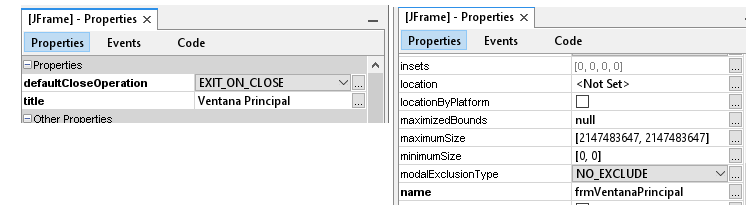
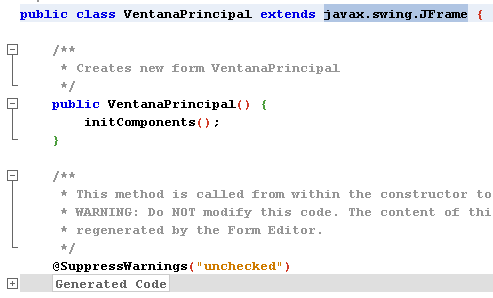
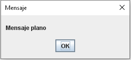

# Swing GUI Forms 
- [Swing GUI Forms](#swing-gui-forms)
  - [Que es Swing](#que-es-swing)
    - [Cómo funciona Swing](#cómo-funciona-swing)
      - [Jerarquía de clases](#jerarquía-de-clases)
  - [Ejemplo crear un proyecto Swing JFrame](#ejemplo-crear-un-proyecto-swing-jframe)
    - [Diseño (Design)](#diseño-design)
    - [Fuente (Source)](#fuente-source)
  - [Cuadros de diálogo](#cuadros-de-diálogo)
    - [JOptionPane](#joptionpane)
      - [JOptionPane.showMessageDialog](#joptionpaneshowmessagedialog)
      - [JOptionPane.showConfirmDialog](#joptionpaneshowconfirmdialog)
    - [JOptionPane.showOptionDialog](#joptionpaneshowoptiondialog)
    - [JOptionPane.InputDialog](#joptionpaneinputdialog)
  - [Componentes,  Eventos y controladores de eventos](#componentes--eventos-y-controladores-de-eventos)
    - [Métodos comunes de estilo](#métodos-comunes-de-estilo)
      - [posicionamiento y tamaño](#posicionamiento-y-tamaño)
      - [Habilitación](#habilitación)
      - [Texto](#texto)
      - [Otros](#otros)
    - [Clase javax.swing.JLabel](#clase-javaxswingjlabel)
    - [Clase javax.swing.JButton](#clase-javaxswingjbutton)
    - [Clase javax.swing.JTextField](#clase-javaxswingjtextfield)
    - [Clase javax.swing.JTextField](#clase-javaxswingjtextfield-1)
    - [Clase javax.swing.JPasswordField](#clase-javaxswingjpasswordfield)
    - [Clase javax.swing.JTextArea](#clase-javaxswingjtextarea)
    - [Clase javax.swing.JComboBox](#clase-javaxswingjcombobox)
  - [Trabajar con imágenes](#trabajar-con-imágenes)

## Que es Swing
La API Swing es un conjunto de componentes para la creación de entornos gráficos de usuarios.

### Cómo funciona Swing
Todos los componentes heredan de javax.swing.JComponent.
*	__JFrame__ será la base para la aplicación principal.
*	__JDialog__ construirá los diálogos (ventanas)
*	El resto de las clases, serán componentes simples.

#### Jerarquía de clases


## Ejemplo crear un proyecto Swing JFrame
Crear nuevo proyecto no cambia, elegimos la categoría “Java with Maven” y proyecto “Java Application” asignamos los datos de nombre al proyecto por ejemplo “primerEjemplo”, una ubicación donde creará el proyecto y un grupo por ejemplo “swing”.
La clase que crea por defecto con el método main debemos eliminarla porque ahora la gestión se realizará a través de swing.
Para crear nuestro primer objeto Swing vamos a la opción de crear fichero, elegimos la categoría “Swing GUIForms” 


En nuestro caso vamos a elegir el tipo __“JFrame Form”__ que es uno de los objetos a utilizar para dibujar una ventana, pero como veis existen otras opciones como por ejemplo Application Sample Form” y “MDI Aplication Sample Form” son ejemplos que nos permiten partir de código ya realizado.
Una vez seleccionado el tipo “JFrame Form”, vamos a dar un nombre a la Clase a crear en este caso por ejemplo “VentanaPrincipal”
Ahora vamos a tener dos pestañas en el documento .java

### Diseño (Design)
Una posible configuración de las ventanas de NetBeans es la primera ventana izquierda, en la opción del menú Windows ->Navigator, nos muestra todos los componentes.
En la parte Diseño, vemos los componentes dibujados y con botón derecho Properties, vemos todas las características que tiene el componente seleccionado en diseño.
A la derecha la paleta con todos los controles que podemos incorporar a nuestro diseño.


En JFrame, al menos debemos dar un título(title) y dar un nombre al componente (name).



### Fuente (Source)

Nos muestra que nos ha creado una clase que extiende de Javax.swing.JFrame
Y tiene un constructor que llama al método initComponents()
Ese método es generado automáticamente a medida que nosotros vamos incorporando características a los componentes, y si queremos verlo, damos al __+ de Generated Code__.



si desplegamos el más vemos el código generado


También observamos que tiene el método main, donde se invoca en este caso que llame a la ventana y la ponga visible


Si nos fijamos en la ventana de navegación y nos situamos en el JFrame también nos muestra los métodos que tiene


Si ejecutamos el programa nos muestra la ventana creada con el título dado y las características elegidas en la propiedad del componente, como tamaño, color de fondo, etc.


:computer: primer ejemplo

## Cuadros de diálogo

__Clases JDialog__ y __JOptionPane__: cuadros de diálogo que muestran información o del tipo de pedir confirmación.
*	JDialog es modal (no accedes al resto de ventanas)
*	JOptionPanel no es modal. Al cerrar la ventana principal, se cierra también este cuadro de diálogo

Existen Diálogos preestablecidos, los cuales pueden tener distinta finalidad:
* Informativos
* Elección
* Mensajes de Error 
* Mensajes de Advertencia
* Entrada de datos
* Etc.
A partir de aquí tenemos una serie de controles que podemos utilizar a continuación exponemos los más comunes:

### JOptionPane
Para crear diálogos preestablecidos esta la clase JOptionPane. Esta clase implementa métodos (static) de la forma showXXDialog, donde XX va a variar de acuerdo según el tipo de dialogo que se necesite.
*	Todos los diálogos son modales.
*	Se puede configurar mediante parámetros: titulo, icono, mensajes, etc.

#### JOptionPane.showMessageDialog
Este método permite mostrar ventanas de diálogo que muestran un mensaje y contienen un botón de aceptación. 

__showMessageDialog(ventana, “Mensaje”, “Titulo de ventana”, icono)__

Ejemplos:

```java
// mensaje plano
JOptionPane.showMessageDialog(null, "Mensaje plano", "Mensaje", JOptionPane.PLAIN_MESSAGE);
```

```java
// mensaje de error
JOptionPane.showMessageDialog(null, "Mensaje de error", "Error", JOptionPane.ERROR_MESSAGE);
```

```java
// mensaje informativo
JOptionPane.showMessageDialog(null, "Mensaje informativo", "Información", JOptionPane.INFORMATION_MESSAGE);
```

```java
// mensaje de atención o aviso
JOptionPane.showMessageDialog(null, "Mensaje de atención ", "Aviso", JOptionPane.WARNING_MESSAGE);
```


```java
// mensaje de pregunta
JOptionPane.showMessageDialog(null, "Mensaje de pregunta", "Pregunta", JOptionPane.QUESTION_MESSAGE);
```


#### JOptionPane.showConfirmDialog
Este método permite mostrar diálogos donde se puede elegir entre varias opciones (aceptar, cancelar, si, no).

__showConfirmDialog (ventana, “Mensaje”, “Titulo de ventana”, tipo de opción, icono)__

Ejemplos:

```java
// mensaje de confirmacion por defecto
JOptionPane.showConfirmDialog(null, "Aqui va el mensaje", "Ventana por defecto", JOptionPane.DEFAULT_OPTION, JOptionPane.INFORMATION_MESSAGE);
```


```java
 // mensaje de confirmacion SI_NO

int respuesta = JOptionPane.showConfirmDialog(null, "Aqui va el mensaje", "Ventana SI-NO", JOptionPane.YES_NO_OPTION, JOptionPane.QUESTION_MESSAGE);
String mensaje="";
if (respuesta == 0) {
    mensaje="ha contestado si";
} else {
   mensaje="ha respondido no";
}
JOptionPane.showMessageDialog(null, mensaje, "Respuesta", JOptionPane.PLAIN_MESSAGE);

```


```java
// mensaje de confirmacion SI_NO_Cancelar
int respuesta = JOptionPane.showConfirmDialog(null, "Aqui va el mensaje", "Ventana SI-NO-Cancelar", JOptionPane.YES_NO_CANCEL_OPTION, JOptionPane.QUESTION_MESSAGE);
String mensaje="";
switch (respuesta) {
    case 0 ->
        mensaje= "ha contestado si";
    case 1 ->
        mensaje= "ha respondido no";
    default ->
        mensaje="ha cancelado ";
}
JOptionPane.showMessageDialog(null, mensaje, "Respuesta", JOptionPane.PLAIN_MESSAGE);
```


```java
// mensaje de Aceptar -Cancelar
int respuesta = JOptionPane.showConfirmDialog(null, "Aqui va el mensaje", "Ventana Aceptar-Cancelar", JOptionPane.OK_CANCEL_OPTION, JOptionPane.QUESTION_MESSAGE);
String mensaje="";
if (respuesta == 0) {
    mensaje="ha contestado aceptar";
} else {
   mensaje="ha respondido cancelar";
}
JOptionPane.showMessageDialog(null, mensaje, "Respuesta", JOptionPane.PLAIN_MESSAGE);
```


### JOptionPane.showOptionDialog

Este método permite mostrar diálogos con los botones, iconos, texto, mensajes, titulo, etc. que se desee. Se puede cambiar el texto de los botones.  Retorna un int. 

__showOptionDialog (ventana, “Mensaje”, “Titulo de ventana”, tipo de opción, icono, icono especial, “titulo de botones”, boton inicial )__

Ejemplo

```java
//Para escoger entre botones
 Object[] options = {"Si, fundamental", "No, para nada", "Cancelar"};
int respuesta = JOptionPane.showOptionDialog(null, "¿Es importante unir programacion y creatividad?", "Pregunta",
                JOptionPane.YES_NO_CANCEL_OPTION,
                JOptionPane.QUESTION_MESSAGE,null, options, options[0]);
//Para mostrar informacion
String mensaje = switch (respuesta) {
    case 0 -> "tu si que sabes";
    case 1 -> "apaga y vamonos";
    default -> "no sabe, no contesta";
};
JOptionPane.showMessageDialog(null, mensaje, "Respuesta", JOptionPane.WARNING_MESSAGE);
```


### JOptionPane.InputDialog
Este método permite mostrar diálogos donde se puede ingresar datos o seleccionar opciones de un combo. Retorna un String, un objeto.

__showInputDialog (ventana, “Mensaje”,”titulo de ventana”, icono, icono especial, “valores”, valor inicial )__

Ejemplos:

```java
//Para introducir un string
 String contesta = JOptionPane.showInputDialog("Dime tu nombre: ");
JOptionPane.showMessageDialog(null, "Hola " + contesta);
```


```java
//Para elegir entre diferentes opciones
Object color = JOptionPane.showInputDialog(null, "Seleccione Un Color",
    "COLORES", JOptionPane.QUESTION_MESSAGE, null,
    new Object[]{"Seleccione", "Amarillo", "Azul", "Rojo"}, "Seleccione");
JOptionPane.showMessageDialog(null, color.toString());
```


:computer: segundo ejemplo

## Componentes,  Eventos y controladores de eventos
__Un componente__  es como un control que se puede representar visualmente y suele ser independiente. Tiene una funcionalidad específica y se representa como una clase individual en Swing API. Por ejemplo, la clase JButton en Swing API es un componente de botón y proporciona la funcionalidad de un botón.

__los eventos__ son la base de la interacción del usuario con la interfaz gráfica. Un evento se desencadena cuando el usuario interactúa con un componente, por ejemplo, al hacer clic en un botón o al escribir en un campo de texto.

Para definir un evento en Swing de Java, debes seguir los siguientes pasos:

1 Crear una clase oyente que implemente una interfaz de oyente de eventos.
2 Registrar la instancia del oyente con un componente mediante el método addXXXListener(). Los listener están asociados a un componente para que se ejecute una respuesta, según un evento que ha ocurrido
3 Implementar los métodos de devolución de llamada en la clase oyente


Ejemplo

Sobre un Jframe añadimos un JButton , al añadir este componente al menos debemos asignarle y un __nombre al control en la pestaña de Code de la ventana de propiedades__  y __una etiqueta al bótón en la pestaña de Properties de la ventana de propiedades__. En la pestaña propiedades del JButton, se pueden asignar muchas más propiedades como tamaños, si lleva imagen, colores, etc. Añadir la funcionalidad al botón, es decir, __la acción que queremos que se desencadene cuando se pulse el botón se elige en la pestaña Events de la ventana de propiedades del componente__

Pestaña de código al menos nombre al control:


Pestaña de propiedades del JButton


Pestaña de eventos


El oyente de eventos donde figura la acción que queremos se desencadene cuando pulse el botón


:computer: tercero y cuarto ejemplo


Todos los componentes derivan de la clase JComponent, la cual es abstracta.
Esta clase define las propiedades que heredan los demás componentes (tamaño, posición, color, etc).

### Métodos comunes de estilo

Pintar lo que está dentro del componente
	void setForeground(Color c) 

Pintar el fondo del componente
	void setBackground(Color c)
                                                                                                                                 
Cambiar la fuente del componente             
void setFont(Font f) 

#### posicionamiento y tamaño
Establecer tamaño del componente
	void setSize(int width, int height)	
Ubicar el componente en un punto del contenedor
	void setLocation(int x, int y)
Establece las coordenadas del componente
 	void setBounds(int x, int y, int width, int height )

#### Habilitación
Habilitar/Deshabilitar un componente
    void setEnabled(boolean b)
Hacer visible/oculto el componente
	void setVisible(boolean b)

#### Texto
Texto presente en el componente
	void setText(String texto)
Texto alternativo (cursor sobre componente)
	void setToolTipText (String texto)

#### Otros
Cambia estilo de borde del componente 
    void setBorder(Border borde)

Icono asociado al componente (gif, jpg,png)
	void setIcon(Icon icono)

### Clase javax.swing.JLabel
Etiqueta de texto y/o imagen no seleccionable

* Constructores
    * JLabel()
    * JLabel(Icon icono)
    * JLabel(Icon icono, JLabel.LEFT|RIGTH|CENTER)
    * JLabel(String text)
    * JLabel(String text, JLabel.LEFT|RIGTH|CENTER)
    * JLabel(String text, Icon icono, JLabel.LEFT|RIGTH|CENTER)

* Métodos
    * void setHorizontalAlignment(JLabel.LEFT|RIGTH|CENTER)
    * void setVerticalAlignment(JLabel.TOP|BOTTOM|CENTER)
    * void setIcon(new ImageIcon(“archivo.gif”));
  
### Clase javax.swing.JButton
Control de pulsación, puede tener iconos

* Constructores
    * JButton()
    * JButton(Icon icono)
    * JButton(String texto)
    * JButton(String texto, Icon icono)

* Métodos
    * Muestra imagen en botón. void setIcon(new ImageIcon(“archivo.gif”));
    * Muestra imagen al estar encima del boton. void setRolloverIcon(new ImageIcon(“archivo.gif”));
    * Muestra imagen al presionar el botón. void setPressedIcon(new ImageIcon(“archivo.gif”));
    
  
### Clase javax.swing.JTextField
Área de texto editable (una línea)

* Constructores
    * JTextField()
    * JTextField(String label, int c)//c :  numero col
    * JTextField(String label)
* Métodos
    * String getText()
    * String getSelectedText()
    * void setText(String s)
   
### Clase javax.swing.JTextField
Botón con estado (seleccionado/no seleccionado)

* Constructores
    * JToggleButton(Icon icono)
    * JToggleButton(String texto)
    * JToggleButton(Icon icono, boolean selec)

* Métodos
    * void setSelected(boolean selec);

### Clase javax.swing.JPasswordField
Área de texto para contraseña (una línea)
* Constructores
    * JPasswordField()
    * JPasswordField(String label, int c)//c :  numero col
    * JPasswordField(String label)
    * JPasswordField(int c)

* Métodos
    * void setEchoChar(char c)//c: carácter que cambia

### Clase javax.swing.JTextArea
Área de texto editable (varias líneas)
* Constructores
    * JTextArea()
    * JTextArea(String label, int c,int f)//c : numero col ,f:numero filas
    * JTextArea(String label)
* Métodos
    * void insert (String, int)//inserta texto en posición determinada

### Clase javax.swing.JComboBox
Combinación de entrada de Texto con Lista de selección desplegable. Posee barra de desplazamiento automática. El primer elemento aparece como seleccionado
* Constructores
    * JComboBox()
    * JComboBox(String items[])//array
* Propiedades y métodos
    * void addItem(String txt)
    * String getItemAt(int pos)
    * int getSelectedItem()
    * void remove(int pos)
    * void remove(String item)	
    * void removeAll() 		
    * void setEditable(boolean b)
  
<div class="page"/>

## Trabajar con imágenes
Las imágenes son archivos que maven los considera como recursos adicionales. No permite que se encuentren en los directorios habituales de programación. Tienen que residir dentro de la carpeta src/main/resources, si la carpeta no existe en el proyecto debes crearla. Desde Netbeans aparecerá en "Other Sources".


:computer: quinto ejemplo
