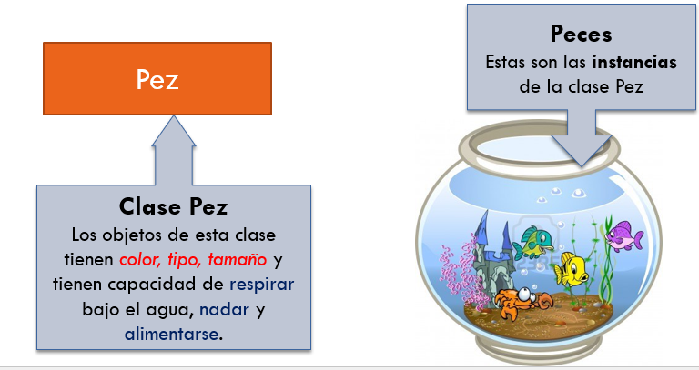
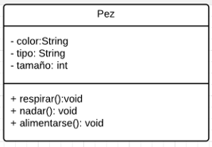
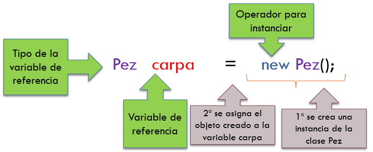

# UNIDAD 2. UTILIZACIÓN DE OBJETOS Y DESARROLLO DE CLASES

## INDICE
- [UNIDAD 2. UTILIZACIÓN DE OBJETOS Y DESARROLLO DE CLASES](#unidad-2-utilización-de-objetos-y-desarrollo-de-clases)
  - [INDICE](#indice)
  - [INTRODUCCIÓN](#introducción)
  - [JAVA Y LA PROGRAMACIÓN ORIENTADA A OBJETOS (POO)](#java-y-la-programación-orientada-a-objetos-poo)
    - [Elementos de la POO: clases y objetos.](#elementos-de-la-poo-clases-y-objetos)
      - [Constructor](#constructor)
    - [Uso de clases y objetos](#uso-de-clases-y-objetos)
    - [La palabra reservada this](#la-palabra-reservada-this)
    - [Métodos get y set](#métodos-get-y-set)
    - [Operador "."](#operador-)
  - [EJERCICIOS](#ejercicios)
    - [Modificadores de acceso](#modificadores-de-acceso)
    - [Definir atributos](#definir-atributos)
    - [Atributos finales](#atributos-finales)
    - [Definir métodos](#definir-métodos)
    - [Sobrecarga de métodos](#sobrecarga-de-métodos)
    - [La referencia this](#la-referencia-this)
    - [Constructores](#constructores)
      - [Constructor copia](#constructor-copia)
    - [Métodos estáticos](#métodos-estáticos)
    - [Métodos recursivos](#métodos-recursivos)
  - [EJERCICIOS](#ejercicios-1)
## INTRODUCCIÓN

Un paradigma es una forma de afrontar la construcción del software. O dicho con otras palabras, es una manera o estilo de programación de software. Existen diferentes formas de diseñar un lenguaje de programación y varios modos de trabajar para obtener los resultados que necesitan los programadores.

Existen varios paradigmas de programación, que se clasifican en:

- Declarativos
  - Funcional
  - Lógico
- Imperativos
  - Programación orientada a objetos
  - Procedimental

## JAVA Y LA PROGRAMACIÓN ORIENTADA A OBJETOS (POO)

Java es un lenguaje orientado a objetos. Siempre que se crea un programa, se necesita declarar una clase. Es decir, no podemos crear aplicaciones que no sean orientadas a objetos.

Con la POO los problemas se dividen en objetos. Cada uno de ellos funciona de forma totalmente independiente. 

Un objeto es un elemento del programa que integra sus propios datos y su propio funcionamiento. Es decir un objeto está formado por datos (propiedades) y por las funciones que es capaz de realizar el objeto (métodos).

Esta forma de programar se asemeja más al pensamiento humano. La cuestión es detectar adecuadamente los objetos necesarios. De hecho hay que detectar las distintas clases de objetos. 

Una clase es lo que define a un tipo de objeto. Al definir una clase lo que se hace es indicar como funciona un determinado tipo de objetos. Luego, a partir de la clase, podremos crear objetos de esa clase.

### Elementos de la POO: clases y objetos.

Una clase es un tipo al cual pertenecen **objetos** o **instancias de la clase**.

Las clases son plantillas para hacer objetos. Antes de definir un objeto se debe definir la clase a la que pertenece.



Una clase es una unidad de software que posee memoria y comportamiento. La memoria está representada por los **atributos** y el comportamiento está representada por los **métodos**.

Una clase es el “plano” que permite “construir” un objeto y está compuesta de:

- Atributos: Define sus propiedades (datos que almacena el objeto)
- Métodos: Define el código de sus métodos (comportamiento)

Dentro de la clase, existen unos métodos especiales denominados **constructores** que se utilizan cuando creamos un objeto a partir de una clase. A esta operación de crear el objeto también se la denomina instanciación del objeto. Los constructores tienen el mismo nombre de la clase.

Si representáramos la Clase pez en un diagrama de clases UML (Notación UML: Es un lenguaje de modelado de sistemas software. Entre otras cosas, se utiliza para representar diagramas de clases)



Veamos un ejemplo de como se representa una clase en lenguaje Java:

```java
public class NombreClase
{
  /**
  * Atributos:
  *
  * tipo nombreAtributo1;
  * tipo nombreAtributo2;
  */
  
  /**
  * Métodos;
  *
  * salida nombreMetodo1 (parámetros)
  * {
  *   contenido del método 1
  * }
  * 
  * salida nombreMetodo2 (parámetros)
  * {
  *   contenido del método 2
  * }
  */
}
```

**Realiza el siguiente ejercicio:**

1. Intentad crear una clase Pez y codificar sus atributos y sus métodos.

```java
public class Pez
{
  private String color;
  private String tipo;
  private int tamaño;
  
  public void respirar()
  {
    //contenido del método respirar
  }
   public void nadar()
  {
    //contenido del método nadar
  }
   public void alimentarse()
  {
    //contenido del método alimentarse
  }
}
```

#### Constructor

Una vez que ya tenemos hecha la clase Pez, vamos a ir completandola con un constructor. Como ya habíamos dicho, un constructor es un método especial que se utiliza para inicializar un objeto. 

Podemos tener más de un constructor en nuestra clase, y se distinguirán por el número de parámetros que tengan. A esta propiedad de poder tener más un método que se llama igual a otros se denomina **sobrecarga**.

El nombre del constructor, como ya habíamos dicho anteriormente, coincide con el nombre de la clase y no devuelve nada. Como esto siempre es así, no se indica que no devuelve nada. Los constructores se escriben inmediatamente después de la definición de los atributos. Completamos nuestra clase Pez:

```java
  //Constructor por defecto (sin parámetros)
  public Pez()
  {
  }
  
  //Constructor que recibe un parámetro int
  public Pez(int _tamaño)
  {
    tamaño=_tamaño;
  }
  
  //Constructor que recibe tres parámetros
  public Pez (string miColor, String miTipo, int miTamaño)
  {
    color=miColor;
    tipo=miTipo;
    tamaño=miTamaño;
  } 
```

### Uso de clases y objetos

Una vez tenemos creada la clase, vamos a proceder a crear un objeto. A la creación de un objeto se la denomina instanciación del objeto, o crear una instancia de la clase.

Cada objeto tiene su propia identidad, es decir, tendrá un nombre único y no puede haber otro objeto con el mismo nombre. Cada objeto se referencia desde una variable.



Para utilizar un objeto primero se debe definir una variable que lo referenciará. El formato es el siguiente:

```
Clase variable
```
Luego se debe crear el objeto (instancia de la clase), de la siguiente forma:

```java
variable = new Constructor(lista de parámetros)
```

Nota:
- La lista de parámetros son datos que se ha especificado como requeridos para crear el objeto.
- Una misma clase puede tener distintas especificaciones de parámetros requeridos para su instanciación, o podría no requerirlos.
- Los datos de la lista de parámetros se separan por comas

Mas ejemplos de creación de objetos de la clase Pez:
```java
Pez carpa = new Pez();
Pez grande = new Pez(50);
Pez cometa = new Pez("Naranja", "Cometa", 8);
```

### La palabra reservada this

En todos los métodos existe por defecto una referencia al objeto concreto que ejecuta el método. Esta referencia es la palabra reservada this.
Su utilidad es resolver ambigüedades cuando existen atributos con el mismo identificador que alguna variable local o parámetro. Veamos un ejemplo de su uso:

```java
public class Pez
{
  private int tamaño;
  
  public Pez(int tamaño)
  {
    this.tamaño=tamaño;
  }
}
```

### Métodos get y set

Sirven para obtener o para modificar los atributos de una clase

```java
public String getColor(){
  return color;
}

public String getTipo(){
  return tipo;
}

public int getTamaño(){
  return tamaño;
}

public void setColor(String color){
  this.color=color;
}

public void setTipo(String tipo){
  this.tipo=tipo;
}

public void setTamaño(int tamaño){
  this.tamaño=tamaño;
}
```

### Operador "."

Se utiliza para acceder a los miembros de una clase

```java
carpa.respirar();
grande.alimentarse();
pezCometa.respirar();
pezCometa.nadar();

carpa.setColor("Naranja");
carpa.setTamaño(30);
System.out.println("El color de la carpa es: "+ carpa.getColor());
```
## EJERCICIOS

[Hoja de ejercicios 1](Ejercicios/Hoja01_POO_02.pdf)

[Hoja de ejercicios 2](Ejercicios/Hoja02_POO_02.pdf)

[Hoja de ejercicios 3](Ejercicios/Hoja03_POO_02.pdf)

[Hoja de ejercicios 4](Ejercicios/Hoja04_POO_02.pdf)

### Modificadores de acceso

Se trata de una palabra que antecede a la declaración de una clase, método o propiedad de clase. Hay tres posibilidades: public, protected y private. Una cuarta posibilidad es no utilizar ninguna de estas tres palabras; entonces se dice que se ha utilizado el modificador por defecto (friendly). En la siguiente tabla se puede observar la visibilidad de cada especificador:

|  | La misma clase | Otra clase del mismo paquete | Subclase de otro paquete | Otra clase de otro paquete |
| ------ | ------ | ------ | ------- | ------ |
| public | X | X | X | X |
| protected | X | X | X |  |
| default | X | X |  |  |
| private | X |  |  |  |

El modificador debe de indicarse antes de indicar el tipo de datos de la propiedad o el método. Por ejemplo:

```java
public class Noria
{
  private double radio;
  public void girar(int velocidad)
  {
    //...
    //definición del método
   }
   public void parar()
   {
    //..
   }
}
```

### Definir atributos

Cuando se definen los datos de una determinada clase, se debe indicar el tipo de atributo que es (String, int, double, ...) y el especificador de acceso (public, private,...). 
Ejemplo:

```java
public class Persona
{
  public String nombre; //se puede acceder desde cualquier clase
  private int contraseña;  //solo se puede acceder desde la clase Persona
  protected String dirección;  //Acceden a esta propiedad esta clase y sus descendientes
}
```

Por lo general los atributos de una clase suelen ser privados o protegidos, a no ser que se trate de un valor constante, en cuyo caso se declararán como públicos. Además pueden ser inicializados.

### Atributos finales

Los atributos de una clase pueden utilizar el modificador final, para que se conviertan en valores no modificables en el objeto. De ser así, se debe iniciar el valor del atributo en la construcción del objeto

```java
public class Alumno 
{
    private final String INSTITUTO = "Miguel Herrero";
    //…
}
```

### Definir métodos

Un **método** es una llamada a una operación de un determinado objeto. La mayoría de métodos devuelven un resultado (gracias a la palabra return), por ello cuando se define el método hay que indicar el tipo de datos al que pertenece el resultado del mismo. 
Si el método no devuelve ningún resultado se indica como tipo de datos a devolver el tipo **void** (void significa vacío).

Los métodos están asociados a una clase. Es una operación que esa clase es capaz de realizar. Cuando una clase ya tiene definido sus métodos, es posible invocarles utilizando los objetos definidos de esa clase. En esa invocación, se deben indicar los **parámetros** (o argumentos) que cada método requiere para poder realizar su labor.

Para construir un método necesitamos definir:
1. **Sus especificadores de alcance o visibilidad**: si el alcance es privado, el método sólo se podrá utilizar dentro de otro método en la misma clase; si el público podrá ser invocado desde cualquier clase; si es protegido desde la propia clase y sus descendientes y si no ponemos nada, desde clases que estén en el mismo paquete.
2. **El tipo de datos o de objeto que devuelve**: si el resultado del método es un número entero, o un booleano, o un String o un objeto de una clase determinada, etc. Si el método no devuelve valor alguno se debe indicar como tipo el valor void.
3. **El identificador del método**: sigue las mismas reglas que para el nombre de las variables
4. **Los parámetros**: pueden necesitar datos para realizar su tarea. 
5. **El cuerpo del método**: el código que permite al método realizar su tarea.

```java
    public double sueldo()
    {
        double salario = 0;
        if(antigüedad < 10 && antigüedad>0)
            salario = 12*horas;
        else if(antigüedad >= 10 && antigüedad <25)
            salario = 13*horas;
        else if(antigüedad >=25)
            salario = 14*horas;
        
        return salario;
    }
```

### Sobrecarga de métodos

Java posee esa propiedad ya que admite sobrecargar los métodos. Esta propiedad ya la habíamos visto con los constructores. 

Esto significa crear distintas variantes del mismo método. Se puede definir más de un método con el mismo nombre, pero se diferencian en los parámetros que este método recibe.

Vemos un ejemplo:

```java
public class Matemáticas
{
	public double suma(double x, double y) 
	{
		return x+y;
	}
	public double suma(double x, double y, double z)
	{
		return x+y+z;
	}
	public double suma(int numero1, int numero2)
	{
		return numero1 + numero2;
	}
}
```
### La referencia this

Los objetos pueden hacer referencia a sí mismos, para ello disponen de la palabra this. Se utiliza dentro del código de las clases para obtener una referencia al objeto actual y permitir evitar ambigüedad y realizar llamadas a métodos que de otra forma serían complicadas.

Los posibles usos de this son:
- **this**: referencia al objeto actual. Se usa por ejemplo pasarle como parámetro a un método cuando es llamado desde la propia clase.
- **this.atributo**: para acceder a una propiedad del objeto actual.
- **this.método(parámetros)**: permite llamar a un método del objeto actual con los parámetros indicados.
- **this(parámetros)**: permite llamar a un constructor del objeto actual. Esta llamada sólo puede ser empleada en la primera línea de un constructor.

```java
public class Punto 
{
     private int posX;
     private int posY;
     public void modificarCoords(int posX, int posY)
     {
                 this.posX=posX; 
                 this.posY=posY;
     }
}
```

### Constructores

Cuando se crea un objeto mediante el operador new las propiedades toman un valor inicial:

- O bien el valor que Java asigna por defecto
- O se utiliza la asignación en su declaración

Pero esta forma no suele ser la más habitual. En su lugar se utilizan los constructores.

Un constructor es un método que se invoca cuando se crea un objeto y que sirve para iniciar los atributos del objeto. Siempre hay al menos un constructor, el constructor por defecto. Ese es un constructor que le crea el compilador en caso de que nosotros no creemos ninguno y se invoca cuando la creación es como:

```java
Alumno a=new Alumno();
```

Pero nosotros podremos crear los nuestros. Un constructor no es más que un método que tiene el mismo nombre que la clase.

Ejemplo 1. En este ejemplo se ve una clase con un constructor definido por el usuario, y el uso que se hace de el desde el programa principal.:
```java
public class Noria 
{
	private double radio;
	public Noria(double radio){
		this.radio = radio;
	}
}

public class Principal
{
           public static void main(String args[])
           {
                Noria n = new Noria(10);
           }
}
```
En este caso, como tenemos un constructor definido por el usuario, no podríamos utilizar el constructor por defecto (el que no tiene parámetros). Si lo necesitáramos, tendríamos que definirlo en la clase. Vemos el ejemplo2:

```java
public class Noria 
{
	private double radio;
	public Noria(){
		this.radio = 55;
	}
	public Noria(double radio){
		this.radio = radio;
	}
}

public class Principal
{
           public static void main(String args[])
           {
	Noria n1 = new Noria();
                 Noria n2 = new Noria(10);
           }
}
```

#### Constructor copia 

Existe otro tipo de constructor denominado **Constructor copia**. Recibe por argumento un objeto del mismo tipo, y le asigna los valores del objeto pasado por parámetro a la nueva instancia del objeto.
Se utiliza para copiar un objeto en otro. Vemos un ejemplo:

```java
public class Noria 
{
	private double radio;
	public Noria(){
		this.radio = 55;
	}
	public Noria(double radio){
		this.radio = radio;
	}
  public Noria(Noria n){
    this.radio=n.radio;
  }
}

public class Principal
{
           public static void main(String args[])
           {
	         Noria n1 = new Noria();
                 Noria n2 = new Noria(10);
                 Noria n3 = new Noria(n2);
           }
}
```
### Métodos estáticos

Un método estático es aquel que no requiere de ningún objeto para ejecutarse y, por tanto, no puede utilizar ningún atributo que no sea estático. (Los atributos estáticos los veremos más adelante). En caso de intentarlo, se produce un error.

La forma de invocar un método estático es, en lugar de poniendo el nombre del objeto que realiza la llamada delante, se pone el nombre de la clase. Veamos un ejemplo:

```java
public class Persona{
	private String nombre;
	public Persona(){
		nombre="";
	}
	public Persona(String nombre){
		this.nombre=nombre;
	}
	public static void nombreClase(){
		System.out.println("Soy la clase Persona");
	}
}

public class Ejemplo{
	public static void main(String args[]){
		Persona.nombreClase();
	}
}
```

La invocación o llamada al método estático se hace desde el programa principal sin necesidad de tener definido un objeto de la clase Persona. Para poder invocar dicho método, se pone delante el nombre de la clase. 
	
	
### Métodos recursivos

La recursividad es una técnica de escritura de métodos o funciones, pensada para problemas complejos. La idea parte de que un método puede invocarse a sí mismo. Esta técnica es peligrosa ya que se pueden generar fácilmente llamadas infinitas.

Como ejemplo vamos a ver la versión recursiva del factorial:

```java
public class Matematicas
{
     public double factorial(int n)
     {
	if(n<=1) 
	     return 1;
	else 
	     return n*factorial(n-1);
      }
}
```

Con una llamada a ese método con factorial(4); usando el ejemplo anterior, la ejecución del programa generaría los siguientes pasos:

- Se llama a la función factorial usando como parámetro el número 4 que será copiado en el parámetro n
- Como n>1, entonces se devuelve 4 multiplicado por el resultado de la llamada factorial(3)
- La llamada anterior hace que el nuevo n (variable distinta de la anterior) valga 3, por lo que esta llamada devolverá 3 multiplicado por el resultado de la llamada factorial(2)
- La llamada anterior devuelve 2 multiplicado por el resultado de la llamada factorial(1)
- Esa llamada devuelve 1
- Eso hace que la llamada factorial(2) devuelva 2\*1, es decir 2
- Eso hace que la llamada factorial(3) devuelva 3\*2, es decir 6
- Por lo que la llamada factorial(4) devuelve 4\*6, es decir 24 Y ese es ya el resultado final

## EJERCICIOS

[Hoja de ejercicios 5](Ejercicios/Hoja05_POO_02.pdf)

[Hoja de ejercicios 6](Ejercicios/Hoja06_POO_02.pdf)

[Hoja de ejercicios 7](Ejercicios/Hoja07_POO_02.pdf)

[Hoja de ejercicios 8](Ejercicios/Hoja08_POO_02.pdf)

[Hoja de ejercicios 9](Ejercicios/Hoja09_POO_02.pdf)


