# UNIDAD 4.  ESTRUCTURAS DE ALMACENAMIENTO ESTÁTICAS. ARRAYS

## ÍNDICE

  - [INTRODUCCIÓN](#introducción)
  - [ARRAYS UNIDIMENSIONALES](#arrays-unidimensionales)
    - [Declaración](#declaración)
    - [Asignación](#asignación)
    - [Longitud](#longitud)
    - [Inicialización](#inicialización)
    - [Recorrido de un array ( FOR Y FOR-EACH)](#recorrido-de-un-array--for-y-for-each)
      - [Recorrido de un array FOR-EACH](#recorrido-de-un-array-for-each)
      - [Limitaciones del ciclo FOR-EACH](#limitaciones-del-ciclo-for-each)
  - [ARRAYS MULTIDIMENSIONALES](#arrays-multidimensionales)
  - [ARRAYS DE OBJETOS](#arrays-de-objetos)
  - [LA CLASE ARRAYS DE JAVA](#la-clase-arrays-de-java)
  - [MÉTODO MAIN](#método-main)
    - [Uso por línea de comandos](#uso-por-línea-de-comandos)
    - [Parámetros main - netbeans](#parámetros-main---netbeans)

## INTRODUCCIÓN

Hasta ahora conocemos los tipos de datos simples. Con ellos no podemos gestionar muchos datos a la vez.
**Pregunta**:
¿Cómo tendríamos que hacer ahora si queremos almacenar la nota de 30 alumnos de clase?
- En la mayoría de los lenguajes se pueden agrupar variables del mismo tipo en una misma estructura conocida como **array**.
- **Los arrays** son una **colección de datos del mismo tipo** al que se le pone un nombre (por ejemplo notas). Para acceder a un dato individual de la colección hay que utilizar su posición. 
- La posición es un número entero, normalmente se le llama **índice**
- Hay que tener en cuenta que en los arrays el primer elemento tiene como índice el **número cero**.
- En Java los arrays son **OBJETOS**.

Si tenemos el siguiente array de notas

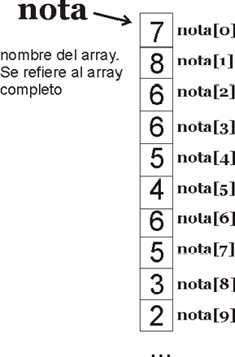

>Preguntas: ¿Cómo accederemos al valor 4? ¿Qué obtendremos si hacemos nota[8]?

## ARRAYS UNIDIMENSIONALES

### Declaración
Para declarar un array en Java podremos hacerlo del siguiente modo:
```java
	tipo[] nombre;
```
Ejemplo:
```java
	 double[] notas;
```
Esta declaración indica para qué servirá el array, pero no reserva espacio en la RAM al no saberse todavía el tamaño del mismo. 

Tras la declaración del array, se tiene que inicializar. Eso lo realiza el **operador new**, que es el que realmente crea el array indicando un tamaño.
Cuando se usa new es cuando se reserva el espacio necesario en memoria. Un array sin inicializar no se puede utilizar en el código.
```java
	double[] notas; //Declaración
	notas =  new double[30]; //Se crea el array con 30 valores de tipo double
```
También se puede hacer ambas operaciones en la misma instrucción: 
```java
	double[] notas = new double[30];
```
### Asignación
Los valores del array se asignan utilizando el índice del mismo entre corchetes:
```java
notas[18]=4.45;
```
También se pueden asignar valores al array en la propia declaración: 
```java
double[] notas = {3.0, 5.2, 8, 0.5} //Esto creará un array de 4 elementos
```
>Preguntas: ¿Cuánto valdrá notas[1]? ¿Y notas[4]?

Si utilizamos  **un índice** que se encuentra **fuera de rango** obtendremos  un error en tiempo de ejecución que **provoca que el programa termine de forma inesperada**, ya que  se detecta que los elementos con los índices utilizados no existen.

Se pueden declarar arrays a cualquier tipo de datos (enteros, booleanos, doubles, ... e incluso objetos como se verá más adelante).

La ventaja de usar arrays es que gracias a un simple **bucle for** se puede recorrer fácilmente todos los elementos de un array.

### Longitud

Los arrays poseen un método que permite determinar cuánto mide un array; es decir, de cuántos elementos consta. Se trata de **length**. 
```java
int a[]=new int [17]; 
System.out.println(a.length); //Escribe: 17 
```
<div class="page"/>

Gracias a este método el bucle de recorrido de un array (para cualquier tipo de array) sería: 
```java
	for (int i = 0; i < x.length; i++) 
	{ 
		//x[i] tendrá el valor de cada posición del array
	}
```
Ejemplo: Realizar un programa en Java que cree un array de 10 notas y calcule la nota media de ellas.
```java
double[] notas = {5, 4.3, 2.7, 6, 7.9, 9.8, 4.9, 7.5, 8.4, 3};
double suma=0; 
for (int i=0;i<notas.length;i++){ 
        suma+=notas[i]; 
    }
double media=suma/notas.length; 
System.out.println("La media de las notas es " + media);
```
:computer: Hoja de ejercicios 1

### Inicialización
A un array se le puede inicializar las veces que haga falta:
```java
int notas[]=new notas[16]; 
…
notas=new notas[25]; 
```
>Pregunta:¿Qué os parece que harán las sentencias anteriores?

El segundo **new** hace que se pierda el contenido anterior. De hecho elimina ese contenido. 
En Java, un array es una referencia a una serie de valores que se almacenan en la memoria. El operador new asigna un hueco en memoria para almacenar una cantidad de elementos y devuelve una referencia a los valores.

Comportamiento en memoria

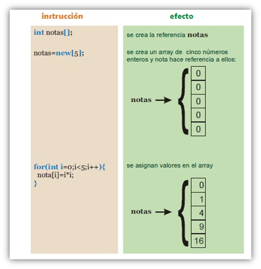

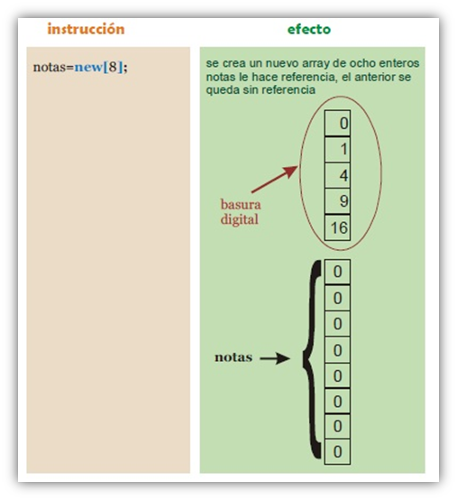

Un array se puede asignar a otro array (si son del mismo tipo): 

```java
int[] a; 
int[] b=new int[]{3,4,5,6,7,8}; 
a=b; 
```
Lo que ocurre en el código anterior es que **tanto a como b hacen referencia al mismo array**. Es decir, el resultado sería: 
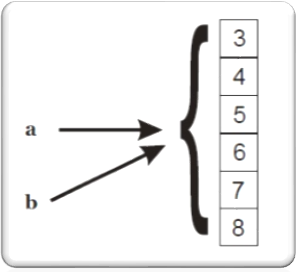

Esta asignación provoca que cualquier cambio en **a también cambie el array b** (ya que, de hecho, es el mismo array). Ejemplo:
 
```java
int[] a={3,3,3}; 
int[] b; 
b= a; 
b[0]=8; 
System.out.println(a[0]);//Escribirá el número 8 
```
El operador de igualdad (==) se puede utilizar con arrays, pero nuevamente no compara el contenido sino las referencias que señalan al mismo array:
```java
int a[]={3,3,3}; 
int b[]={3,3,3}; 
System.out.println(a==b); 	//escribe false, aunque ambos arrays tienen el mismo contenido
int c[]=b; 
System.out.println(b==c); 	//escribe true
```
:computer: Hoja de ejercicios 2
:computer: Hoja de ejercicios 3

### Recorrido de un array ( FOR Y FOR-EACH)
Al trabajar con Arrays, es común encontrar situaciones en las que cada elemento de una matriz debe examinarse, de principio a fin. Por ejemplo, para calcular la suma de los valores contenidos en una matriz, cada elemento de la matriz debe examinarse. 

<div class="page"/>

Ejemplo: 

- **FOR**
```java
int nums[]={1,2,3,4,5};
int sum=0;
for (int i=0;  i<nums.length ; i++) {
	sum+=nums[i];
}
```
- **FOR-EACH**
```java
int nums[]={1,2,3,4,5};
int sum=0;
for(int numeros:nums){
	sum+=numeros;
}
```
#### Recorrido de un array FOR-EACH

Comienza con la palabra for al igual que el bucle for normal.

En lugar de declararse e inicializar una variable contador del bucle, **declara una variable que es del mismo tipo que del array**, seguido de dos puntos y del nombre del array.

Esta variable irá tomando en cada iteración cada uno de los valores de los elementos del array y el bucle se ejecutará tantas veces como elementos existan.

Es importante tener en cuenta que la variable es una copia de cada elemento, y que en el caso de que se modifique, estamos modificando una copia, no el elemento de la tabla.

Se usa comúnmente para iterar sobre un array o una clase de colecciones.

Sintaxis:
```java
for (tipo variable: array)
	{
		declaraciones usando variable;
	}
```
Equivalente a:
```java
for( int i=0; i<array.length;i++)
	{  	tipo variable=array[i];
		declaraciones usando variable;
	}
```

Ejemplo:
```java
double sumaSueldos=0;
double sueldos[]={1200.25,1500.34,2045.65};
for (double sueldo:sueldos){// sueldo tomará los valores del array sueldos
    sumaSueldos +=sueldo;
}
System.out.printf ("La suma de los valores aleatorios es %,.2f€",sumaSueldos);

```
#### Limitaciones del ciclo FOR-EACH

El bucle no es apropiado cuando se quiere modificar el array
```java
for(int num: marks)
	{	//solo cambia num, no el elemento del array
		num=num*2;
	}
```
El bucle no realiza un seguimiento del índice. No podemos obtener un índice del array
```java
for(int num: numbers)
{   if  (num==target)
	{
	    return ??? // no sabe el índice de num
	}	
}
```

## ARRAYS MULTIDIMENSIONALES
Los arrays además pueden tener varias dimensiones. Entonces se habla de arrays de arrays (arrays que contienen arrays). Un uso podría ser representar datos identificables por más de un índice.
Ejemplo:
```java
int notas[][]; 
```
notas es un array que contiene arrays de enteros. La primera dimensión podría significar el número de un aula y el segundo el número del alumno. De modo que, por ejemplo, notas[2][7] significaría la nota del alumno número ocho del tercer aula. 

Como ocurre con los arrays unidimensionales, hasta que no se define el array con el operador **new**, no se puede utilizar el array en el código. 
Ejemplo:
```java
notas = new int[3][12]; //notas está compuesto por 3 arrays  de 12 numeros cada uno
notas[0][0]=9; //el primer valor es un 9 
```
Los arrays multidimensionales se pueden inicializar de forma más creativa incluso.
Ejemplo
```java
int notas[][]=new int[5][]; //Hay 5 arrays de enteros (aún por definir) 
notas[0]=new int[100]; 	//El primer array es de 100 enteros 
notas[1]=new int[230]; 	//El segundo de 230 
notas[2]=new int[400]; 	//... 
notas[3]=new int[100]; 
notas[4]=new int[200]; 
```
Hay que tener en cuenta que en el ejemplo anterior, **notas[0]** es un array de **100 enteros**. Mientras que **notas**, es un array de **5 arrays de enteros**. Esta forma irregular de arrays da muchas posibilidades y permite optimizar el gasto de espacio de almacenamiento. 

Lo importante es recordar que **los arrays multidimensionales en Java son manejados como arrays de arrays**. 

También sería posible utilizar más de dos dimensiones.

:computer: Hoja de ejercicios 4
:computer: Hoja de ejercicios 5

## ARRAYS DE OBJETOS

El uso más común de los arrays es para organizar la información de objetos definidos por el  programador.

Ejemplo:
Si utilizamos una **clase Alumno** para almacenar la información de alumnos (con los atributos nombre, apellidos, nota y fecha de nacimiento). 

La representación en UML de la clase Alumno es:

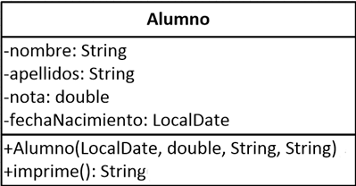

y una clase grupo que simulará  un grupo de alumnos, nuestra clase tendrá un array de objetos del tipo creado anteriormente (Alumno).

La representación en UML de la clase Grupo es:

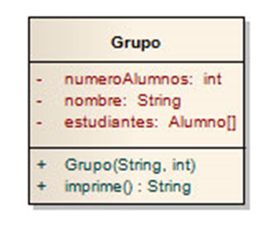

Con el uso de un array podemos definir también el objeto apropiado para gestionar la información de un grupo de alumnos. 

<div class="page"/>
Ejemplo:

```java
public class Grupo {
    private int numeroAlumnos;
    private String nombre;
    private Alumno[] estudiantes;

    /**
     * Parámetros del grupo
     * @param numeroAlumnos
     * @param nombre
     */
    public Grupo(int numeroAlumnos, String nombre) {
        this.numeroAlumnos = numeroAlumnos;
        this.nombre = nombre;
        estudiantes=new Alumno[numeroAlumnos];
        for(int i=0;i<estudiantes.length;i++){
            estudiantes[i]=new Alumno("Nombre "+ (i+1),"Apellidos "+(i+1),0,LocalDate.now());
        }
    }
    
    /**
     *Nos muestra por pantalla la información del Grupo
     */
    public void print(){
        System.out.println("Grupo : "+nombre);
        System.out.println("Numero de alumnos: "+numeroAlumnos);
        for(int i=0;i<estudiantes.length;i++){
            estudiantes[i].print();
        }
    
    }
}
```
:computer: Ejemplos de arrays
:computer: Hoja de ejercicios 6

## LA CLASE ARRAYS DE JAVA

En el paquete **java.utils** se encuentra una clase estática llamada **Arrays**. Una clase estática permite ser utilizada como si fuera un objeto (como ocurre con Math), es decir, que para utilizar sus métodos hay que utilizar simplemente esta sintaxis:

```java
Arrays.métodos(argumentos);
```
Algunos métodos interesantes son los siguientes:
- **fill**
Permite rellenar todo un **array unidimensional** con un determinado valor. Sus argumentos son el array a rellenar y el valor deseado: 
```java
int valores[]=new int[23]; 
Arrays.fill(valores,-1);//Todo el array vale -1 
```
También permite decidir desde que índice hasta qué índice rellenamos
```java
int valores[]=new int[23]; 
Arrays.fill(valores,5,8,-1);//Del elemento 5 al 7 valdrán -1
```
- **sort**
Permite ordenar un array en orden ascendente. Se pueden ordenar todo el array o bien desde un elemento a otro: 
```java
int x[]={4,5,2,7,3,8,2,3,9,5}; 
Arrays.sort(x,2,5); //El array queda {4 5 2 3 7 8 2 3 9 5} 
Arrays.sort(x); //Estará completamente ordenado 
```
- **equals**
Compara dos arrays y devuelve true si son iguales. Se consideran iguales si son del mismo tipo, tamaño y contienen los mismos valores. A diferencia del operador de igualdad (==), este operador sí compara el contenido.  
```java
int a[]= {2,3,4,5,6}; 
int b[]= {2,3,4,5,6}; 
int c[]=a; 
System.out.println(a==b); //false 
System.out.println(Arrays.equals(a,b)); //true 
System.out.println(a==c); //true 
System.out.println(Arrays.equals(a,c)); //true 
```
- **binarySearch**
Permite buscar un elemento de forma ultrarrápida en un **array ordenado** (en un array desordenado sus resultados son impredecibles). Devuelve el índice en el que está colocado el elemento. 
es el algoritmo de **búsqueda dicotómica** también llamado **búsqueda binaria** que comprueba si la clave de búsqueda se encuentra en el elemento central de la tabla. Con esta información sabe si debe seguir buscando en la primera o segunda mitad del array. El proceso se repite con la mitad, donde es posible encontrar la clave de búsqueda, que se subdivide de nuevo en dos partes. El algoritmo continúa hasta encontrar la clave de búsqueda o hasta que no existan más elementos donde buscar.

```java
int x[]={1,2,3,4,5,6,7,8,9,10,11,12}; 
Arrays.sort(x); 
System.out.println(Arrays.binarySearch(x,8)); //Escribe: 7 
```
- **copyOf**
Obtiene una copia de un array. Recibe dos parámetros: el primero es el array a copiar y el segundo el tamaño que tendrá el array resultante. De modo que si el tamaño es menor que el del array original, sólo obtiene copia de los primeros elementos (tantos como indique el tamaño); si el tamaño es mayor que el original, devuelve un array en el que los elementos que superan al original se rellenan con ceros o con datos de tipo null.
```java
int a[] = {1,2,3,4,5,6,7,8,9}; 
int b[]=Arrays.copyOf(a, a.length);//b es {1,2,3,4,5,6,7,8,9} 
int c[]=Arrays.copyOf(a, 12); //c es {1,2,3,4,5,6,7,8,9,0,0,0} 
int d[]=Arrays.copyOf(a, 3); //d es {1,2,3}
```
- **copyOfRange**
Funciona como la anterior, sólo que indica con dos números de qué elemento a qué elemento se hace la copia:
```java
int a[] = {1,2,3,4,5,6,7,8,9}; 
int b[]=Arrays.copyOfRange(a, 3,6); //b vale {4,5,6} 
```
:computer: Hoja de ejercicios 7

## MÉTODO MAIN
Hasta ahora hemos estado trabajando con el método main en nuestros proyectos de manera habitual.
Ya estamos en condiciones de entender por completo la firma de este método.

```java
public class Principal {

    /**
     * 
     * @param args
     */
    public static void main(String[] args) {
      //código de la aplicación
    }
    
}
```
- El **método main** siempre lo hemos situado en una clase independiente destinada exclusivamente a contener este método.
- No es obligatorio. La clase con el **método main** podría tratarse como una clase más y el **método main** como un método más. 
- Lo diferenciamos por motivos didácticos.
- El método main() es usado por la JVM para iniciar la ejecución de cualquier programa Java. 
- El método main será siempre un método público, ya que por su papel de iniciador de la aplicación no tendría sentido que fuera privado y por tanto inaccesible desde el exterior. 
- El método main siempre es un método estático, ya que cuando se invoca por el motor en tiempo de ejecución, no existen objetos creados con anterioridad porque la ejecución del programa aún no ha comenzado. Si un programa no ha comenzado, existen clases pero no objetos 
- main siempre devuelve void (nulo) ya que no se devuelve ningún valor.
- Su parámetro de entrada siempre será un array de String. (String[] args). 

### Uso por línea de comandos
Java al igual que cualquier otro programa nos permite ejecutarlo mediante la línea de comandos, siguiendo los siguientes pasos:

```java
class HolaMundo 
{
	public static void main(String[] args) { 
	
		System.out.println("Hola mundo " +args[0] ); 
	}
}
```
-Comprueba que java está correctamente instalado y es accesible desde cualquier ruta. 

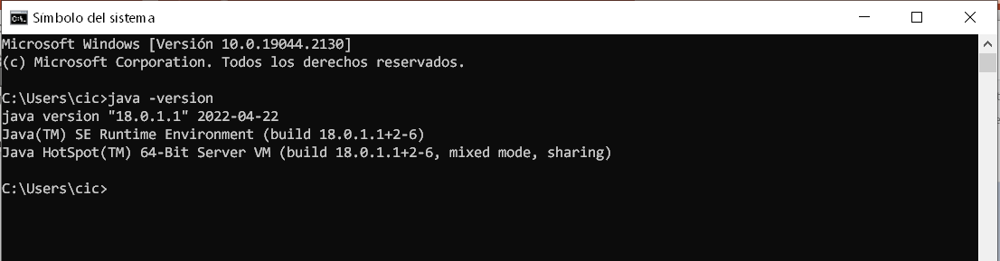
-Si no lo está descárgalo e inclúyelo en las variables de entorno del sistema. 


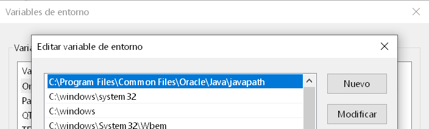

- Llama al compilador de java -> javac 

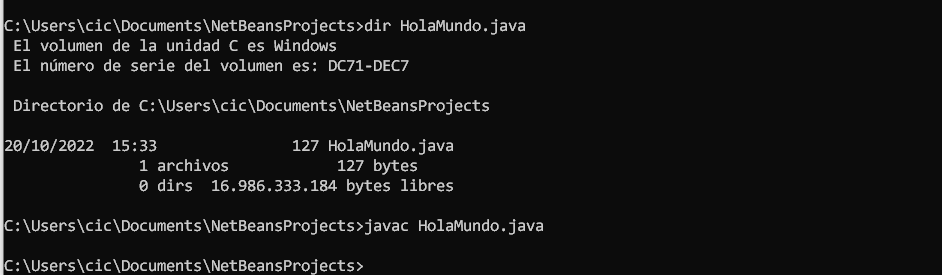

- La compilación nos crea el fichero .class y ejecutamos el programa -> java
  
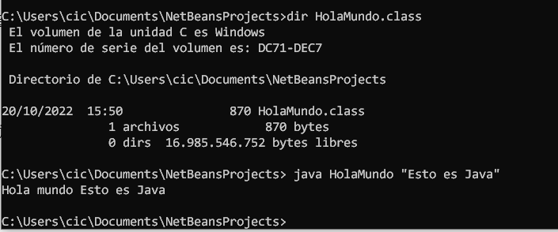

### Parámetros main - netbeans

Se puede simular en NetBeans que nuestros programas reciben argumentos desde la línea de comandos.
Para ello hay que ir a las propiedades del programa, en la pantalla de RUN.

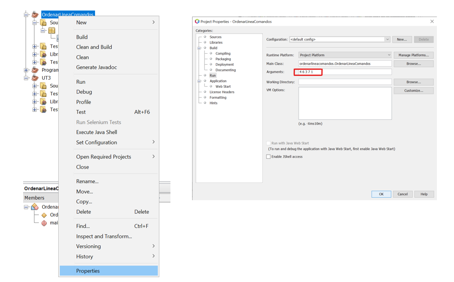

Interpretamos los argumentos del main como **un array de String**.

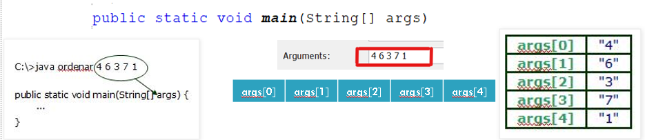

El programa al que llama es:
```java
public class Ordenar {

    public static void main(String[] args) {
       
       if (args.length>0){
           Arrays.sort(args);//ordeno el array
           System.out.println("imprimir los valores del array ordenado");
           for (int i=0;i<args.length;i++){
               System.out.println(args[i]);
           }
       }
    }
}
```
La salida del programa es 

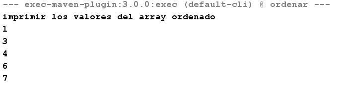

La propiedad length del array args (args.length) contiene el número de valores enviados al programa.

Siempre que trabajemos con valores recibidos desde la línea de comandos debemos controlar el número de valores recibidos para evitar que se produzcan errores al procesar el array.

Ejemplo: visualizar los argumentos introducidos en la línea de comando

```java
public class MostarArgumentos {

    public static void main(String[] args) {
         if (args.length>0){
           System.out.println("imprimir los valores pasados por línea");
           for (int i=0;i<args.length;i++){
               System.out.print(args[i]+" ");
           }
       }
    }
}
```

:computer: Hoja de ejercicios 8

