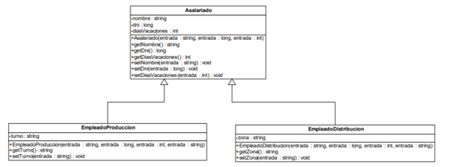
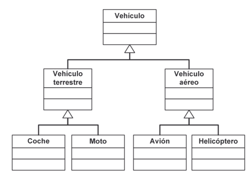
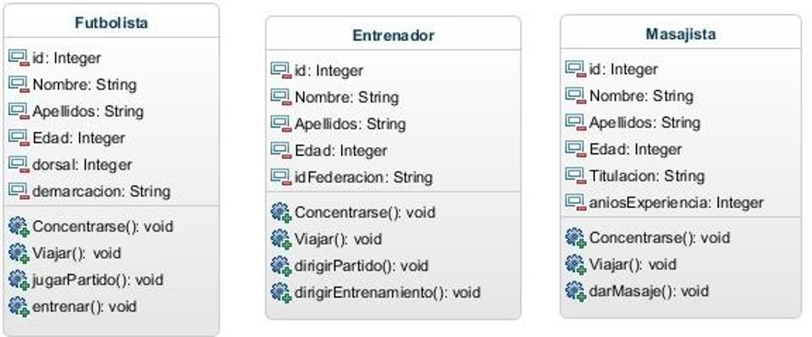
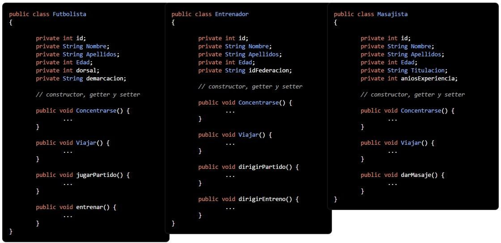
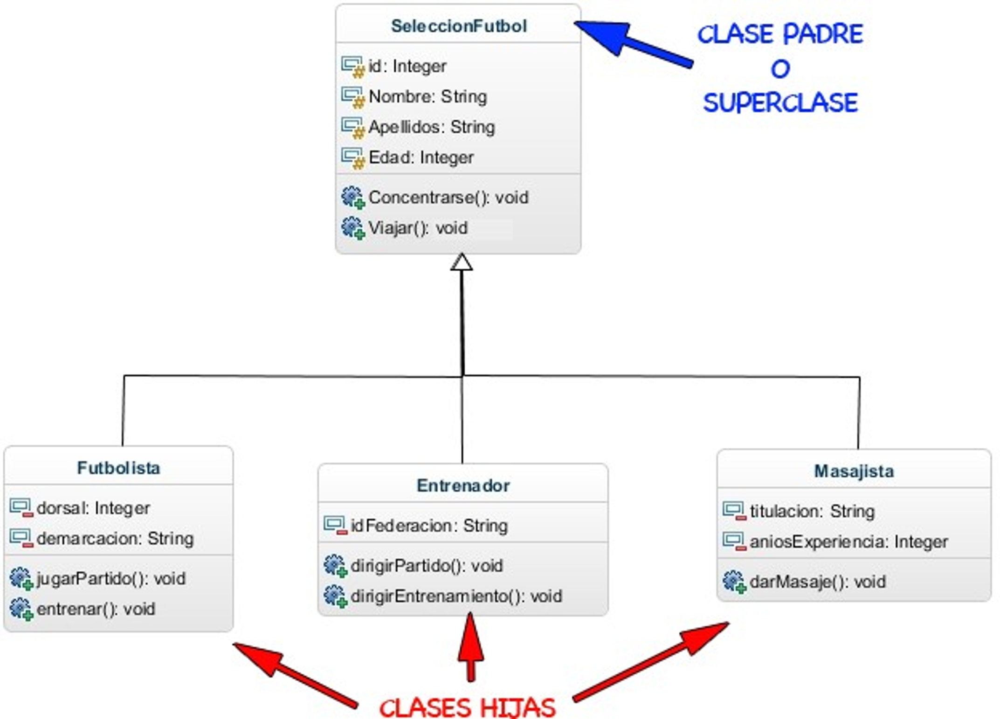
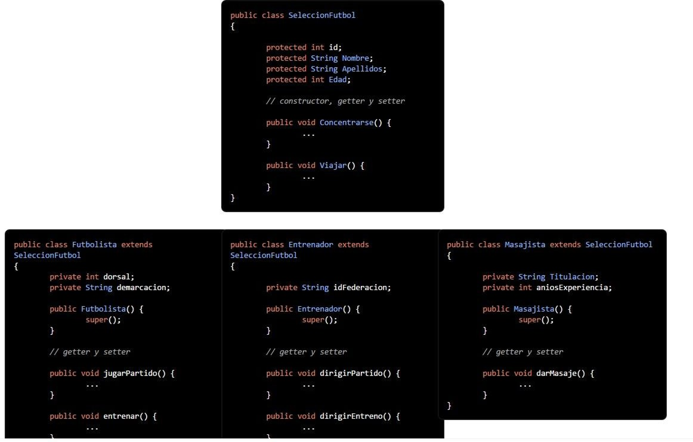
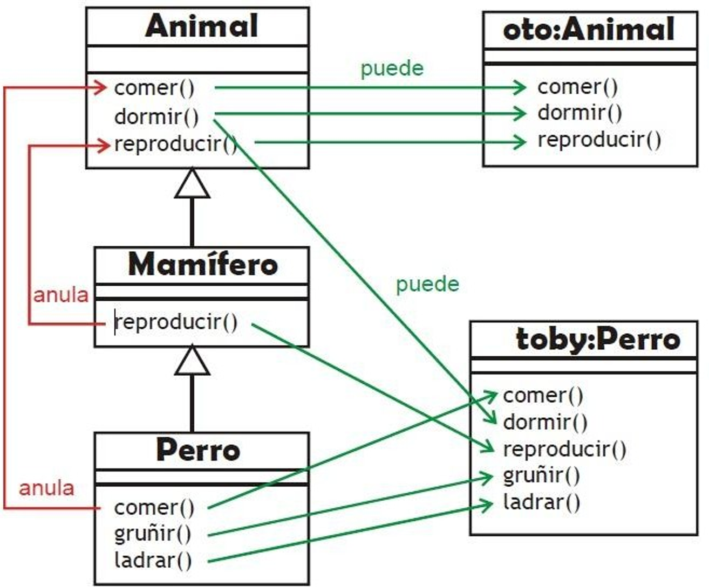
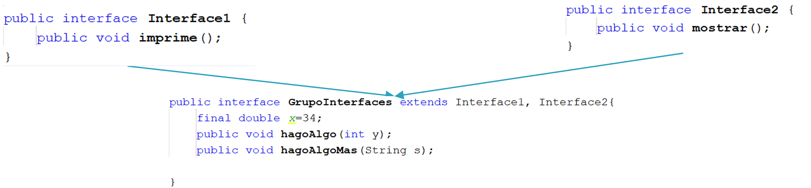
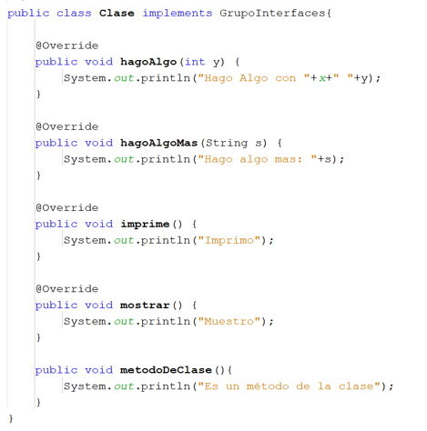
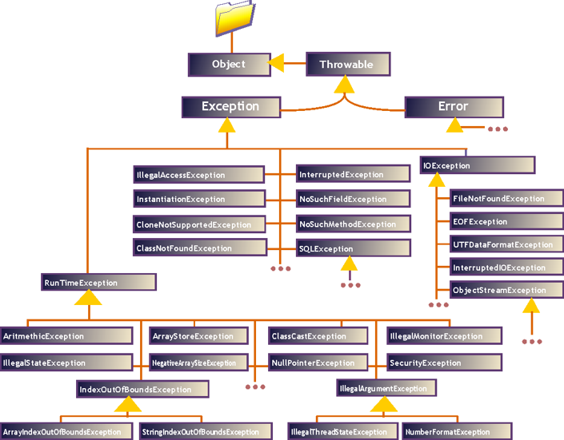

# UNIDAD 5. USO AVANZADO DE CLASES

- [UNIDAD 5. USO AVANZADO DE CLASES](#unidad-5-uso-avanzado-de-clases)
  - [MIEMBROS ESTÁTICOS O DE CLASE EN JAVA](#miembros-estáticos-o-de-clase-en-java)
  - [EJERCICIOS](#ejercicios)
  - [HERENCIA DE CLASES](#herencia-de-clases)
    - [Sobreescritura de métodos](#sobreescritura-de-métodos)
    - [Constructores](#constructores)
  - [EJERCICIOS](#ejercicios-1)
    - [Castings de clases](#castings-de-clases)
  - [EJERCICIOS](#ejercicios-2)
    - [Clases Abstractas](#clases-abstractas)
    - [Modificador final.](#modificador-final)
  - [EJERCICIOS](#ejercicios-3)
  - [INTERFACES](#interfaces)
    - [Definición](#definición)
    - [Implementación en una clase.](#implementación-en-una-clase)
    - [Variables de interface.](#variables-de-interface)
    - [Tipos de métodos que puede tener una Interface](#tipos-de-métodos-que-puede-tener-una-interface)
  - [EJERCICIOS](#ejercicios-4)
    - [Diferencias entre interfaces y clases abstractas](#diferencias-entre-interfaces-y-clases-abstractas)
  - [CLASE OBJECT](#clase-object)
  - [EJERCICIOS](#ejercicios-5)
  - [EXCEPCIONES EN JAVA](#excepciones-en-java)
  - [EJERCICIOS](#ejercicios-6)
    - [Throws y throw](#throws-y-throw)
    - [Excepciones de usuario](#excepciones-de-usuario)
  - [EJERCICIOS](#ejercicios-7)
  - [EXPRESIONES REGULARES EN JAVA](#expresiones-regulares-en-java)
  - [EJERCICIOS](#ejercicios-8)


## MIEMBROS ESTÁTICOS O DE CLASE EN JAVA

Cuando se crea una instancia de la clase, los objetos tendrán sus propios miembros igual que en la clase.

A veces, es interesante que alguno de los miembros de la clase sea común para todos los objetos creados de esta clase.

Por ejemplo, si creamos una clase Coche y quisiéramos disponer de un atributo con el nombre de la clase (un atributo de tipo String con la cadena "Coche"), no tiene mucho sentido replicar ese atributo para todos los objetos de la clase Coche, pues para todos va a tener siempre el mismo valor (la cadena "Coche"). 

Podría no haberse creado ningún objeto de la clase Coche y sin embargo seguiría teniendo sentido poder acceder a ese atributo de nombre de la clase, pues se trata en efecto de un atributo de la propia clase más que de un atributo de cada objeto instancia de la clase.

```java
public class Coche {
    private static String NOMBRE="Coche";
    private String matricula;
    private String color;

    public static String getNOMBRE() {
        return NOMBRE;
    }  
}

public class Ejercicio {

    public static void main(String[] args) {
        System.out.println(Coche.getNOMBRE());
    }
}

```
Para poder definir miembros estáticos en Java se utiliza el modificador static. Los miembros (tanto atributos como métodos) declarados utilizando este modificador son conocidos como miembros estáticos o miembros de clase.

El modificador static hace que el atributo sea común (el mismo) para todos los objetos de una misma clase. El atributo será siempre el mismo para todos los objetos y tendrá un valor único independientemente de cada objeto. Aunque no exista ningún objeto de esa clase, el atributo sí existirá y podrá contener un valor (pues se trata de un atributo de la clase más que del objeto).

Ejemplo de atributos estáticos o de clase: un contador que indica el número de objetos de esa clase que se han ido creando. Otro ejemplo de atributo estático puede ser un atributo nombre, que contuviera un String con el nombre de la clase.

```java
class Punto {
    // Coordenadas del punto
    private int x, y;
    // Atributos de clase: cantidad de puntos creados hasta el momento
    public static cantidadPuntos;
    public static final nombre;
}
```
Obviamente, para que esto funcione como estás pensando, también habrá que escribir el código necesario para que cada vez que se cree un objeto de la clase Punto se incremente el valor del atributo cantidadPuntos. 

En una clase también podemos encontrar métodos static. La implementación es igual para todos los objetos, pero solo puede acceder a los atributos estáticos de la clase. Para llamar a un método estático, no es necesario tener una instancia de la clase. Se hace referencia al método con el nombre de la propia clase, y no el de una instancia. De todos modos, estos métodos también pueden ser invocados por un objeto.

Ejemplo típico de métodos estáticos se encuentra en la clase Math, cuyos métodos son todos estáticos (Math.abs, Math.sin, Math.cos, etc.). En Java es habitual encontrar métodos estáticos en muchas de sus clases.

Por ejemplo, la mayoría de las clases del paquete java.lang que representan tipos (Integer , String, Float, Double, Boolean, etc.) ofrecen métodos estáticos para hacer conversiones. Aquí tienes algunos ejemplos:

- static String valueOf(int i): devuelve la representación en formato String (cadena) de un valor int. Se trata de un método que no tiene que ver nada en absoluto con instancias de concretas de String, sino de un método auxiliar que puede servir como herramienta para ser usada desde otras clases. Se utilizaría directamente con el nombre de la clase. Por ejemplo:

```java
String enteroCadena= String.valueOf (23);
```
- static String valueOf(float f): algo similar para un valor de tipo float. Ejemplo de uso:

```java
String floatCadena= String.valueOf (24.341);
```
- static int parseInt (String s): en este caso se trata de un método estático de la clase Integer . Analiza la cadena pasada como parámetro y la transforma en un int. Ejemplo de uso:
  
```java
int cadenaEntero= Integer.parseInt ("-12");
```

Todos los ejemplos anteriores son casos en los que se utiliza directamente la clase como una especie de caja de herramientas que contiene métodos que pueden ser utilizados desde cualquier parte, por eso suelen ser métodos públicos.

## EJERCICIOS

:computer: Ejemplo: Estático

:computer: Hoja de ejercicios 1 de Estático

## HERENCIA DE CLASES

La herencia define una relación entre clases en la cual una clase posee características (métodos y propiedades) que proceden de otra. Esto permite estructura de forma muy atractiva los programas y reutilizar código de forma más eficiente. Es decir genera relaciones entre clases del tipo **ES UN**.

A la clase que posee las características a heredar se la llama **superclase** y la clase que las hereda se llama **subclase**. Una subclase puede incluso ser superclase en otra relación de herencia. También se emplea habitualmente los términos madre para referirnos a una superclase e hija para una subclase.

Para que una clase herede las características de otra hay que utilizar la palabra clave extends tras el nombre de la clase. A esta palabra le sigue el nombre de la clase cuyas características se heredarán. Una clase que extiende a otra hereda sus atributos y sus métodos (no los constructores). 



Puede haber varios niveles de herencia, es decir clases que heredan de otra clase que a su vez es heredera de otra.



En Java sólo se puede hererar de una clase. No existe herencia múltiple como en otros lenguajes como Python

El ejemplo que proponemos es un caso en el que vamos a simular el comportamiento que tendrían los diferentes integrantes de la selección española de futbol; tanto los Futbolistas como el cuerpo técnico (Entrenadores, Masajistas, etc…).

Para simular este comportamiento vamos a definir tres clases que van a representaran a objetos Futbolista, Entrenador y Masajista. De cada unos de ellos vamos a necesitar algunos datos que reflejaremos en los atributos y una serie de acciones que reflejaremos en sus métodos. Estos atributos y métodos los mostramos en el siguiente diagrama de clases:



Como se puede observar, vemos que en las tres clases tenemos atributos y métodos que son iguales ya que los tres tienen los atributos id, Nombre, Apellidos y Edad; y los tres tienen los métodos de Viajar y Concentrarse. A nivel de código tendremos algo así:



Lo que podemos ver en este punto es que estamos escribiendo mucho código repetido ya que las tres clases tienen métodos y atributos comunes.

Por tanto lo que haremos será crearnos una clase con el “código que es común a las tres clases” (a esta clase se le denomina en la herencia como “Clase Padre o SuperClase”) y el código que es específico de cada clase, lo dejaremos en ella, siendo denominadas estas clases como “Clases Hijas”, las cuales heredan de la clase padre todos los atributos y métodos públicos o protegidos.

Es muy importante saber que las clases hijas no van a heredar nunca los atributos y métodos privados de la clase padre.

Como podéis observar ahora queda un código mucho más limpio, estructurado y con menos líneas de código, lo que lo hace más legible, cosa que es muy importante y lo que todavía lo hace más importante es que es un código reutilizable.

Si ahora queremos añadir más clases a nuestra aplicación como por ejemplo una clase Médico, Utiller@, Jefe/a de prensa etc. que pertenezcan también al equipo técnico de la selección Española, lo podemos hacer de forma muy sencilla ya que en la clase padre (SeleccionFutbol) tenemos implementado parte de sus datos y de su comportamiento y solo habrá que implementar los atributos y métodos propios de esa clase.

Nuestro diagrama de clases nos quedaría del siguiente modo:



A nivel de código nos quedaría algo así:



Además de public, private y default en Java se dispone del modificador protected (protegido). Este modificador de acceso está específicamente pensado para la herencia. Cuando se utiliza sobre una propiedad o un método indica que dicha propiedad o método serán visibles por las subclases que además heredarán la propiedad o el método. Sin embargo permanecerán invisibles para el resto.

Se heredan todos los métodos y propiedades protected y public (no se heredan los private ni los default). La subclase por su parte puede definir nuevos métodos y propiedades.

|  | La misma clase | Otra clase del mismo paquete | Subclase | Otra clase de otro paquete |
| ------ | ------ | ------ | ------- | ------ |
| public | X | X | X | X |
| protected | X | X | X |  |
| default | X | X |  |  |
| private | X |  |  |  |

### Sobreescritura de métodos

Las subclases heredan los métodos de las superclases. Pero también los pueden sobrecargar para proporcionar una versión de un determinado método adaptado a las necesidades de la nueva clase.

Por último, si una subclase define un método con el mismo nombre, tipo y argumentos que un método de la superclase, se dice entonces que se sobrescribe o anula el método de la superclase.

Vamos a ver un ejemplo:



En el diagrama el objeto toby que es un perro, usa el método comer de la clase Perro (los mamíferos y animales también puede comer pero toby usa el método redefinido en la clase Perro).

Sin embargo toby duerme como cualquier otro animal ya que dormir no ha sido redefinido, se reproduce como un mamífero ya que la reproducción es distinta en un mamífero según el diagrama. Lógicamente puede gruñir y ladrar ya que es un perro.

Oto es un animal y por ello todo lo que puede usar procede sólo de la clase Animal.

A veces se requiere llamar a un método de la superclase. Eso se realiza con la palabra reservada super. Anteriormente hemos visto que this hace referencia a la clase actual. super hace referencia a la superclase respecto a la clase actual, con lo que es un método imprescindible para poder acceder a métodos anulados por herencia.

```java
public class Vehiculo {
    protected double velocidad;
    ...
    public void acelerar(double kmh)
    {
        velocidad += kmh;
    }
}

public class Coche extends Vehiculo {
    private int gasolina;
    public void acelerar(double kmh) {
        super.acelerar(kmh);
        gasolina*=0.9;
    }
}
```

En el ejemplo anterior, la llamada super.acelerar(kmh) llama al método acelerar de la clase Vehículo (el cual acelerará la marcha).

Es necesario redefinir el método acelerar en la clase Coche ya que aunque la velocidad varía igual que en la superclase, hay que tener en cuenta el consumo de gasolina. Por ello invocamos al método acelerar de la clase padre (que no es oculto gracias a super).

Se puede incluso llamar a un constructor de una superclase, usando la sentencia super.

```java
public class Vehiculo {
    protected double velocidad;

    public Vehiculo(double kmh)
    {
        velocidad = kmh;
    }
}

public class Coche extends Vehiculo {
    private int gasolina;
    public Coche(double v, int g){
        super(v);
        gasolina*=g;
    }
}
```

### Constructores

Los constructores no se heredan de la clase base a las clases derivadas. Pero sí se puede invocar al constructor de la clase base. De hecho por defecto aunque haya o no haya constructor se hace una invocación al constructor por defecto de la clase base.

```java
public class A{
    protected int valor;
    public A(){
        valor=2;
    }
    public void escribir(){
        System.out.println(valor);
    }
}

public class B extends A{
    public void escribir(){  
        System.out.println(valor*2);
    }
}
```

¿Qué escribiría lo siguiente?

```java
A objA=new A();
B objB=new B();
objA.escribir();
objB.escribir();
```

Sin embargo si la clase A no tuviese constructor por defecto:

```java
public classA{
    protected int valor;  
    public A(int v){
        valor=v;
    }
    public void escribir(){  
        System.out.println(valor);
    }
}

//1º version
public classB extends A{
    public void escribir(){  
        System.out.println(valor*2);
    }
}
//error: NO SE PUEDE INVOCAR AL CONSTRUCTOR POR DEFECTO

//2º version
public classB extends A{
    public B(int v){
        valor=v;
    } //ERROR! Falta el constructor A()
    public void escribir(){
        System.out.println(valor*2);
    }
}

//3º versión, la correcta
public class B extends A {
    public B(int v){ //¡Ahora sí!
        super(v);
    }
    public void escribir(){ 
        System.out.println(valor*2);
    }
}
```
En resumen: hay que tener en cuenta que en los constructores Java realiza estas acciones:

- Si la primera instrucción de un constructor de una subclase no es una invocación a otro constructor con this o super, Java añade de forma invisible e implícita una llamada super() con la que invoca al constructor por defecto de la superclase. Luego continúa con las instrucciones de inicio de las variables de la subclase y luego sigue con la ejecución normal. Si en la superclase no hay constructor por defecto (sólo hay explícitos) ocurrirá un error.

- Si se invoca a constructores de superclases mediante super(…) en la primera instrucción, entonces se llama al constructor seleccionado de la superclase, luego inicia las propiedades de la subclase y luego sigue con el resto de sentencias del constructor.

- Finalmente, si esa primera instrucción es una invocación a otro constructor de la clase con this(…), entonces se llama al constructor seleccionado por medio de this y realiza sus instrucciones, y después continúa con las sentencias del constructor. La inicialización de variables la habrá realizado el constructor al que se llamó mediante this(..).

## EJERCICIOS

:computer: Ejemplo: Herencia Simple.

:computer: Hoja de ejercicios 2 de Herencia. Solo ejercicio 1.

### Castings de clases

Es posible realizar un casting de objetos para convertir entre clases distintas. Hay que tener mucho cuidados al hacerlo y sobre todo comprender perfectamente su funcionamiento.

No se puede convertir objetos de una clase a otra, pero si se utiliza el casting para convertir referencias para indicar la subclase concreta a la que pertenece la misma. Es decir, podemos convertir de objetos de una superclase o objetos de una subclase. Pero sólo si realmente la referencia al objeto pertenece realmente a dicha subclase.

La razón de los casting está en que es posible asignar referencias de una superclase a objetos de una de sus subclases (pero no al revés).

Ejemplo:

```java
Vehiculo v1=new Vehiculo();
Coche cocheDePepe = new Coche();
v1=cocheDePepe;   //Esto si se permite
cocheDePepe=v1;   //Error, tipos incompatibles
cocheDePepe=(Coche)v1;  //Ahora si se permite, porque realmente v1 hace referencia a un coche
```

Hay que tener en cuenta que los objetos nunca cambian de tipo, se les prepara para su asignación pero no pueden acceder a propiedades o métodos que no les sean propios.

Por ejemplo, si repostar() es un método de la clase Coche y no de Vehículo:

```java
Vehiculo v1=new Vehiculo();
Coche c=new Coche();
v1=c;//No hace falta casting
v1.repostar(5);//¡¡¡Error!!! v1 sólo puede utilizar métodos de la clase Vehiculo
```
Cuando se fuerza a realizar un casting entre objetos, en caso de que no se  pueda realizar, ocurrirá una excepción del tipo ClassCastingException. La instrucción:

```java
cocheDepepe=(Coche) vehiculo4;
```

Sólo es posible si vehiculo4 hace referencia a un objeto Coche, de otro modo se produce el ClassCastingException.

La instruccion **instanceof** permite comprobar si un determinado objeto pertenece a una clase concreta. Se
utiliza de esta forma:

```java
objeto instanceof clase
```

Comprueba si el objeto pertenece a una determinada clase y devuelve un valor true si es así. Ejemplo:

```java
Coche miMercedes=new Coche();
if (miMercedes instanceof Coche)
    System.out.println("ES un coche");  
if (miMercedes instanceof Vehículo)
    System.out.println("ES un vehiculo");  
if (miMercedes instanceof Camión)
    System.out.println("ES un camión");
```

En el ejemplo anterior aparecerá en pantalla:
```
ES un coche
ES un vehiculo
//pero no mostrará es un camión
```

## EJERCICIOS

:computer: Ejemplo: Herencia Vehiculo.

:computer: Hoja de ejercicios 2 de Herencia. Solo ejercicio 2.

### Clases Abstractas

A veces resulta que en las superclases se desean incluir métodos teóricos, métodos que no se desea implementar del todo, sino que sencillamente se indican en la clase para que el desarrollador que desee crear una subclase heredada de la clase abstracta, esté obligado a sobrescribir el método.

A las clases que poseen métodos de este tipo (métodos abstractos) se las llama **clases abstractas**. Son clases creadas para ser heredadas por nuevas clases creadas por el programador. Son clases base para herencia, plantillas de clases. Las clases abstractas no pueden ser instanciadas (no se pueden crear objetos pertenecientes a clases abstractas).

Una clase abstracta debe ser marcada con la palabra clave abstract. Cada método abstracto de la clase, también llevará el abstract.
Nunca voy a crear objetos de ella, es decir, **NO SE PUEDE INSTANCIAR**.

Los métodos abstractos:

- No tiene cuerpo (llaves): sólo consta de signatura con paréntesis.
- Su signatura termina con un punto y coma.
- Sólo puede existir dentro de una clase abstracta. Si una clase incluye un método abstracto, forzosamente la clase será una clase abstracta.

Los métodos abstractos forzosamente habrán de estar sobreescritos en las subclases. Si una subclase no implementa un método abstracto de la superclase tiene un método no ejecutable, lo que la fuerza a ser una subclase abstracta. Para que la subclase sea concreta habrá de implementar métodos sobreescritos para todos los métodos abstractos de sus superclases.

Lo vemos con un ejemplo:

```java
public abstract class Vehiculo {
    public int velocidad=0;
    public abstract void acelera();  
    public void para() {
        velocidad=0;
    }
}

public class Coche extends Vehiculo {

    public void acelera() {
        //obligatoriamente hay que
        //definirle
        velocidad+=5;
    }
}

public class Prueba {
    public static void main(String[] args) {  
        Coche c1=new Coche();  
        c1.acelera();  
        System.out.println(c1.velocidad);  
        c1.para();  
        System.out.println(c1.velocidad);
    }
}
```

En UML las clases abstractas aparece con  el nombre en cursiva. Los métodos  abstractos también aparecerán en cursiva.

### Modificador final.

En Java el modificador **final** en un elemento significa que dicho elemento no puede cambiar de valor, que es definitivo (en la práctica, una  constante). Se puede utilizar en varios sitios. Algunos de ellos son:

- Delante del nombre de una propiedad o de una variable en su definición, crea una  constante.
- En la declaración de un método, indica que dicho método no puede ser sobrescrito en  una subclase. Es decir si en la clase Vehiculo, el método parar se define con la palabra  final (por ejemplo public final void parar(...)) entonces la clase Coche (heredera de  Vehiculo) no puede redefinir el método. Si una subclase intentar sobrescribir el método, el  compilador de Java avisará del error.
Una ventaja de estos métodos es que invocarles es más rápido porque al saber el  compilador que no pueden ser sobrescritos, les coloca como definitivos acelerando su  ejecución. Los métodos privados se toman como constantes ya que no pueden ser  redefinidos.
- Si se utiliza al definir una clase (por ejemplo public final class Coche) significará que esa  clase no puede tener descendencia. Al igual que ocurre con un método de tipo final, hay  que tener precaución porque es difícil saber si en el futuro necesitaremos o no hacer  descendientes de una clase.

## EJERCICIOS

:computer: Hoja de ejercicios 2 de Herencia. Solo ejercicio 3.

:computer: Hoja de ejercicios 3 de Herencia.

:computer: Hoja de ejercicios 4 de Herencia.

## INTERFACES

### Definición
**¿Que son las interfaces?:** Una interface tiene un conjunto de operaciones que una clase se compromete a implementar. Una interfaz es un contrato de compromiso. La clase tiene que implementar los métodos abstractos que tenga dicha interface. 

Mediante interfaces se definen una serie de comportamientos del objeto. Estos comportamientos puede ser implementados en un  determinado sitio.

No definen el tipo de objeto que es, sino lo que pueden hacer (sus capacidades). Por ello lo normal es que el nombre de las interfaces  terminen con el sufijo able (configurable, modificable, cargable).

La interfaz contiene los métodos que deben ser sobrescritos indicando la firma de cada método. (Firma es la cabecera del método). Lo más habitual es que en la interfaz se definan métodos abstractos. A diferencia de las clases abstractas, en las interfaces no es necesario que los métodos abstractos lleven el abstract delante.

Desde Java 8, pueden incluir también otro tipo de métodos con cuerpo (estáticos y por defecto). También puede incluir atributos que deben inicializarse (constantes). Esto lo veremos en un apartado posterior.

Usaremos la palabra reservada **Interface** para definir una interfaz. Se usan las misma normas de acceso (visibilidad) que para una clase, así como las mismas reglas de nombres que una clase.

Una clase puede heredar interfaces (extends) y esta puede ser múltiple (podemos heredar de varios interfaces).



Vemos un ejemplo: Ejemplo1Interfaces (sin el main).

### Implementación en una clase.

Cuando una clase quiere utilizar una interface, usa la palabra reservada implements. Una clase puede implementar más de una interface (simulación de herencia múltiple) separadas por comas. 

Es importante ver que no tienen porque existir una relación de herencia entre la clase que las implementa y la/s interfaces. (ES UN). Por ejemplo el método mostrar() de la Interface2 lo puedo implementar en muchísimas clases.



### Variables de interface.

Podemos crear variables de interface. Estas variables de interface no son objetos. Son  variables que son capaces de hacer referencia a cualquier objeto de una clase que  haya implementado la interface. Es decir, una variable de la interface Arrancable puede utilizarse para hacer referencia a objetos de la clase Coche y de la clase  BombaAgua, ya que ambas son clases que implementan dicha interface.

Esto permite cosas como:

```java
Arrancable motorcito; //motorcito es una variable de tipo arrancable  
Coche c=new Coche(); //Objeto de tipo coche
BombaAgua ba=new BombaAgua(); //Objeto de tipo BombaAgua  
motorcito=c; //Motorcito apunta al coche
motorcito.arrancar(); //Se arrancará el coche  
motorcito=ba; //Motorcito apunta a la bomba de agua  
motorcito.arrancar(); //Se arranca la bomba de agua
```

El juego que dan estas variables es impresionante, manipulan todo tipo de objetos.  Eso facilita la escritura de métodos genéricos para clases que implementen la  misma interface

Vemos un ejemplo: Ejemplo1Interfaces (el main).

### Tipos de métodos que puede tener una Interface

**Métodos por defecto:** Se utilizan poniendo la palabra reservada default. Es un método que ya tiene una implementación por defecto, descrita en la interface. 

```java
public interface Interfaz { 
	default public void metodoPorDefecto() { 
		System.out.println("Este es método por defecto"); 
} } 
```

La clase que lo implementa lo puede dejar como está, o lo puede sobrescribir. 

Uso: supongamos que hemos desarrollado un proyecto en el que tenemos una interface de la que heredan muchas clases. Si la implementación de dicho método es igual para la mayoría de las clases que la implementan y solo tengo que sobreescribirlo en unas pocas de clases, es más efectivo hacer un método por defecto, para todas las clases igual, y solo se sobreescribe la clase que tenga un comportamiento diferente.

## EJERCICIOS

:computer: Hoja de ejercicios 5 de Herencia. Ejercicio 1 y 2.

**Métodos estáticos:** Se utiliza la palabra reservada static. Funciona como un método estático de clase, se puede llamar sin haber implementado la interfaz, poniendo el nombre de la Interfaz.método(). Tienen la misma sintaxis que los métodos estáticos en clases 

```java
public interface Interfaz{
    public static void metodoEstatico(){
        System.out.println("Es un método estático");
    }
}
```

Uso: me permite incluir el uso de los métodos estáticos que ya vienen implementados en interfaces de Java y poder usarlos sin problemas.

Vemos un ejemplo: Estatico2


### Diferencias entre interfaces y clases abstractas

| INTERFACES | CLASES ABSTRACTAS |
| ----- | ----- |
| No se pueden instanciar | No se pueden instanciar |
| Métodos sin implementación | Métodos sin implementación |
| Métodos con implementación por defecto | Métodos con implementación por defecto |
| Atributos estáticos o constantes | Cualquier tipo de atributo |
| Métodos públicos o por defecto | Métodos públicos, privados, protegidos o por defecto |
| Una clase puede implementar varios interfaces | Una clase solo puede heredar de otra clase |

**Cuando usar una interfaz o una clase abstracta**

| INTERFACES | CLASES ABSTRACTAS |
| ----- | ----- |
| Clases no relacionadas podrán implementar los métodos. | Compartir código con clases muy relacionadas. |
| Si se quiere indicar que existe un tipo de comportamiento, pero no sabemos quien lo implementa. | Las clases derivadas usarán métodos protected o private. |
| Si necesitamos tener herencia múltiple. | Queremos definir atributos que no sean estáticos o constantes. |


## CLASE OBJECT

En Java todas las clases heredan de Object. Al ser superclase de todas las clases de Java, todos los objetos Java en definitiva son de tipo Object, lo que permite crear métodos genéricos. Ejemplo:

```java
public class Clase{
    public static void funcion(Object o){
        …
    }
}
….
public class D{
    public static void main(String args[] ){
        Clase.funcion(new String());  
        Clase.funcion (new int[7]);  
        Clase.funcion (new Clase());
        //todas las líneas son válidas. Al método estático funcion se le puede enviar cualquier
        //clase de objeto
    }
}
```

Otra ventaja es que Object posee una serie de métodos muy interesantes que todas las clases heredan. Normalmente hay que redefinirlos para que funcionen adecuadamente, adaptándolos a la clase correspondiente.

**Comparar objetos**

La clase Object proporciona un método para comprobar si dos objetos son iguales. Este  método es equals. Este método recibe como parámetro un objeto con quien comparar y  devuelve true si los dos objetos son iguales.

No es lo mismo equals que usar la comparación de igualdad. Ejemplo (suponiendo que se ha  definido correctamente el método equals):

```java
Coche uno=new Coche("Renault","Megane","P4324K");
Coche dos=uno; //dos y uno son referencias al mismo coche

boolean resultado=(uno.equals(dos)); //Resultado valdrá true
resultado=(uno==dos); //Resultado también valdrá true

dos=new Coche(“Renault”,”Megane”,”P4324K”); //los mismos datos

resultado=(uno.equals(dos)); //Resultado valdrá true
resultado=(uno==dos); //Resultado ahora valdrá false
```

En el ejemplo anterior equals devuelve true si los dos coches tienen el mismo modelo, marca y  matrícula. El operador “==” devuelve true si las dos referencias que se comparan apuntan al mismo objeto.

Realmente en el ejemplo anterior la respuesta del método equals sólo será válida si en la  clase que se está comparando (Coche en el ejemplo) se ha redefinido el método equals. Esto  no es opcional sino obligatorio si se quiere usar este método.

El resultado de equals depende de cuándo consideremos nosotros que hay que devolver verdadero o falso (es el creador de la clase el que sabe como compararla).

Para que el ejemplo anterior funcione, el método equals de la clase Coche sería:

```java
public class Coche extends Vehículo{
...
public boolean equals (Object o){
    if ((o!=null) && (o instanceof Coche)){
        if (((Coche)o).matricula.equals(matricula) && ((Coche)o).marca.equals(marca) &&  ((Coche)o).modelo.equals(modelo))
            return  true;
        else
            return false ;
        }
    else
        return false; //Si no se cumple todo lo anterior
    }
}
```

Vemos un ejemplo: EjemploEqualsYComparable

**Método toString**

Este es un método de la clase Object que da como resultado un  texto que describe al objeto. Utiliza, por ejemplo, el método  println para poder escribir un método por pantalla. Normalmente  en cualquier clase habría que definir el método toString. Sin  redefinirlo el resultado podría ser:

```java
Coche uno=new Coche();
System.out.println(uno);//Escribe: Coche@26e431 el código de clase

//Si redefinimos este método en la clase Coche:
public String toString(){
return("Velocidad :"+velocidad+"\nGasolina: "+gasolina);
}

//Ahora en el primer ejemplo se escribiría la velocidad y la gasolina  del coche.
```

Vemos un ejemplo: EjemploObject.

## EJERCICIOS

:computer: Hoja de ejercicios 5 de Herencia. Ejercicio 3 y 4.

:computer: Hoja de ejercicios 6 de Herencia.

## EXCEPCIONES EN JAVA

Uno de los problemas más importantes al escribir aplicaciones es el tratamiento de los errores. Los errores detienen la ejecución del programa e impiden su desarrollo normal y, lo peor, además provocan que el usuario esté desinformado. Toda programadora o programador tiene que reconocer las situaciones que pueden provocar el fin de la ejecución normal del programa por un error no controlado. Dicho de otra forma, todos los posibles errores en un programa deben de estar controlados. 

Java nos echa una mano para ello a través de las excepciones. Se denomina excepción a un hecho que podría provocar la detención del programa; es decir, una condición de error en tiempo de ejecución pero que puede ser controlable (a través de los mecanismos adecuados). 

En Java, sin embargo, se denomina error a una condición de error incontrolable (ejemplos son el error que ocurre cuando no se dispone de más memoria o errores de sintaxis). Ejemplos de excepciones son: 

- El archivo que queremos abrir no existe 
- Falla la conexión a una red
- Se intenta dividir entre cero 

El control de las excepciones se realiza mediante las sentencias try y catch. La sintaxis es: 

```java
	try { 
		instrucciones que se ejecutan salvo que haya un error 
	}
	catch (ClaseExcepción objetoQueCapturaLaExcepción) { 
		instrucciones que se ejecutan si hay un error 
	} 
```

Puede haber más de una sentencia catch para un mismo bloque try. Ejemplo: 

```java
	try { 
		readFromFile(“arch”); 
		... 
	}
	catch(FileNotFoundException e) { 
		//archivo no encontrado 
		... 
	}
	catch (IOException e) { 
		... 
	} 
```
Si en las instrucciones del bloque try hay un error causado por no encontrar el archivo se producirá una excepción de tipo FileNotFound y será manejada por el catch correspondiente, si se produce del otro tipo (IOException) se maneja por el siguiente, si se produce de otro tipo, el programa se detendrá. 

Diagrama de algunas de las clases fundamentales para el control de excepciones. 



Dentro del bloque try se colocan las instrucciones susceptibles de provocar una excepción, el bloque catch sirve para capturar esa excepción y evitar el fin de la ejecución del programa. Desde el bloque catch se maneja, en definitiva, la excepción. 

Cada catch maneja un tipo de excepción. Cuando se produce una excepción, se busca el catch que posea el manejador de excepción adecuado, será el que utilice el mismo tipo de excepción que se ha producido. Esto puede causar problemas si no se tiene cuidado, ya que la clase Exception es la superclase de todas las demás. Por lo que si se produjo, por ejemplo, una excepción de tipo AritmethicException y el primer catch captura el tipo genérico Exception, será ese catch el que se ejecute y no los demás. 

Vemos un ejemplo: Excepciones1 (Solo ejemplo1).

Por eso el último catch debe ser el que capture excepciones genéricas y los primeros deben ser los más específicos. Lógicamente si vamos a tratar a todas las excepciones (sean del tipo que sean) igual, entonces basta con un solo catch que capture objetos Exception. Ejemplo (de mal uso): 

```java
	int x; 
	try{ 
		x=Integer.parseInt( JOptionPane.showInputDialog("Escriba un número")); 
	}
	catch (Exception e) { 
		JOptionPane.showMessageDialog(null, "Error indeterminado"); 
	}
	catch (NumberFormatException e) { 
		JOptionPane.showMessageDialog(null, "El número no es válido"); 
	} 
```

El código del catch NumberFormatException no es alcanzable, porque siempre se ejecutaría el primer catch. De hecho hoy en día Java marca como error ese código.

Cuando se produce un error, se asume que es irrecuperable. Por tanto, se anula la instrucción que dio pie al error. En caso de querer que se maneje el error y regresar de nuevo al código que lo provocó, deberíamos ser nosotros los que lo controlemos encerrando el bloque try en un bucle que se repetirá hasta que el error deje de existir.

```java
	boolean indiceNoValido=true; 
	int i; //Entero que tomará nos aleatorios de 0 a 9 
	String texto[]={"Uno","Dos","Tres","Cuatro","Cinco"}; 
	while(indiceNoValido){ 
		try{ 
			i=(int)(Math.round(Math.random()*9)); 
			System.out.println(texto[i]); 
			indiceNoValido=false; 
		}catch(ArrayIndexOutOfBoundsException exc){ 
			System.err.println("Fallo en el índice"); 
		}	 
	} 
```

Vemos un ejemplo: Excepciones1 (Solo ejemplo2).

Explicación del ejemplo 2: En el código anterior, el índice i calcula un número aleatorio del 0 al 9 y con ese número el código accede al array texto que sólo contiene 5 elementos. Esto producirá continuamente (ya que el array es mucho más pequeño) una excepción del tipo ArrayIndexOutOfBoundsException que es manejada por el catch correspondiente. 

Para buscar otro intento, el bloque catch está dentro de un bucle while, que permite otro intento y así hasta que no haya excepción (es decir hasta que el número esté entre 0 y 5), lo que provocará que indiceNovalido valga true y la salida, al fin, del while. Es un tanto enrevesado el código pero valga como ejemplo del funcionamiento de la captura de errores con reintento.

La clase Exception es la superclase de todos los tipos de excepciones. Esto permite utilizar una serie de métodos comunes a todas las clases de excepciones: 

- String getMessage(): obtiene el mensaje descriptivo de la excepción o una indicación específica del error ocurrido: 
    ```java
	try{ 

	} catch (IOException ioe){ 
		System.out.println(ioe.getMessage()); 
	} 
    ```
- String toString(): escribe una cadena sobre la situación de la excepción. Suele indicar la clase de excepción y el texto de getMessage(). 
- void printStackTrace(): escribe el método y mensaje de la excepción (la llamada información de pila). El resultado es el mismo mensaje que muestra el ejecutor (la máquina virtual de Java) cuando no se controla la excepción.

## EJERCICIOS

:computer: Hoja de ejercicios 7 de Excepciones. Ejercicio 1 y 2.

### Throws y throw

En la orientación a objetos toda acción la realiza un método. Si llamamos a un método que puede generar un error, ¿quién la manejará? 
¿El propio método? ¿O el código que hizo la llamada al método?

Con lo visto hasta ahora, sería el propio método quien se encargara de sus excepciones, pero esto complica el código ya que descentraliza el control de excepciones y dificulta el mantenimiento del código. Por eso otra posibilidad es hacer que la excepción la maneje el código que hizo la llamada. 

Esto se hace añadiendo la palabra **throws** tras la primera línea de un método. Tras esa palabra se indica qué excepciones puede provocar el código del método. Si ocurre una excepción en el método, el código abandona ese método y regresa al código desde el que se llamó al método. Allí se posará en el catch apropiado para esa excepción. Ejemplo: 

```java
	void usarArchivo (String archivo) throws IOException, InterruptedException { 
		... 
	} 
```

En este caso se está indicando que el método usarArchivo puede provocar excepciones del tipo IOException y InterruptedException. Lo cual obliga a que el código que invoque a este método deba preparar el (o los) catch correspondientes. Para utilizar el método: 

```java
	try{ 
		... 
		objeto.usarArchivo("C:\texto.txt");//puede haber excepción 
	.. 
	}
	catch(IOException ioe){ 
		... 
	}
	catch(InterruptedException ie){ 
		... 
	}
	... 
```

Vemos un ejemplo: Excepciones1 (Solo ejemplo3).

La instrucción **throw** nos permite provocar a nosotros una excepción (o lo que es lo mismo, crear artificialmente nosotros las excepciones). Ante: 

```java
throw new Exception(); 
```

El flujo del programa se dirigirá a la instrucción try…catch más cercana. Se pueden utilizar constructores en esta llamada (el formato de los constructores depende de la clase que se utilice): 

```java
throw new Exception(“Error grave, grave”); 
```

Eso construye una excepción con el mensaje indicado. **throw** permite también relanzar excepciones. Esto significa que dentro de un catch podemos colocar una instrucción throw para lanzar la nueva excepción que será capturada por el catch correspondiente: 

```java
	try{ 
		... 
	} catch(ArrayIndexOutOfBoundsException exc){ 
		throw new IOException(); 
	} catch(IOException){ 
		... 
	} 
```
El segundo catch capturará también las excepciones del primer tipo.

### Excepciones de usuario

Podemos crear nuestras propias excepciones con solo heredar de alguna que ya exista. Además, es posible lanzarlas cuando nos interese por medio de la palabra reservada throw.

Para definir una excepción, creamos una clase que herede de Exception. Dentro de la clase se sustituye los métodos que necesitemos, principalmente el toString, y ya podemos utilizar nuestra propia excepción.

Vemos un ejemplo:
 
 ```java
 public class ExcepcionPersonalizada extends Exception{

    
    @Override
    public String toString() {
        return "toString redefinido "+super.toString(); 
    }

    @Override
    public String getMessage() {
        return "getMessage redefinido "+super.getMessage();
    }
    
}
```

Ejemplo de uso de la excepción personalizada:

```java
try{
    throw new ExcepcionPersonalizada();
}catch(ExcepcionPersonalizada e){
    System.out.println(e.toString());
    }
```

Vemos un ejemplo: Excepciones1 (Solo ejemplo4 y ejemplo5).

## EJERCICIOS

:computer: Hoja de ejercicios 7 de Excepciones. Ejercicio 3 y 4.

La cláusula finally está pensada para limpiar el código en caso de excepción. Su uso es: 

```java
	try{ 
		... 
	}catch (FileNotFoundException fnfe){ 
		... 
	}catch(IOException ioe){ 
		... 
	}catch(Exception e){ 
		...
	}finally{ 
		...//Instrucciones de limpieza 
	} 
```

Las sentencias finally se ejecutan tras haberse ejecutado el catch correspondiente. Si ningún catch capturó la excepción, entonces se ejecutarán esas sentencias antes de devolver el control al siguiente nivel o antes de romperse la ejecución. 
Hay que tener muy en cuenta que las sentencias finally se ejecutan independientemente de si hubo o no excepción. Es decir esas sentencias se ejecutan siempre, haya o no excepción. Son sentencias a ejecutarse en todo momento. Por ello se coloca en el bloque finally código común para todas las excepciones (y también para cuando no hay excepciones).

## EXPRESIONES REGULARES EN JAVA

[Expresiones regulares en Java.](Tema5/ExpresionesRegulares.md)

## EJERCICIOS

:computer: Hoja de ejercicios 7 de Excepciones. Ejercicio 5.

:computer: Hoja de ejercicios 8 de Excepciones.

:computer: Hoja de ejercicios 9 de Excepciones.

:computer: Hoja de ejercicios 10 de Herencia (Repaso de clases).

:computer: Hoja de ejercicios 11 de Herencia (Contenido teórico-práctico. Opcional).