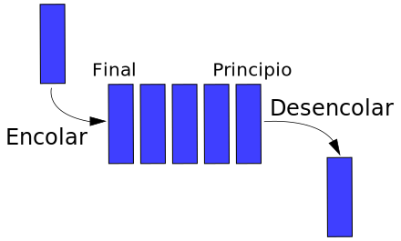

# UNIDAD 6. ESTRUCTURAS DE ALMACENAMIENTO DINÁMICAS - COLECCIONES Y MAPAS
## Índice
- [UNIDAD 6. ESTRUCTURAS DE ALMACENAMIENTO DINÁMICAS - COLECCIONES Y MAPAS](#unidad-6-estructuras-de-almacenamiento-dinámicas---colecciones-y-mapas)
  - [Índice](#índice)
  - [Introducción](#introducción)
  - [Clasificación](#clasificación)
  - [Las interfaces](#las-interfaces)
  - [Tipos de datos parametrizados o genéricos](#tipos-de-datos-parametrizados-o-genéricos)
    - [Clases con parámetros genéricos](#clases-con-parámetros-genéricos)
    - [Parámetros genéricos limitados](#parámetros-genéricos-limitados)
    - [Métodos genéricos](#métodos-genéricos)
    - [Comodines o wildcards](#comodines-o-wildcards)
    - [Cosas que no se pueden hacer con parámetros genéricos](#cosas-que-no-se-pueden-hacer-con-parámetros-genéricos)
  - [Interface collection](#interface-collection)
    - [Interface List](#interface-list)
    - [Interface Queue](#interface-queue)
    - [Clase ArrayList](#clase-arraylist)
    - [Clase LinkedList](#clase-linkedlist)
    - [Interface Set](#interface-set)
    - [Clase HashSet](#clase-hashset)
    - [clase LinkedHashSet](#clase-linkedhashset)
    - [Interface SortedSet](#interface-sortedset)
      - [Estructura en Árbol. Lista ordenada](#estructura-en-árbol-lista-ordenada)
    - [Clase TreeSet](#clase-treeset)
  - [Interface Map](#interface-map)
    - [Clases de la interfaz Map](#clases-de-la-interfaz-map)

## Introducción
__Las colecciones__ son estructuras dinámicas. Esto quiere decir que pueden aumentar o disminuir su tamaño dependiendo de los elementos que almacenan en tiempo de ejecución.

Mejora respecto a las estructuras de datos estáticas: se altera el tamaño definido en la creación y se puede alterar en tiempo de ejecución.

Todo lo que se almacena en las colecciones se denomina elemento y estos elementos pueden ser añadidos, eliminados, recorridos, evitar duplicados u ordenados dependiendo del tipo de colección que utilicemos.

La librería de Java Collections Framework (JCF) (__java.util__) está compuesta de:
* __Colecciones__: Interfaces que identifica una colección de objetos independiente de la implementación
* __Contenedores__: Implementaciones de colecciones. Serán contendedores ArrayList, HashSet, LinkedList, etc. Se implementarán las colecciones ordenadas, desordenadas, sin duplicidad de elementos o sin ella.
* __Algoritmos__: que trabajan sobre las colecciones, de un modo polimórfico.
  
El número de interfaces, clases abstractas y clases disponibles para la creación de colecciones es espectacular. Poco a poco iremos viendo las principales.

## Clasificación

La clasificación en dos grupos:
* Lineales

  

* No lineales

  

## Las interfaces 

__Las estructuras dinámicas__ se implementan __por medio de interfaces__.  Una interfaz en java es una colección de métodos abstractos y propiedades constantes. En las interfaces se especifica qué se debe hacer pero no su implementación. Serán las clases que implementen estas interfaces las que describen la lógica del comportamiento de los métodos.


## Tipos de datos parametrizados o genéricos
__Las colecciones__ trabajan con tipos de __datos genéricos__.

El uso de los tipos genéricos obedece a la necesidad de disponer de clases, interfaces o métodos que se puedan usar con muchos tipos de datos distintos, pero haciendo __comprobaciones de tipo en tiempo de compilación__.

Ejemplos son los métodos de comparación, compareTo() y compare(), que aparecen en las interfaces Comparable y Comparator respectivamente.

Ambas interfaces están pensadas para comparar objetos de cualquier clase.

Implementamos Comparable para cualquier clase de objetos que insertemos en cualquier colección que pretendamos ordenar.

__Implementando genéricos__ si hay __error__ se manifiesta durante __la compilación__

```java
class Estudiante implements Comparable<Estudiante>{

    public int compareTo( Estudiante o){
        return this.nombre.compareTo(o.nombre);
    }
}
```
__Sin implementar parámetros genéricos__ si hay __error__ con el tipo de dato del parámetro no se manifiesta durante la compilación, sino __en tiempo de ejecución__, lanzando una excepción

<div class="page"/>

```java
	class Estudiante implements Comparable{

       public int compareTo( Estudiante o){
        return this.nombre.compareTo(o.nombre);
    }
}
```
### Clases con parámetros genéricos
Ejemplo:una clase Contenedor que sirva para todo tipo de objetos y que a su vez permita en cada caso ese tipo => __Una clase contenedor con tipo genérico T__

__T representa el tipo de datos__ que va usar la clase en cada declaración concreta, y __tiene que ser clase o interfaz, nunca un tipo primitivo__.
```java
public class Contenedor<T>{
    // atributo
    private T objeto;
    // se inicializa a null contenedor vacío
    public Contenedor(){

    }
    // agregar un objeto
    public void guardar (T nuevo){
        objeto=nuevo;
    }
    // sacar el objeto
    public T extraer(){
        T res=objeto;
        // el contenedor vuelve a estar vacío
        objeto=null;
        return res;
    }
}
```
Podemos utilizarlo para crear un Contenedor para enteros, para numeros reales o de clientes. La sintaxis es:
```java
//contenedor de enteros
Contenedor<Integer> contenedor1= new Contenedor<Integer>();
//otra sintaxis 
Contenedor<Integer> contenedor2= new Contenedor<>();
// contenedor de reales
Contenedor<Double> contenedor3= new Contenedor<>();
//contenedor de clientes, partimos que tenemos una clase cliente
Contenedor<Cliente> contenedor4= new Contenedor<>();
```

:computer: Hoja de ejemplos (EjemploGenerico)

[Enlace a la API Java 18. Interfaz Comparable](https://docs.oracle.com/en/java/javase/18/docs/api/java.base/java/lang/Comparable.html)

[Enlace a la API Java 18. Interfaz Comparator](https://docs.oracle.com/en/java/javase/18/docs/api/java.base/java/util/Comparator.html)

En general, se usa la letra T para el tipo genérico, U para arrays, E para elementos de colecciones, K para claves, V para valores o N para números.

Ya hemos comentado la intefaz Comparable de java. Otra interfaz que ha sido redefinida con tipos genéricos es __Comparator__.

Ejemplo: Implementar una clase comparadora para ordenar los estudiantes por orden alfabético de nombres.
```java
public class ComparaNombres  implements Comparator<Estudiante>{
    @override
    public int compare(Estudiante e1, Estudiante e2){
        return e1.getNombre().compareTo(e2.getNombre());
    }
}
```
Ejemplos de interfaces de java implementadas con genéricos
```java
public interface Comparable<T>{
    int compareTo(T o);
}
public interface Comparator<T>{
    in compare( T o1, T o2);
}

```
### Parámetros genéricos limitados
A veces las operaciones solo tienen sentido para determinados tipos de T. Por ejemplo, si queremos hacer una operación aritmética entre valores de tipo T, entonces no puede ser String, ni Estudiante.

La idea es que se limiten los posibles tipos de T a una determinada clase claseLimite y todas sus subclases ( si claseLimite es un límite superior) o todas sus superclases( si claseLimite es un límite inferior)

 

* Si claseLimite es un límite superior, definiremos:
  
```java
class nombreClase <T extends claseLimite>
```
Significa que T puede ser claseLimite o cualquiera de sus subclases

* Si clase claseLimite es un limite inferior, definiremos:
  
```java
class nombreClase <T super claseLimite>
```
Significa claseLimite y todas sus superclases

### Métodos genéricos

Normalmente los métodos genéricos aparecen implementados dentro de clases o interfaces genéricas. Sin embargo, dentro de cualquier clase, podemos implementar métodos con sus propios parámetros genéricos.

<div class="page"/>

Ejemplo, vamos a implementar un método que nos devuelve el número de elementos null que hay en un vector que se le pasa como argumento.
El tipo U del vector es genérico, y se declara en la definición del método, justo antes del tipo de dato devuelto.

```java
public static <U> int numeroDeNulos( U[] vector){
    int cont=0;
    for (U elemento: vector){
        if (elemento==null){
            cont++
        }
    }
    return cont;
}
```
### Comodines o wildcards
Los comodines se suelen usar en la declaración de atributos, variables locales o parámetros pasados a un método.
__Un comodín se representa con un símbolo ? Significa cualquier tipo__

Ejemplo

```java
Contenedor<?> contenedor;
```
Hemos declarado una variable contenedor de tipo Contenedor cuyo parámetro genérico asociado puede ser cualquiera.

Esto significa que todos los objetos Contenedor pertenecen a alguna subclase de Contenedor<?>, como por ejemplo un contenedor de enteros o contenedor de cliente declarados anteriormente.

Un comodín también se puede usar en la clase limite superior

```java
<? extends T>;
```
Significa cualquier clase que herede de T, incluyendo a esta.

Un comodín para limitar una clase limite inferior

```java
<? super T>;
```
Significa T o cualquier superclase de T

<div class="page"/>

Ejemplo 

```java
Contenedor <? extends Number> contenedor;
```
Estamos declarando una variable de tipo Contenedor de tipo numérica, es decir, puede referenciar a un objeto de tipo Integer, o de tipo Double, etc...Todas son subclases de Number.

### Cosas que no se pueden hacer con parámetros genéricos

1. Los tipos genéricos nunca pueden ser primitivos. Cuando nos hagan falta, usaremos las clases envoltorio Integer, Character …
2. No se pueden crear instancias de tipo genérico, como en new T();
3. No se pueden crear arrays de tipos genéricos, como en new T[10]. Cuando se necesiten se pasan como argumento al método donde van a ser usadas.
4. Tampoco se pueden crear tablas de clases parametrizadas, como new Contenedor<Integer>[5];
5. No se pueden usar excepciones genéricas.

:computer: Hoja de ejercicios 1 genéricos

## Interface collection
La interface fundamental de trabajo con estructuras dinámicas es java.util.Collection. Es la raíz del funcionamiento de las colecciones y representa objetos que tienen la capacidad de almacenar listas de otros objetos. 

Están implementadas con dos versiones
* Utilizando **Genericidad**: Collection\<E\>
* Utilizando **Polimorfismo**: Collection

La interfaz principal es Collection, y tiene a su vez tres interfaces hijas. Cada una de ellas representa distintos tipos de colecciones que funcionan de determinada manera.
  


* Las listas son lineales, hay posibilidad de ordenarlas, y sus elementos pueden estar repetidos.
* Los conjuntos (set) no soportan elementos repetidos y hay posibilidad de ordenar sus elementos.
* Las colas (queue) funcionan como su nombre indica, el primer elemento que llega es el primer elemento que sale, (como en la cola del cine).

Los métodos más importantes de la interfaz Collection son los siguientes:
  
| Nombre | Uso | 
| ------------- | ------------- |
|size|Devuelve el número de elementos|
|add|Inserta un objeto. Devuelve true si lo inserta|
|constains|Indica si un objeto pertenece a la colección|
|remove|Elimina una referencia del objeto si existe. Devuelve true si lo realiza|
|clear|Limpia todas las referencias|
|iterator|Devuelve una implementación de un iterado|
|addAll|Añade todos los elementos de la colección pasada como argumento|
|containsAll|Indica si todos los objetos pertenecen a la colección|
|removeAll|Elimina todas las referencias a los objetos si existiesen|
|reatainAll|Elimina todas las referencias a los objetos no pasados|

Existen dos modos para recorrer las colecciones:

* Bucle for-each

```java
  for( String elemento:collection){
    system.out.println(elemento);
  }   
```      

* Mediante iteradores
  
```java
Iterator <String> iterator = collection.iterator();
while (iterator.hasNext()){
    String cadena=it.next();
    system.out.println(cadena);
}
```
:computer: Hoja de ejemplos (EjemploCollection)

 ### Interface List

* Los elementos tienen posición
* Permite __duplicados__
* También permite búsqueda e iteraciones
* Las implementaciones más conocidas son __ArrayList y LinkedList__.
* Si no sabemos cual escoger, utilizaremos siempre ArrayList.


* Inclusión de los genéricos 
* Permiten parametrizar el tipo 
* Operador diamond
  
  <div class="page"/>

```java  
	List<String> cars = new ArrayList<String>();
//Nos ahorra indicar dos veces el tipo A partir de Java 1.7
	List<String> cars = new ArrayList<>();
```

| Nombre | Uso |
| ------------- | ------------- |
|add|Inserta un objeto. Devuelve true si lo inserta|
|remove|Elimina una referencia del objeto si existe. Devuelve true si lo realiza|
|set|Sustituye el elemento número índice por uno nuevo. Devuelve además el elemento antiguo|
|get|Obtiene el elemento almacenado en la colección en la posición que indica el índice|
|indexOf|Devuelve la posición del elemento. Si no lo encuentra, devuelve -1|
|lastIndexOf|devuelve la posición del elemento comenzando a buscarle por el final. Si no lo encuentra, devuelve -1|

### Interface Queue

* Una cola es una estructura de datos de tipo FIFO (First input, First Output)
* Una cola está diseñado para que los elementos sean insertados al final de la cola, y los elementos eliminados sean los del principio de la cola.
* se implementa para gestionarla con la clase __LinkedList__
```java
//Declarar una Queue:
Queue<nombreClase> nombreCola;
//Crear una Queue :
nombreCola = new LinkedList();
//Como suele ser habitual, se puede declarar la lista a la vez que se crea:
Queue<nombreClase> nombreCola = new LinkedList();
```

| Nombre | Uso |
| ------------- | ------------- |
|add|Inserta elemento en la cola. Devuelve true si lo inserta|
|peek|Devuelve el elemento pero no borra la cabeza de la cola|
|element|Como la anterior pero lanza una excepción si la cola esta vacía|
|poll|Devuelve y elimina la cabeza de la cola|
|remove|Como al anterior pero lanza una excepción si está vacía|

<div class="page"/>

### Clase ArrayList

Implementa __la interface List__ y posee 3 constructores:
```java
//constructor por defecto, crea un Arraylist vacío
ArrayList();
//Crea una lista con una capacidad inicial indicada por parámetro
ArrayList(int capacidadInicial)
//Crea una lista a partir de los elementos de la colección pasada por parámetro
ArrayList( Collection| Collection<E> collection)
```
Nos permitirá implimentar cualquier tipo de listas


### Clase LinkedList

Implementa __las interfaces List y Queue__. Tiene métodos que permiten crear listas de adición tanto por delante como por detrás (listas dobles). Desde esta clase es sencillo implementar estructuras en forma de pila o de cola.

| Nombre | Uso |
| ------------- | ------------- |
|getFirst|Obtiene el primer elemento de la lista|
|getLast|Obtiene el último elemento de la lista|
|addFirst|Añade el objeto al principio de la lista|
|addLast|Añade el objeto al final de la lista|
|removeFirst|Borra el primer elemento|
|removeLast|Borra el último elemento|

Los métodos están pensados para que las listas creadas mediante objetos __LinkedList__ sirven para añadir elementos por la cabeza o la cola, pero en ningún caso por el interior. 

En el caso de __implementar pilas__, los nuevos elementos de la pila se añadirían por la cola (mediante __addLast__) y se obtendrían por la propia cola (__getLast, removeLast__). 


En el caso de __implementar colas__,los nuevos elementos se añaden por la cola, pero se obtienen por la cabeza (__getFirst, removeFirst__).



:computer: Hoja de ejemplos (Ejemplo1 - colecciones, Ejemplo2 -listas, Ejemplo3 - listas de objetos ordenadas)

:computer: Hoja de ejercicios de colecciones 1

:computer: Hoja de ejercicios de colecciones 2

### Interface Set

La interfaz __Set__ representa una repetición de elementos que __no pueden estar duplicados__

Hereda de la interface Collection y, por tanto, posee los mismos métodos. La diferencia está en el uso de duplicados. 

Es el __método equals__ el que se encarga de determinar __si dos objetos son duplicados__ en la lista (habrá que redefinir este método para que funcione adecuadamente). 


Listas:
* __HashSet__: Conjunto desordenado
* __LinkedHashSet__: Conjunto desordenado que guarda el orden de inserción (mediante una lista enlazada)
* __TreeSet__: Conjunto ordenado

### Clase HashSet

Implementa __listas sin duplicados__.
Tiene los métodos de la __interfaz Collection__ 
__Internamente una tabla de tipo hash__. Esas tablas asocian claves a conjuntos de valores.
La naturaleza de las tablas hash hace que cuando se crean listas HashSet, no habrá valores duplicados, pero en absoluto se garantiza el orden. Es decir, cada vez que llega un valor único al array se añade en una posición del mismo (la siguiente que esté libre), si llega otro con el mismo valor se añade a la lista de esa celda del array. 


>Pero ¿cómo compara Java los objetos de la lista para saber si son iguales? 

* Utiliza el __método equals__ heredado de la clase base Object. Por ello es necesario que las clases de los objetos que se almacenarán en la tabla definan ese método. 
* Definir también el método heredado __hashCode__. La razón es que es el hashCode es el código pensado para este tipo de lista, de hecho es el identificador en una lista HashSet, por ello los objetos que consideremos iguales en contenido deben devolver el mismo hashCode, es decir, el mismo número entero. 
  
### clase LinkedHashSet

Se trata de una clase heredera de la anterior con los mismos métodos y funciones, pero que consigue mantener el __orden en el que los datos fueron insertados__.
Sigue necesitando __hashCode y equals__ en la clase.

:computer: Hoja de ejemplos (Ejemplo 4- HashSet y LinkedHashSet)

:computer: Hoja de ejercicios de colecciones 3

### Interface SortedSet
La interfaz SortedSet es la encargada de definir __una estructura en arbol__. 
Esta interfaz deriva de __Collection__ y añade estos métodos:

| Nombre | Uso |
| ------------- | ------------- |
|first|Obtiene el primer elemento del árbol(el más pequeño)|
|last|Obtiene el último elemento del árbol(el más grande)|
|headSet|Obtiene un SortedSet que contendrá todos los elementos menores que el objeto o|
|tailSet|Obtiene un SortedSet que contendrá todos los elementos mayores que el objeto o|
|subSet|Devuelve la posición del elemento en el árbol (-1 significa que no lo ha encontrado)|

#### Estructura en Árbol. Lista ordenada
Un árbol es una estructura en la que los datos se organizan en nodos los cuales se relacionan con dos o más nodos. En general se utilizan para ordenar datos y en ese caso de cada nodo sólo pueden colgar otros dos de modo que a la izquierda cuelgan valores menores y a la derecha valores mayores. 

Al recorrer esta estructura, los datos aparecen automáticamente en el orden correcto. La adición de elementos es más lenta, pero su recorrido ordenado es mucho más eficiente. 


### Clase TreeSet

Se trata de la clase que se utiliza prioritariamente para conseguir __árboles ordenados__ ya que implementa la __interfaz SortedSet__. 

El problema es que los objetos tienen que poder ser comparados para determinar su orden en el árbol. Esto implica implementar __la interfaz Comparable__ de Java (está en java.lang).

Esta interfaz define el __método compareTo__ que utiliza como argumento un objeto a comparar y que devuelve 0 si los objetos son iguales, un número positivo si el primero es mayor que el segundo y negativo en caso contrario. 

Con lo cual __los objetos a incluir en un TreeSet deben implementar Comparable y esto les obliga a redefinir el método compareTo__

:computer: Hoja de ejemplos (Ejemplo 5- TreeSet)

:computer: Hoja de ejercicios de colecciones 4

<div class="page"/>

## Interface Map

Representa una estructura de datos para almacenar pares "clave/valor“.
Para cada clave, solo tiene un valor.

principales métodos
```java
nombreMap.size();//Devuelve el número de elementos del Map
nombreMap.isEmpty();// Devuelve true si no hay elementos en el Map y false si si los hay
nombreMap.put(K clave, V valor); //Añade un elemento al Map
nombreMap.get(K clave);//Devuelve el valor de la clave que se pasa como parámetro o null si la clave no existe
nombreMap.clear();//Borra todos los componentes del Map
nombreMap.remove(K clave);//Borra el par clave/valor de la clave que se pasa como parámetro
nombreMap.containsKey( K clave);//Devuelve true si en el Map hay una clave que coincide con K
nombreMap.ContainsValue(V valor); //Devuelve true si en el Map hay un valor que coincide con V
nombreMap.values();// Devuelve una colección con los valores el Map

```
### Clases de la interfaz Map

* __HashMap__: Los elementos que inserta en el map no tendrán un orden específico. No aceptan claves duplicadas ni valores nulos. 

* __TreeMap__: El Mapa lo ordena de forma "natural". Por ejemplo, si la clave son valores enteros, los ordena de menor a mayor.
   
* __LinkedHashMap__: Inserta en el Map los elementos en el orden en el que se van insertando; es decir, que no tiene una ordenación de los elementos como tal, por lo que esta clase realiza las búsquedas de los elementos de forma más lenta que las demás clases. 

:computer: Hoja de ejemplos (Ejemplo 6- de las clases de la interfaz Map)

:computer: Hoja de ejercicios de colecciones 5

:computer: Hoja de ejercicios de colecciones 6 repaso
