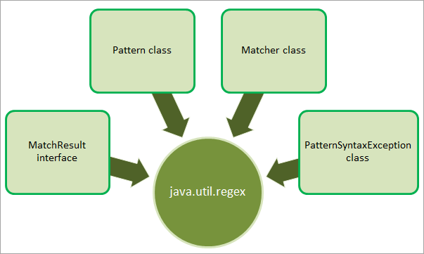

# UNIDAD 6. EXPRESIONES REGULARES

## Índice
- [UNIDAD 6. EXPRESIONES REGULARES](#unidad-6-expresiones-regulares)
  - [Índice](#índice)
  - [Introducción](#introducción)
  - [Clases del paquete regex](#clases-del-paquete-regex)
  - [El método matches en la clase String](#el-método-matches-en-la-clase-string)
  - [Crear expresiones regulares en java](#crear-expresiones-regulares-en-java)
    - [Cuantificadores para una expresión regular](#cuantificadores-para-una-expresión-regular)
    - [Metacaracteres en una expresión regular](#metacaracteres-en-una-expresión-regular)
    - [Ejemplos de expresiones regulares](#ejemplos-de-expresiones-regulares)

## Introducción 

Las expresiones regulares son un gran aliado a la hora de buscar y reemplazar contenido textual que simplifica enormemente la búsqueda y sustitución de términos variables.

¿Qué es una expresión regular en java?

Podemos definir una expresión regular como una secuencia de carácteres que forman una __secuencia o patrón__ que puede ser automatizada de alguna manera.

Por ejemplo, dentro de un texto queremos eliminar todas las palabras que sean «la» podemos usar un patrón para eliminarlas. Una expresión regular nos va a permitir buscar o reemplazar una secuencia. 

A la expresión regular en Java que se abrevia como __regex__. Es una expresión que se utiliza para definir un patrón de búsqueda de cadenas.

El lenguaje Java no proporciona ninguna clase incorporada para expresiones regulares. Pero, podemos trabajar con expresiones regulares importando el paquete __java.util.regex__.

<div class="page"/>

## Clases del paquete regex
El paquete java.util.regex proporciona una interfaz y tres clases como se muestra a continuación:



* Matcher: esta clase nos permite hacer match sobre la secuencia de caracteres que nos define el Pattern.
* MatchResult: el resultado de la operación al hacer match.
* Pattern: es la representación de la expresión regular.
* PatternSyntaxException: lanza una Unchecked Exception para indicar un error de expresion en el patrón.

Ejemplo: encontrar cualquier ocurrencia de la palabra prueba en una sentencia:

```java
import java.util.regex.Matcher;
import java.util.regex.Pattern;

public class Main {
  public static void main(String[] args) {
    Pattern pattern = Pattern.compile("prueba", Pattern.CASE_INSENSITIVE);
    Matcher matcher = pattern.matcher("es una Prueba!");
    boolean matchFound = matcher.find();
    if(matchFound) {
      System.out.println("Match encontrado");
    } else {
      System.out.println("Match no encontrado");
    }
  }
}
```
<div class="page"/>

## El método matches en la clase String

La clase String proporciona diferentes métodos para realizar operaciones con expresiones regulares, siendo la más simple la operación de concordancia. El método **matches** recibe una cadena que especifica la expresión regular, igualando el contenido del objeto String que llama al método con la expresión regular. Este método devuelve un booleano indicando si ha habido concordancia o no.

El método matches de la clase String es equivalente a utilizar el método matches de la clase Pattern. Vemos un ejemplo para ver la equivalencia.

```java
import java.util.regex.Pattern;

public class Main {
    public static void main(String[] args){
        String nombre;
        nombre="Programacion";
        //Comprobación con matches de String
        if(nombre.matches("[A-Z][a-zA-Z]*")){
            System.out.println("Nombre correcto");
        }else{
            System.out.println("No cumple el formato.");
        }
        //Misma comprobación con matches de Pattern
        if(Pattern.matches("[A-Z][a-zA-Z]*", nombre)){
            System.out.println("Nombre correcto");
        }else{
            System.out.println("No cumple el formato");
        }
    }
}
```

## Crear expresiones regulares en java
Para crear una expresión regular haremos uso de los cuantificadores y metacaracteres. 

### Cuantificadores para una expresión regular

Tenemos caracteres especiales que nos van a indicar el número de repeticiones de la expresión, la siguiente tabla muestra los caracteres: 

| Cuantificador | Descripción | 
| ------------- | ------------- |
|n+|Encuentra cualquier string con al menos un «n»|
|n*|Encuentra cero o más ocurrencias de n|
|n?|Encuentra en el string la aparición de n cero o una vez|
|n{x}|Encuentra la secuencia de n tantas veces como indica x|
|n{x,}|Encuentra una secuencia de X tantas veces como indica n|

### Metacaracteres en una expresión regular

| Metacaracter | Descripción | 
| ------------- | ------------- |
|\||símbolo para indicar OR|
|.|Encuentra cualquier carácter|
|^|Sirve para hacer match al principio de la cadena|
|$|Hace match al final de una cadena|
|\d|Encuentra dígitos|
|\s|Busca un espacio|
|\b|Hace match al principio de una palabra|
|\uxxxx|Encuentra el carácter Unicode especificado por el número hexadecimal xxxx|

### Ejemplos de expresiones regulares

| Metacaracter | Descripción |
| ------------- | ------------- |
|[abc]|Establece la definición de la expresión, por ejemplo, la expresión escrita haría match con a, b o c|
|[abc][vz]|Establece una definición en la se hace match con a, b o c y a continuación va seguido por v o por z|
|[^abc]|Cuando el símbolo ^aparece al principio de una expresión después de [, niega el patrón definido. En este caso hace match para todo menos para la a, la b o la c|
|[e-f]|Cuando hacemos uso de -, definimos rangos. En este caso buscamos hacer match de una letra entre la e y la f|
|Y\|X|Establece un OR, encuentra la Y o la X|
|HO|Encuentra HO|

:computer: Hoja de ejemplos(Ejemplo 9 -Expresiones Regulares)

Tarea para casa: Diseña una clase Teclado con métodos estáticos donde se validen, haciendo uso de excepciones y uso de expresiones regulares, los siguientes métodos:

- IntroEntero
- IntroDouble
- IntroNombre
- IntroBoolean
- IntroFecha