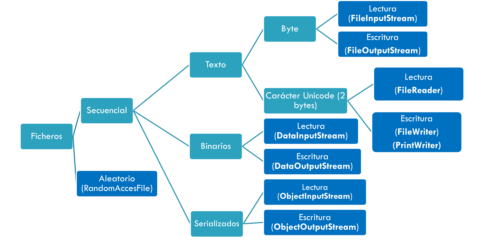
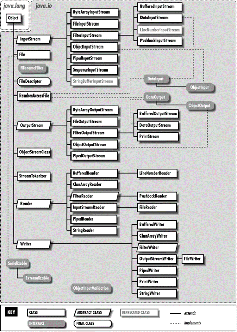
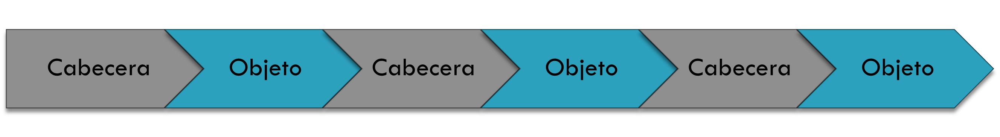

# UNIDAD 7. FICHEROS

## INTRODUCCIÓN

Un fichero es un conjunto de bits almacenado en un dispositivo. Tienen nombre y se ubican en directorios. Ese nombre es único en el directorio.

Los ficheros tienen diferentes extensiones que indican el tipo de contenido y formato.

Si el fichero almacena datos organizados en elementos, cada elemento se denomina registro y cada registro está compuesto por campos. 
La forma de agrupar los datos depende de la persona que lo diseñe.

Para trabajar con ficheros en Java existen diferentes APIs diferentes. Por un lado está la API java.io, y luego está la API java.nio y java.nio2.

## CLASES PARA TRABAJAR CON EL SISTEMA DE FICHEROS

### API java.io

Se introduce por primera vez en Java 1.0, actualmente consta de diferentes clases, pero nos vamos a centrar en la **clase File** que tiene específicamente para trabajar con el sistema de ficheros del sistema operativo:

- File: proporciona un conjunto de utilidades relacionadas con los ficheros que nos da información de los mismos y nos permite realizar acciones sobre ellos.

- Constructores para File: (Buscar en la API Java)
    - File(string directorioyFichero)
    - File(string directorio, string fichero)
    - File(File directorio, string fichero)
- Métodos importantes:	
    - getName(), getPath(), getAbsolutePath(), getParent(), length(), createNewFile(), delete(), exists(), isDirectory(), isFile(), mkdir(), mkdirs(), renameTo(),list(),listFiles()
- Otros
    - canExecute(), canRead(), canWrite(), setExecutable(boolean), isHidden(), lastModified(), setReadable(boolean), setWritable(boolean), setReadOnly()

Ejemplo: 

```java
File f=new File("prueba.txt");
if(f.exists()){
    System.out.println("El fichero existe");
}else{
    System.out.println("El fichero no existe");
}
```

**Ejemplo:** Ejemplo File

## EJERCICIOS

:computer: Hoja de ejercicios 1

### API java.nio

La API java.nio aparece para solucionar los problemas de la API java.io:

- La clase File carece de algunas funciones importantes, como un método de copia.
- También definió muchos métodos que devolvían valores booleanos, que en caso de error, se devolvía false, en lugar de lanzar una excepción, lo que dificulta saber por qué falló.
- No proporcionó un buen manejo en el soporte de enlaces simbólicos.
- Se proporciono un conjunto limitado de atributos de archivo.

Para solucionar estos problemas se introduce en Java 1.4 la API java New Input/Output (NIO) dentro del paquete java.nio. En Java 1.7 se actualiza java NIO introduciendo un nuevo paquete java.nio.file con el nombre de Java Non Blocking Input/Output (NIO2), que introduce:

- Files
- Path
- Paths
- FileSystem
- FileSystems

La **clase Paths** principalmente dispone del método estático get(Uri uri), que devuelve la instancia de un **objeto Path**. Con un objeto Path podemos gestionar la información relativa a la ruta o path de un fichero o de un directorio.
Mediante objetos de la clase  Path podemos usar métodos como:

- getFileName(): Devuelve el path extrayendo sólo nombre del elemento (fichero o carpeta)
- getParent(): Devuelve el Path de la carpeta que contiene al elemento.
- Iterator(): Aplicándose al path de una carpeta, devuelve un Iterator de objetos Path que apuntan a cada elemento contenido en la carpeta.

La **clase Files** perteneciente al paquete java.nio tiene muchos métodos estáticos para hacer múltiples operaciones con ficheros y directorios.
La clase Files tiene métodos para realizar:
1. Comprobaciones: 
    - Exists
    - notExists
    - isSameFile
    - isRegularFile
    - isReadable
    - isWritable
    - isExecutable
    - Etc.
  
**Ejemplo:** EjemploNIO

1. Manipulación de ficheros a nivel de sistema
    - Borrar (delete, deleteIfExists)
    - Copiar (copy)
    - Mover (move)
    - Para crear ficheros: Regulares (createFile) y Temporales (createTempFile)

2. La lectura y escritura con Java NIO de ficheros es mucho más sencilla:
    - Dispone de métodos que agilizan la lectura sobre ficheros de texto: readAllLines, lines, readString (desde Java 11)
    - Disponen de métodos más eficientes para instanciar flujos de caracteres
    - Para flujos de lectura (newBufferedReader). Ojo! No se trata del constructor
    - Para flujos de escritura (newBufferedWriter)
    - Disponen de métodos más eficientes para instanciar flujos de bytes
    - Para flujos de lectura (newInputStream)
    - Para flujos de escritura (newOutputStream)

3. Files también tiene métodos para trabajar con carpetas o directorios
    - Listar:	Contenido de directorios (newDirectoryStream, list, find, walk)
    - Crear: Crear un directorio (createDirectory, createDirectories) o directorio temporal (createTempDirectory)

**Ejemplo:** EjemploNIO2

## FLUJOS DE DATOS

Un **stream o flujo de datos** es un objeto que establece la conexión o vía de comunicación entre el programa y un dispositivo de entrada o de salida (teclado, pantalla, fichero, conexión de Internet). Los flujos nos permitirán introducir o sacar datos de nuestro sistema. Pueden ser de Entrada o de salida.

Ejemplos típicos:

- Lectura y escritura de ficheros.
- Entrada por teclado.
- Envío de datos por la red.
- Etc.

**Pasos para trabajar con Flujos**

1. Se abre el fichero
  - Para ello hay que crear un objeto de la clase correspondiente al tipo de fichero que vamos a manejar, y el tipo de acceso que vamos a utilizar:
  ```
	TipoDeFichero obj = new TipoDeFichero(ruta);
  ```
  - Donde ruta es la ruta de disco en que se encuentra el fichero o un descriptor de fichero válido.

2. Se utiliza el fichero
  - Para ello cada clase presenta diferentes métodos de acceso para escribir o leer en el fichero.

3. Gestión de excepciones (es opcional, pero recomendado).
  - Se puede observar que todos los métodos que utilicen clases de este paquete deben tener en su definición una cláusula throws IOException. Los métodos de estas clases pueden lanzar excepciones de esta clase (o sus hijas) en el transcurso de su ejecución, y dichas excepciones deben de ser capturadas y debidamente gestionadas para evitar problemas.
4. Se cierra el fichero y se destruye el objeto.
  - Para cerrar un fichero lo que hay que hacer es destruir el objeto. Esto se puede realizar de dos formas, dejando que sea el recolector de basura de Java el que lo destruya cuando no lo necesite (no se recomienda) o destruyendo el objeto explícitamente mediante el uso del método close() del objeto: obj.close().

**Tipos de ficheros en Java**

En Java es posible utilizar dos tipos de ficheros (de texto o binarios) y dos tipos de acceso a los ficheros (secuencial o aleatorio).



Las clases para trabajar con ficheros se encuentran en el paquete java.io, por lo que al principio del código fuente tendremos que escribir la sentencia import java.io.*;



## FICHEROS DE TEXTO

### Gestión de ficheros de texto (Byte a byte)

**Lectura de ficheros de texto byte a byte**:

La **clase InputStream** y sus hijas se utilizan para leer corrientes de datos byte a byte. Con la clase FileInputStream leemos de ficheros de texto de forma secuencial.

Presenta el método read() para la lectura del fichero. Este método se puede invocar de varias formas:

- int read(): Devuelve el siguiente carácter del fichero ó -1 si no hay más.
- int read( byte a[] ): Llena el vector a con los caracteres leídos del fichero. Devuelve la longitud del vector que se ha llenado si se realizó con éxito o –1 si no había suficientes caracteres en el fichero para llenar el vector.
- int read( byte a[], int off, int len ): Lee len caracteres del fichero, insertándolos en el vector a.

Todos ellos devuelven -1 si se ha llegado al final del fichero (momento de cerrarle).

El siguiente ejemplo mostrará por pantalla el contenido del fichero mifichero.txt
```java
int c;
FileInputStream f = null;
try {
  f = new FileInputStream("mifichero.txt");
  while ((c = f.read()) != -1) {
    System.out.print((char) c);
  }
} catch (IOException e) {
  System.out.println(e.toString());
} finally {
  if (f != null)
    try {
      f.close();
    } catch (IOException ex) {
      System.out.println("Error al cerrar el fichero.");
    }
}

```
**Ejemplo:** LeerByteaByte

**Escritura de ficheros de texto byte a byte**:

La **clase OutputStream** y sus hijas se utilizan para escribir corrientes de datos byte a byte. Con la clase FileOutputStream escribimos en ficheros de texto de forma secuencial.

Presenta el método write() para la escritura en el fichero. Presenta varios formatos:

- int write( int c ): Escribe el carácter en el fichero.
- int write( byte a[] ): Escribe el contenido del vector en el fichero.
- int write( byte a[], int off, int len ): Escribe len caracteres del vector a en el fichero, comenzando desde la posición off. 

En el siguiente ejemplo se crea el fichero “mifichero.txt’ carácter a carácter con los datos tecleados:

```java
public static void main(String[ ] args) 
{
	int c;
	FileOutputStream f=null;
	try{
		f=new FileOutputStream("mifichero.txt");
		while((c=System.in.read())!='\n')
			f.write((char)c);
	}
	catch(IOException e){
		System.out.println(e.toString());
	}
	finally{
		if(f!=null)
			try {
      f.close();
    } catch (IOException ex) {
      System.out.println("Error al cerrar el fichero.");
    }
}
```

En este otro ejemplo creamos “otrofichero.txt” byte a byte:

```java
public static void main(String[ ] args) {
  byte[ ]buffer=new byte[81];  //define una matriz 			        //buffer de  longitud 81 bytes
  int nbytes;
  FileOutputStream f=null;;
  try{
	  f=new FileOutputStream("otrofichero.txt",true);
	  nbytes=System.in.read(buffer);
	  f.write(buffer,0,nbytes); 
    //buffer=matriz que contiene los bytes
    //0= posisicon en la matriz del 1º byte que se desea escribir
    //nbytes=nº de bytes a escribir
  }
  catch(IOException e){
	  System.err.println(e.toString());
  }
  finally{
	  if(f!=null)
		  try {
      f.close();
    } catch (IOException ex) {
      System.out.println("Error al cerrar el fichero.");
    }
```

En este ejemplo hemos añadido palabra true después del nombre del fichero para que grabe a continuación, y también hemos añadido la clausula finally de la excepción para que en caso de que se haya podido abrir el fichero, al final lo cierre.

**Ejemplo:** EscribirCarACar

## EJERCICIOS

:computer: Hoja de ejercicios 2

### Gestión de ficheros de texto (Caracter a caracter)

**Lectura de ficheros de texto caracter a caracter**

La clase **Reader** y sus hijas se utilizan para leer corrientes de datos byte a byte. Podemos abrir un fichero de texto para leer usando la clase **FileReader**. Esta clase tiene métodos que nos permiten leer caracteres. Sin embargo, suele ser habitual querer las líneas completas, bien porque nos interesa la línea completa, bien para poder analizarla luego y extraer campos de ella. 

FileReader no contiene métodos que nos permitan leer líneas completas, pero sí **BufferedReader**.

Afortunadamente, podemos construir un BufferedReader a partir del FileReader de la siguiente forma:

```java
File archivo = new File ("C:\\archivo.txt");
FileReader fr = new FileReader (archivo);
BufferedReader br = new BufferedReader(fr);
...
String linea = br.readLine(); //permite leer una línea
```

Ejemplo: Mostramos por pantalla el contenido del fichero “mifichero.txt”. Para ello se leerá línea a línea todo el fichero:

```java
public static void main(String[] args) {
  FileReader fr = null;
  BufferedReader br = null;
  String linea;
  try {
    fr = new FileReader("mifichero.txt");
    br = new BufferedReader(fr);
    while ((linea = br.readLine()) != null) {
      System.out.println(linea);
    }
  } catch (IOException ex) {
    System.err.println(ex.toString());
  } finally {
    if (br != null)
			try {
        br.close();
      } catch (IOException ex) {
        System.out.println("Error al cerrar");
      }
    }
  }
```

**Escritura de ficheros de texto caracter a caracter**.

Para escribir suele ser habitual hacer uso de la clase **BufferedWriter** que contiene métodos: write(String s) que nos permiten grabar String en un fichero. Si queremos añadir al final de un fichero ya existente, simplemente debemos poner un booleano a true como segundo parámetro del constructor de **FileWriter**.

```java
public static void main(String[] args) {
  FileWriter fr = null;
  BufferedWriter br = null;
  String frase;
  Scanner e = new Scanner(System.in);
  frase = e.nextLine();
  try {
    fr = new FileWriter("otroFichero.txt", true);
    br = new BufferedWriter(fr);
    br.write(frase);
    br.write(System.lineSeparator());
  } catch (IOException ex) {
    System.err.println(ex.toString());
  } finally {
    if (br != null)
		  try {
        br.close();
      } catch (IOException ex) {
        System.out.println("Error al cerrar");
      }
  }
}
```

Una forma alternativa a escribir en un fichero línea a línea es utilizando la clase **PrintWriter** que contiene métodos: 
- print(String s)
- println(String s) 
- o de otros tipos, 

que nos permiten grabar una línea e incluye el salto de línea al final en un fichero. 

```java
public static void main(String[] args) {
  Scanner sc = new Scanner(System.in);
  PrintWriter salida = null;
  try {
    salida = new PrintWriter("datos.txt"); 
    String cadena;
    System.out.println("Introduce texto:");
    cadena = sc.nextLine(); 
    while (!cadena.equalsIgnoreCase("FIN")) {
      salida.println(cadena);  
      cadena = sc.nextLine(); 
    }
    salida.flush();
  } catch (FileNotFoundException e) {
    System.out.println(e.getMessage());
  } finally {
    salida.close();
  }
}
```

Si queremos añadir al final de un fichero ya existente, simplemente debemos poner un booleano a true como segundo parámetro del constructor de FileWriter.

```java
public static void main(String[] args) {
  Scanner sc = new Scanner(System.in);
  PrintWriter salida = null;
  try {
    salida = new PrintWriter(new FileWriter("datos.txt",true)); 
    String cadena;
    System.out.println("Introduce texto:");
    cadena = sc.nextLine(); 
    while (!cadena.equalsIgnoreCase("FIN")) {
      salida.println(cadena);  
      cadena = sc.nextLine(); 
    }
    salida.flush();
  } catch (FileNotFoundException e) {
    System.out.println(e.getMessage());
  } catch (IOException ex) {
    System.out.println(e.getMessage());
  } finally {
    salida.close();
  }
}
```

## EJERCICIOS

:computer: Hoja de ejercicios 3

## FICHEROS BINARIOS

Un fichero binario es aquel que el usuario no puede editarle directamente con un editor de texto y, cuando lo intentas abrir a través de ese medio, tiene símbolos que no se pueden leer directamente.

Este tipoo de ficheros se utilizan cuando queremos trabajar con tipos de datos primitivos: bolean, byte, int, double,…. para después recuperarlos como tal.

El paquete java.io proporciona las clases **DataOutputStream** y **DataInputStream** que derivan de la clase **OutputStream** y **InputStream** respectivamente y actúan como filtros. Lo utilizamos de la siguiente manera:

- **DataOutputStream:**

```java
FileOutputStream f = new FileOutputStreasm ("fichero.dat");
DataOutputStream g=new DataOutputStream(f);
```

Los métodos más utilizados de esta clase son:

- writeBoolean(): Escribe un valor de tipo booleno
- writeByte(): Escribe un valor de tipo byte
- writeChar(): Escribe un valor de tipo char
- writeShort(): Escribe un valor de tipo short
- writeInt(): Escribe un valor de tipo int
- writeLong(): Escribe un valor de tipo long
- writeDouble(): Escribe un valor de tipo double
- writeFloat(): Escribe un valor de tipo float
- writeUTF(): Escribe una cadena de caracteres en formato UTF-8

- **DataInputStream:**

```java
FileInputStream f = new FileInputStreasm ("fichero.dat");
DataIntputStream g=new DataInputStream(f);
```

Sus métodos más utilizados son:
- readBoolean(): Devuelve un valor de tipo booleno
- readByte(): Devuelve un valor de tipo byte
- readChar(): Devuelve un valor de tipo char
- readShort(): Devuelve un valor de tipo short
- readInt(): Devuelve un valor de tipo int
- readLong(): Devuelve un valor de tipo long
- readDouble(): Devuelve un valor de tipo double
- readFloat(): Devuelve un valor de tipo float
- readUTF(): Devuelve una cadena de caracteres en formato UTF-8

Para este tipo de ficheros, primero se crean a través de un programa en Java, escribiendo los datos que se necesiten según las características del ejercicio. Vemos un ejemplo donde se crea un fichero donde se guarda el nombre y edad de una persona.

```java
public static void crear(File fichero) {
  String nombre;
  int edad;
  FileOutputStream f = null;
  DataOutputStream fd = null;
  boolean resp;
  try {
    f = new FileOutputStream(fichero); 
    fd = new DataOutputStream(new BufferedOutputStream(f));    
    do {
      nombre = Teclado.IntroTexto("Introduce nombre: ");
      edad = Teclado.IntroEntero("Introduce edad: ");
      //lo grabamos en el fichero
      fd.writeUTF(nombre);
      fd.writeInt(edad);
      resp = Teclado.IntroBoolean("Otro registro: ");
    } while (resp);
  } catch (IOException ex) {
    System.out.println("error " + ex.toString());
  } finally {
    if (fd != null) {
      try {
      fd.close();
    } catch (IOException ex) {
      System.out.println("Error al cerrar el fichero.");
    }
  }
}
```

Una vez creado el fichero, se puede leer el contenido de dicho fichero. Para ello, la lectura de los datos del fichero ha de ser en el mismo orden y el mismo tipo de datos que como fue creado.

```java
public static void leer(File fichero) throws IOException {
  String nombre;
  int edad;
  FileInputStream f = null;
  DataInputStream fd = null;
  boolean fin = false;
  try {
    //creamos un flujo hacia el fichero
    f = new FileInputStream(fichero);
    fd = new DataInputStream(new BufferedInputStream(f));
    do {
      nombre = fd.readUTF();
      edad = fd.readInt();
      System.out.println("Nombre = " + nombre);
      System.out.println("Edad = " + edad);
    } while (!fin);
  } catch (EOFException eof) {
    fin = true;
  } catch (IOException ex) {
    System.out.println("error " + ex.toString());
  } finally {
    if (fd != null) {
    fd.close();
    }
  }
}
```

## EJERCICIOS

:computer: Hoja de ejercicios 4

:computer: Hoja de ejercicios 5

## FICHEROS DE OBJETOS. SERIALIZACIÓN

El hecho de poder guardar objetos en ficheros recibe el nombre de **Persistencia**. Para poder almacenar objetos de una clase en un fichero se necesita que la clase implemente la interfaz **Serializable**, y así los objetos se podrán guardar en ficheros. La interfaz Serializable no tiene ningún método para implementar, pero es obligatorio implementarlo para poder guardar objetos en un fichero.

Los flujos que se utilizan para la lectura y escritura de ficheros de objetos son **ObjectInputStream** y **ObjectOutputStream**.

Los métodos a utilizar son:

- public Object readObject();
- public void writeObject(Object obj);

Vemos un ejemplo. Empezamos con la clase Coche:

```java
public class Coche implements Serializable {

    private String marca;
    private double velocidad;
    private int gasolina;

    public Coche(String marca, double velocidad, int gasolina) {
        this.marca = marca;
        this.velocidad = velocidad;
        this.gasolina = gasolina;

    }

    @Override
    public String toString() {
        return "Coche{" + "marca=" + marca + ", velocidad = " 
                + velocidad + ", gasolina =" + gasolina + '}';
    }
}
```

El método escribir un objeto en el fichero:

```java
public static void Escribir(File f) {
  ObjectOutputStream fo = null;
  String marca="";
  double velocidad;
  int gasolina;
  try {
    if(f.exists()){
      fo=new MiObjectOutputStream(new FileOutputStream(f,true));
    }else{
      fo = new ObjectOutputStream(new FileOutputStream(f));
    }
    marca=Teclado.pedirMarca();
    velocidad=Teclado.pedirVelocidad();
    gasolina=Teclado.pedirGasolina();
    Coche c = new Coche(marca,velocidad,gasolina);
    fo.writeObject(c);
  } catch (IOException ex) {
    System.err.println(ex.toString());
  } finally {
    if (fo != null) {
      try {
        fo.close();
      } catch (IOException ex) {
        System.out.println("Error de lectura");
      }
    }
  }
}
```

El método leer los objetos de un fichero:

```java
public static void Leer(File f) {
  ObjectInputStream os = null;
  try {
    os = new ObjectInputStream(new FileInputStream(f));
    Coche c;
    while (true) {
      c = (Coche) os.readObject();//Casting necesario 
      System.out.println(c.toString());
    }
  } catch (EOFException e) {
    System.out.println("Se alcanzó el final");
  } catch (ClassNotFoundException e) {
    System.out.println("Error el tipo de objeto no es compatible");
  } catch (FileNotFoundException e) {
    System.out.println("No se encontró el archivo");
  } catch (IOException e) {
    System.out.println("Error " + e.getMessage());
  } finally {
    if (os != null) {
      try {
        os.close();
      } catch (IOException ex) {
        System.out.println("Error al cerrar");
      }
    }
  }
}
```

Hasta aquí funciona todo bien si únicamente queremos escribir una única vez en el fichero. Cada vez que se crea un objeto ObjectOutputStream y escribimos en él, se escribe en el fichero una cabecera (para identificar el tipo de objeto serializado).
Si llamamos varias veces a nuestro método escribirCoche anterior nos escribirá algo así en el fichero:



Al leer del fichero intentará realizar lo siguiente:


El primer objeto lo leerá bien, pero al intentar leer el 2º, cogerá una cabecera, intentará convertirlo a objeto y dará un error.

¿Se os ocurre alguna solución? Posiblemente lo más sencillo sea mirar si existe el fichero. En caso que no exista, que cree cabeceras
Si ya existe, que escriba únicamente objetos, sin cabeceras.

Para la opción 1, en caso de que no exista el fichero, crearemos un objeto ObjectOutputStream.
Para la opción 2, en caso que el fichero ya exista, crearemos un objeto ObjectOutputStreamSinCabeceras. Es una clase que tendremos que añadir a nuestros ejercicios que hereda de ObjectOutputStream, y lo único que hace es sobreescribir el método que imprime las cabeceras en el fichero. Si dejamos ese método vacío, no escribirá ninguna cabecera en el fichero.

Vemos el ejercicio completo en el siguiente ejemplo.

**Ejemplo:** EjemploSerializable

## EJERCICIOS

:computer: Hoja de ejercicios 6

:computer: Hoja de ejercicios 7


