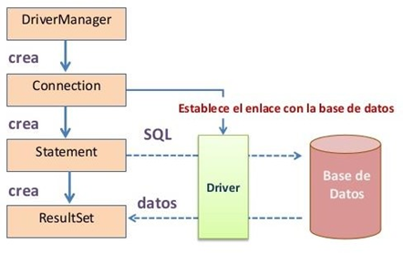
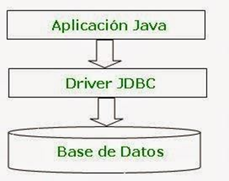
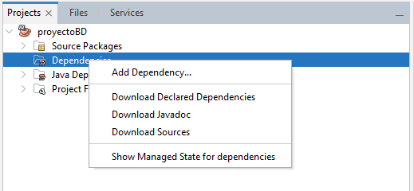
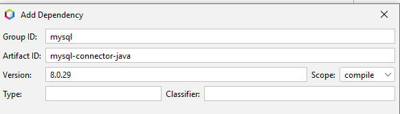
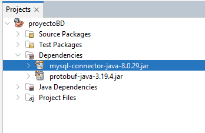
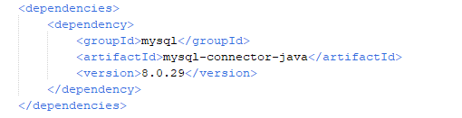
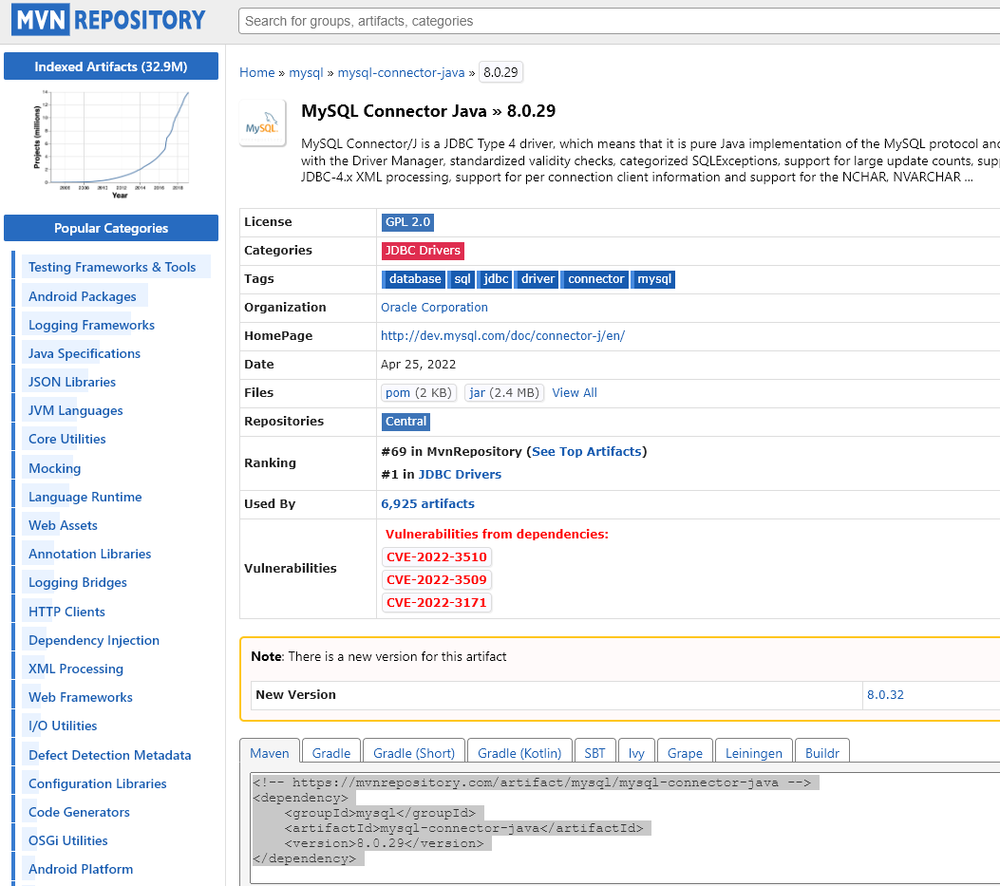

# UNIDAD 8. GESTION DE BASES DE DATOS RELACIONALES

- [UNIDAD 8. GESTION DE BASES DE DATOS RELACIONALES](#unidad-8-gestion-de-bases-de-datos-relacionales)
  - [INTRODUCCIÓN](#introducción)
  - [JDBC](#jdbc)
    - [COMPONENTES DEL JDBC](#componentes-del-jdbc)
  - [DRIVERS](#drivers)
  - [AÑADIR EL DRIVER AL PROYECTO JAVA MAVEN](#añadir-el-driver-al-proyecto-java-maven)
  - [PASO 1 - ESTABLECER CONEXIÓN](#paso-1---establecer-conexión)
  - [PASO 2 - CREAR Y EJECUTAR SENTENCIAS](#paso-2---crear-y-ejecutar-sentencias)
  - [PASO 3 - RECUPERAR Y PROCESAR LOS RESULTADOS](#paso-3---recuperar-y-procesar-los-resultados)
    - [SENTENCIAS PREPARADAS](#sentencias-preparadas)
    - [PATRÓN  DAO( OBJETO DE ACCESO A DATOS)](#patrón--dao-objeto-de-acceso-a-datos)
  - [EJERCICIOS](#ejercicios)


## INTRODUCCIÓN
Para establecer una conexión a una base de datos relacional en Java, primero debes hacer uso de __JDBC__. 
__JDBC__ es un conjunto de clases e interfaces que permiten a los desarrolladores Java acceder y manipular bases de datos relacionales.

Para realizar la conexión a una base de datos desde Java necesitas hacer uso de __JDBC__ y un __driver__ específico para cada SGBD que se utilice. Una vez establecida la conexión ya puedes interrogar la BD con cualquier comando SQL (select, update, create, etc.)

## JDBC

* __JDBC__ Son las siglas de Java Database Connectivity
* Consta de un conjunto de clases e interfaces Java que nos  permiten acceder de una forma genérica a las bases de  datos independientemente del proveedor del SGBD
* Se encuentra dentro del paquete java.sql
* JDBC nos permite escribir aplicaciones Java para gestionar  las siguientes tareas con una base de datos relacional:
  * __Conectarse__ a la base de datos (local o remota)
  * __Enviar consultas e instrucciones de actualización__ a la base de  datos
  * __Recuperar y procesar los resultados__ recibidos de la base de datos en respuesta a las consultas

### COMPONENTES DEL JDBC
* El gestor de los drivers (java.sql.DriverManager)
* La conexión con la base de datos (java.sql.Connection)
* La sentencia a ejecutar (java.sql.Statement)
* Sentencias preparadas (java.sql.PreparedStatement)
* El resultado (java.sql.ResulSet)



## DRIVERS

* Llamamos __Drivers__ al conjunto de clases que implementan las interfaces JDBC
* El driver proporciona la comunicación entre la aplicación Java y la base de datos
* Cada tipo de bases de datos (Oracle, MySQL,  PostGreSQL, etc) tienen su propio driver.
* Los drivers los proporcionan los fabricantes de las  bases de datos. Normalmente se descarga desde la  página web del fabricante.
  
Por lo tanto, el primer paso para trabajar con bases de  datos desde Java es conseguir el driver adecuado. En nuestro caso vamos a cargar el driver que requiere para conectar con la [base de datos de MySQL](https://dev.mysql.com/downloads/connector/j/). 



## AÑADIR EL DRIVER AL PROYECTO JAVA MAVEN

* El JAR del conector para esta versión se denomina mysql-connectorjava-8.0.29.jar
* Abrir el proyecto e ir al directorio __Dependencies__
* Y situados en ese directorio con botón derecho aparece la opción





* Una vez añadido aparece




* En el fichero POM.XML, aparece la dependencia añadida
  


 
Otra opción de instalación es simplemente añadir directamente en el POM.XML la dependencia desde el [repositorio de maven el conector](https://mvnrepository.com/artifact/mysql/mysql-connector-java/8.0.29) 




## PASO 1 - ESTABLECER CONEXIÓN
El código para conectarnos a la BD, previamente arrancado el SGBD y creada la BD que sigue el patrón Singleton:

__El patrón Singleton__ en Java es un patrón de diseño que garantiza que tan solo exista un objeto de su tipo y proporciona un único punto de acceso a él para cualquier otro código.

```java
/*
 * sigue el patrón Singleton para la conexión a la base de datos
 */
package cic.ejemplos09.ejemplo1;

import java.sql.Connection;
import java.sql.DriverManager;
import java.sql.ResultSet;
import java.sql.SQLException;
import java.sql.Statement;
import java.util.Properties;

/**
 *
 * @author cic
 */
public class AccesoBaseDatos {

    private Connection conn = null; //atributo conexión
    // constantes a definir
    private static final String BD = "ejemplo";
    private static final String USUARIO = "conexion";
    private static final String CLAVE = "";
    private static final String URL = "jdbc:mysql://localhost:3306/" + BD;

    private AccesoBaseDatos() {
        
        try {
            Properties properties = new Properties();
            properties.setProperty("user", USUARIO);
            properties.setProperty("password", CLAVE);
            properties.setProperty("useSSL", "false");
            properties.setProperty("autoReconnect", "true");
            conn = (Connection) DriverManager.getConnection(URL, properties);
            if (conn == null) {
                System.out.println("Error en conexion");
            } else {
                System.out.println("Conexion correcta a: " + URL);
            }
        } catch (SQLException ex) {
            // handle any errors
            System.out.println("SQLException: " + ex.getMessage());
            System.out.println("SQLState: " + ex.getSQLState());
            System.out.println("VendorError: " + ex.getErrorCode());
        }
    }

    public static AccesoBaseDatos getInstance() {
        return AccesoBaseDatosHolder.INSTANCE;
    }

    private static class AccesoBaseDatosHolder {

        private static final AccesoBaseDatos INSTANCE = new AccesoBaseDatos();
    }

    // método obtener la conexión
    public Connection getConn() {
        return conn;
    }
    
    // método para cerrar la conexión a la bd
    public boolean cerrar() {
        boolean siCerrada = false;
        try {
            conn.close();
            if (conn.isClosed()) {
                siCerrada = true;
            }
        } catch (SQLException sqe) {
            System.out.println("Se produjo un error en el cierre");
        }
        return siCerrada;
    }

```
para acceder a la conexión de la base de datos:
```java
Connection conn = AccesoBaseDatos.getInstance().getConn();
```

## PASO 2 - CREAR Y EJECUTAR SENTENCIAS

Para enviar sentencias SQL al controlador de la BD se utiliza el  __objeto Statement__ y el __método createStatement__, suministrando el método SQL con la sentencia a ejecutar.

```java
Statement sentencia=conn.createStatement();
```
Para sentencias insert, delete, update, create, modify o drop , el  método a utilizar es __executeUpdate()__

```java
String sql= "..."; // sentencia sql de insert,update, delete o create,modify, drop
Statement sentencia= con.createStatement();
sentencia.executeUpdate (sql);
```
Ejemplos:

1 Nos crea la tabla ejemplo en la BD conectada

```java
// método que crea la tabla productos
public static void crearTablas() {
        Statement sentencia = null;
        try {
            Connection conn = AccesoBaseDatos.getInstance().getConn();
            sentencia = conn.createStatement();
            // en String tabla codigo sql con el create table
            String tabla = "create table productos(\n"
                    + "  id smallint NOT NULL AUTO_INCREMENT,\n"
                    + "  nombre varchar(40) NOT NULL,\n"
                    + "  cantidad int NOT NULL,\n"
                    + "  PRIMARY KEY (`id`)\n"
                    + ") ENGINE=InnoDB AUTO_INCREMENT=12 DEFAULT CHARSET=utf8mb4 ";
            sentencia.executeUpdate(tabla);
            System.out.println("Tabla producto creada con éxito!!");

        } catch (SQLException ex) {
            System.out.println("Error al ejecutar la creacion de tabla " + ex.getMessage());
        } finally {
            try {
                if (sentencia != null) {
                    sentencia.close();
                }
            } catch (SQLException ex) {
                System.out.println("Error al cerrar la sentencia " + ex.getMessage());
            }

        }

    }

```
2 Inserta datos en la tabla creada

```java
 // insertar información en la tabla productos
   public static void insertarDatos() {
        Statement sentencia = null;
        Connection conn = AccesoBaseDatos.getInstance().getConn();
        try {
            sentencia = conn.createStatement();
            // dentro de executeUpdate codigo del insert, update o delete
            String inserta = "INSERT INTO productos"
                    + "(nombre,cantidad)"
                    + "VALUES ('melocotones',8),"
                    + "('platanos',12),('peras',3)";
            int resul = sentencia.executeUpdate(inserta);
            if (resul == 3) {
                System.out.println("Filas afectadas: " + resul);
            } else {
                throw new Exception("error no se han insertado todos los registros");
            }
        } catch (SQLException ex) {
            System.out.println("Error en la inserción de datos " + ex.getMessage());
        } catch (Exception ex) {
            System.out.println(ex.getMessage());
        } finally {
            try {
                if (sentencia != null) {
                    sentencia.close();
                }
            } catch (SQLException ex) {
                System.out.println("Error al cerrar la sentencia " + ex.getMessage());
            }
        }
    }
```
para realizar el cierre del Statement utilizamos la cláusula __finally__ para que independiente de si hay error o no se cierre correctamente.
No cerramos la conexión porque utilizamos Singleton para solo crear una conexión a la base de datos y mantenerla abierta y cerrarla solo al final de la ejecución del programa.

También podemos utilizar la funcionalidad incorpora en la cláusula try para que realice el cierre automático de sentencias

```java
// insertar información en la tabla productos

public static void insertarDatos2() {

        Connection conn = AccesoBaseDatos.getInstance().getConn();
        try ( Statement sentencia = conn.createStatement();) {
            // dentro de executeUpdate codigo del insert, update o delete
            String inserta = "INSERT INTO productos"
                    + "(nombre,cantidad)"
                    + "VALUES ('manzanas',18),"
                    + "('kiwis',22),('naranjas',23)";
            int resul = sentencia.executeUpdate(inserta);
            if (resul == 3) {
                System.out.println("Filas afectadas: " + resul);
            } else {
                throw new Exception("error no se han insertado todos los registros");
            }
        } catch (SQLException ex) {
            System.out.println("Error en la inserción de datos " + ex.getMessage());
        } catch (Exception ex) {
            System.out.println(ex.getMessage());
        }
    }

```
Como observamos en el ejemplo dentro de los paréntesis de la sentencia try incluimos las sentencias que queremos se cierren automáticamente y por lo tanto ya no requiere definir la cláusula finally.

<div class="page"/>

## PASO 3 - RECUPERAR Y PROCESAR LOS RESULTADOS

Se utiliza el __método executeQuery()__ para sentencias SELECT
```java
String sql= "....";
Statement sentencia= con.createStatement();
sentencia.executeQuery (sql);
```
* JDBC devuelve los datos en un __objeto ResultSet__, donde se almacenarán los datos obtenidos de la consulta.
* Para obtener cada uno de los datos recuperados de la consulta se usará el __método next__, que permitirá ir posicionándonos en cada una de las filas devueltas.
* Con los __métodos getXXX__ (getInt, getString, etc.) obtendremos cada uno de los campos de la fila.
  
Ejemplo

```java

   public static void mostrarDatos() {
        Statement sentencia = null;
        ResultSet rs = null;
        Connection conn = AccesoBaseDatos.getInstance().getConn();
        try {
            sentencia = conn.createStatement();
            // dentro de executeQuery Codigo de la select
            String sql = "select id,nombre,cantidad from productos";
            rs = sentencia.executeQuery(sql);
            while (rs.next()) {
                //cada columna se indica, el tipo en el get, y que posicion o 
                //que nombre tiene en el argumento
                System.out.print(rs.getInt(1) + " ");
                System.out.print(rs.getString("nombre") + " ");
                System.out.println(rs.getInt(3));
            }
        } catch (SQLException ex) {
            System.out.println("Error en la consulta " + ex.getMessage());
        } finally {
            try {
                if (sentencia != null) {
                    rs.close();
                    sentencia.close();
                }
            } catch (SQLException ex) {
                System.out.println("Error al cerrar la sentencia " + ex.getMessage());
            }
        }
    }
```
Si queremos que se realice el cierre automático de Statement y ResultSet la implementación es:

```java

public static void mostrarDatos2() {
        // dentro de executeQuery Codigo de la select
        String sql = "select id,nombre,cantidad from productos";
        Connection conn = AccesoBaseDatos.getInstance().getConn();
        try (
             Statement sentencia = conn.createStatement();  
             ResultSet rs = sentencia.executeQuery(sql);) {
            while (rs.next()) {
                //cada columna se indica, el tipo en el get, y que posicion o 
                //que nombre tiene en el argumento
                System.out.print(rs.getInt(1) + " ");
                System.out.print(rs.getString("nombre") + " ");
                System.out.println(rs.getInt(3));
            }
        } catch (SQLException ex) {
            System.out.println("Error en la consulta " + ex.getMessage());
        }
    }

```

**Ejemplo:** ejemplo01

### SENTENCIAS PREPARADAS
Las sentencias preparadas nos permiten ejecutar consultas SQL con parámetros. Las sentencias preparadas se utilizan para mejorar el rendimiento y la seguridad de las consultas SQL.

En lugar de concatenar los valores de los parámetros directamente en la consulta SQL, las sentencias preparadas permiten que los valores se pasen como parámetros separados. Esto evita la posibilidad de ataques de inyección SQL y mejora el rendimiento al permitir que la base de datos compile la consulta una sola vez y luego la reutilice con diferentes valores.

En java se utiliza __objetos PreparedStatement__ que hereda de  la clase Statement. El símbolo de interrogación __?__ se utiliza para representar __un parámetro__.

Ejemplos

1 Esta consulta puede ser llamada muchas veces con distintas cantidades

```java

  public static void getProductosCantidad(int cantidad) {
        PreparedStatement ps = null;
        ResultSet rs = null;
        Connection conn = AccesoBaseDatos.getInstance().getConn();
        String sql = "SELECT id,nombre,cantidad from productos where cantidad > ? ";    
        try {
            //Consulta preparada
            ps = conn.prepareStatement(sql);
            // indico que para el primer parámetro el valor pasado por parámetro
            ps.setInt(1, cantidad);
            rs = ps.executeQuery();
            System.out.println("Productos con cantidad > que : "
                    + cantidad + "\n");
            while (rs.next()) {
                System.out.println(rs.getString("nombre")
                        + " con cantidad: "
                        + rs.getInt(3));
            }
        } catch (SQLException ex) {
            System.out.println("error en la ejecución getProductosCantidad " + ex.getMessage());
        } finally {
            try {
                if (ps != null) {
                    rs.close();
                    ps.close();
                }
            } catch (SQLException ex) {
                System.out.println("Error al cerrar sentencia ");
            }
        }

    }
```
También podemos utilizar el cierre automático del try

```java
public static void getProductosCantidad2(int cantidad) {

        String sql = "SELECT id,nombre,cantidad from productos where cantidad > ? ";
        Connection conn = AccesoBaseDatos.getInstance().getConn();
        try ( PreparedStatement ps = conn.prepareStatement(sql);) {
            //Consulta preparada
            // indico que para el primer parámetro el valor pasado por parámetro
            ps.setInt(1, cantidad);
            try ( ResultSet rs = ps.executeQuery();) {
                System.out.println("Productos con cantidad > que : " + cantidad + "\n");
                while (rs.next()) {
                    System.out.println(rs.getString("nombre")
                            + " con cantidad: "
                            + rs.getInt(3));
                }
            }
        } catch (SQLException ex) {
            System.out.println("error en la ejecución de getProductoCantidad2 " + ex.getMessage());
        } 

    }
```
En la sentencia Try entre paréntesis no permite acciones de sustitución solo de sentencias de cerrado en este caso solo podemos cerrar automáticamente PreparedStatement en el primer try y realizar otro try anidado para cerrar automáticamente el  ResulSet

2 Esta inserción puede ser ejecutada por cada producto que queremos insertar en la base de datos

```java
 public static void insertarProductosBD(String nombre, int cantidad) {

        PreparedStatement ps = null;
        Connection conn = AccesoBaseDatos.getInstance().getConn();
        // insert preparada
        String sql = "INSERT INTO productos (nombre,cantidad) VALUES (?,?)";
        try {

            ps = conn.prepareStatement(sql);
            // indico que para el primer parámetro el valor pasado por parámetro String nombre
            ps.setString(1, nombre);
            // indico que para el segundo parámetro el valor pasado por parámetro int cantidad
            ps.setInt(2, cantidad);
            int salida = ps.executeUpdate();
            if (salida == 1) {
                System.out.println("Ha sido insertado el producto");
            }else{
                throw new Exception("Error no se ha realizado la inserción");
            }
        } catch (SQLException ex) {
            System.out.println("error en la ejecución de insertarProductoBD " + ex.getMessage());
        }catch (Exception ex){
            System.out.println(ex.getMessage());
        }
        finally {
            try {
                if (ps != null) {
                    ps.close();
                }
            } catch (SQLException ex) {
                System.out.println("Error al cerrar la sentencia ");
            }
        }
    }
```
```java
 public static void insertarProductos2BD(String nombre, int cantidad) {
        Connection conn = AccesoBaseDatos.getInstance().getConn();
        // insert preparada
        String sql = "INSERT INTO productos (nombre,cantidad) VALUES (?,?)";
        try ( PreparedStatement ps = conn.prepareStatement(sql);) {
            // indico que para el primer parámetro el valor pasado por parámetro String nombre
            ps.setString(1, nombre);
            // indico que para el segundo parámetro el valor pasado por parámetro int cantidad
            ps.setInt(2, cantidad);
            int rs = ps.executeUpdate();
            if (rs == 1) {
                System.out.println("Ha sido insertado el producto");
            }else{
                throw new Exception("Error no se ha realizado la inserción");
            }
            
        } catch (SQLException ex) {
            System.out.println("error en la ejecución de la sentencia " + ex.getMessage());
        }catch (Exception ex){
            System.out.println(ex.getMessage());
        }
    }
```

__Ejemplo:__ ejemplo02

### PATRÓN  DAO( OBJETO DE ACCESO A DATOS)
El patrón DAO (Data Access Object) es un patrón de diseño de software que se utiliza comúnmente en la programación orientada a objetos para separar la lógica de acceso a datos de la lógica de negocio.

En Java, el patrón DAO se implementa creando una interfaz DAO que define los métodos necesarios para acceder a los datos y una o varias clases DAO que implementan esta interfaz y proporcionan acceso a los datos en una fuente de datos (por ejemplo, una base de datos o un archivo).

La interfaz DAO define métodos como create, read, update y delete (CRUD), que permiten a la aplicación realizar operaciones en la fuente de datos sin conocer los detalles de la implementación subyacente.

El patrón DAO es una buena práctica para separar la lógica de acceso a datos de la lógica de negocio, lo que facilita el mantenimiento y la evolución de la aplicación a medida que cambian los requisitos y las tecnologías.

Una intefaz genérica que cumpla por ejemplo el patrón es:

```java
public interface Repositorio<T> {
    // método para listar todos los objetos T
    // para listar todos los registros de una tabla
    public List<T> listar();
    // método para recuperar un objeto por su ID
    // nos recupera un registro de la base de datos por clave primaria
    public T porId( int id);
    // método en este caso puede ser tanto para realizar la inserción o modificación de un objeto
    // aunque también se pueden crear un método para añadir un objeto y otro para modificar
    // inserta un registro en la tabla o bien lo modifica
    public void guardar(T t);
    // método para borrar un objeto por su ID
    // nos permite borrar un registro de la base de datos por clave primaria
    public void eliminar( int id);
}
```
Ejemplo
Partiendo de la tabla definida en el método crearTablas() implementaremos el interfaz para la clase Producto:


```java
public class ProductoDAOImp implements Repositorio<Producto> {

    // metodo privado que nos devuelve la conexión
    private Connection getConnection() {
        return AccesoBaseDatos.getInstance().getConn();
    }
    // recuperamos todos los registros de la bd
    @Override
    public List<Producto> listar() {
        List<Producto> productos = new ArrayList<>();
        try ( Statement stmt = getConnection().createStatement();  ResultSet rs = stmt.executeQuery("SELECT id,nombre,cantidad FROM productos");) {
            while (rs.next()) {
                Producto producto = crearProducto(rs);
                if (!productos.add(producto)) {
                    throw new Exception("error no se ha insertado el objeto en la colección");
                }
            }

        } catch (SQLException ex) {
            // errores
            System.out.println("SQLException: " + ex.getMessage());
        } catch (Exception ex) {
            System.out.println(ex.getMessage());
        }
        return productos;
    }
    // recuperamos objeto por clave primaria
    @Override
    public Producto porId(int id) {
        Producto producto = null;
        String sql = "SELECT id,nombre,cantidad FROM productos WHERE id=?";
        try ( PreparedStatement stmt = getConnection().prepareStatement(sql);) {
            stmt.setInt(1, id);
            try ( ResultSet rs = stmt.executeQuery();) {
                if (rs.next()) {
                    producto = crearProducto(rs);
                }
            }

        } catch (SQLException ex) {
            // errores
            System.out.println("SQLException: " + ex.getMessage());
        }
        return producto;
    }

    // implementa tanto insertar como modificar
    // distinguimos que es una inserción porque el id en la tabla se genera automáticamente
    @Override
    public void guardar(Producto producto) {
        String sql = null;
        if (producto.getId() > 0) {
            sql = "UPDATE productos SET nombre=?,cantidad=? WHERE id=?";
        } else {
            sql = "INSERT INTO productos(nombre,cantidad) VALUES (?,?)";
        }
        try ( PreparedStatement stmt = getConnection().prepareStatement(sql);) {

            if (producto.getId() > 0) {
                stmt.setInt(3, producto.getId());
            }
            stmt.setString(1, producto.getNombre());
            stmt.setInt(2, producto.getCantidad());
            int salida = stmt.executeUpdate();
            if (salida != 1) {
                throw new Exception(" No se ha insertado/modificado un solo registro");
            }

        } catch (SQLException ex) {
            // errores
            System.out.println("SQLException: " + ex.getMessage());
        } catch (Exception ex) {
            System.out.println(ex.getMessage());
        }
    }
    // borrar en la base de datos por clave primaria
    @Override
    public void eliminar(int id) {

       String sql="DELETE FROM productos WHERE id=?";
        try ( PreparedStatement stmt = getConnection().prepareStatement(sql);) {
            stmt.setInt(1, id);
            int salida = stmt.executeUpdate();
            if (salida != 1) {
                throw new Exception(" No se ha borrado un solo registro");
            }
        } catch (SQLException ex) {
            // errores
            System.out.println("SQLException: " + ex.getMessage());
        } catch (Exception ex) {
            System.out.println(ex.getMessage());
        }
    }
    // método privado crea el objeto producto en este caso utiliza constructor por parámetros.
    private Producto crearProducto(final ResultSet rs) throws SQLException {
        return new Producto( rs.getInt("id"),rs.getString("nombre"),rs.getInt("cantidad"));
    }
}
```
__Ejemplo:__ ejemplo03

## EJERCICIOS

:computer: Hoja de ejercicios 1 - patrón DAO
:computer: Hoja de ejercicios 2
:computer: Hoja de ejercicios 3


