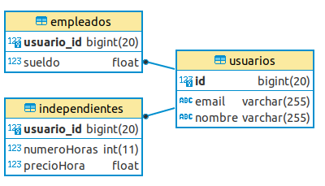

NOTA, PARA LOS DE PRIMERO VER SOLO APARTADOS 1, 2, 3, 4, 5, Y LUEGO 9 Y 10.1, JPQL BÁSICO
HOJAS DE EJERCICIOS LA 1, 2, 6 Y 7.

cON ESO PARA PRIMERO ES SUFICIENTE, TODO LO QUE TENGO AQUÍ ES EL TEMA COMPLETO EN BASES DE DATOS.

- [1. Introducción](#1-introducción)
  - [1.1 El concepto de mapeo objeto-relacional](#11-el-concepto-de-mapeo-objeto-relacional)
  - [1.2 Características de las herramientas ORM](#12-características-de-las-herramientas-orm)
- [2. Herramientas ORM. Hibernate](#2-herramientas-orm-hibernate)
- [3. Primer proyecto](#3-primer-proyecto)
  - [3.1 Requisitos previos](#31-requisitos-previos)
  - [3.2 Creación del proyecto](#32-creación-del-proyecto)
- [4. Mapeo de entidades](#4-mapeo-de-entidades)
  - [4.1 Valores y entidades](#41-valores-y-entidades)
  - [4.2 Mapeo](#42-mapeo)
- [5. Mapeo de valores](#5-mapeo-de-valores)
  - [5.1 Mapeo de columnas](#51-mapeo-de-columnas)
  - [5.2 Tipos embebidos](#52-tipos-embebidos)
- [6. Asociaciones](#6-asociaciones)
  - [6.1 Many-to-one Unidireccional](#61-many-to-one-unidireccional)
  - [6.2 One-to-many Unidireccional](#62-one-to-many-unidireccional)
  - [6.3 One-to-many Bidireccional](#63-one-to-many-bidireccional)
  - [6.4 One-to-one Unidireccional](#64-one-to-one-unidireccional)
  - [6.5 One-to-one Bidireccional](#65-one-to-one-bidireccional)
  - [6.6 Many-to-many Unidireccional](#66-many-to-many-unidireccional)
  - [6.7 Many-to-many Bidireccional](#67-many-to-many-bidireccional)
  - [6.8 Many-to-many con atributos extra](#68-many-to-many-con-atributos-extra)
- [7. Herencia](#7-herencia)
  - [7.1 @MappedSuperclass](#71-mappedsuperclass)
  - [7.2 Table per Class](#72-table-per-class)
  - [7.3 Single Table](#73-single-table)
  - [7.4 Joined](#74-joined)
- [8. Valores generados](#8-valores-generados)
  - [8.1 @CreationTimestamp](#81-creationtimestamp)
  - [8.2 @UpdateTimestamp](#82-updatetimestamp)
  - [8.3 @ColumnTransformer](#83-columntransformer)
- [9. Generación de esquemas](#9-generación-de-esquemas)
  - [9.1 Ingeniería inversa. Generación de entidades a partir de una base de datos](#91-ingeniería-inversa-generación-de-entidades-a-partir-de-una-base-de-datos)
  - [9.2 Ejemplo](#92-ejemplo)
- [10. Consultas](#10-consultas)
  - [10.1 JPQL básico](#101-jpql-básico)
  - [10.2 Select en JPQL](#102-select-en-jpql)
  - [10.3 Joins con JPQL](#103-joins-con-jpql)
  - [10.4 Consultas de actualización](#104-consultas-de-actualización)
  - [10.5 NamedQueries](#105-namedqueries)
  - [10.6 Consultas con SQL nativo](#106-consultas-con-sql-nativo)


# 1. Introducción


* Aprenderemos a acceder a BD relacionales desde lenguaje OO Java intercambiando los datos de filas a través de objetos.
* Necesitamos una interfaz que traduzca la lógica de los Objetos a la lógica relacional.
* Se llama **ORM** y es la herramienta que sirve para transformar representaciones de datos de los SGBDR a Objetos.


## 1.1 El concepto de mapeo objeto-relacional

* **Mapeo Objeto-Relacional**: técnica de programación para convertir datos entre sistemas OO y sistemas relacionales, usando un motor de persistencia.
* En la práctica se crea una BD OO virtual sobre la base de datos relacional.
* Nos permite usar características de la OO (herencia y polimorfismo).


## 1.2 Características de las herramientas ORM

* Las herramientas ORM permiten crear una capa de acceso a datos. 
* La capa de acceso se encarga de la conversión de tablas del SGBD relacional a objetos y viceversa.
* El programador interactúa con esta capa de acceso persistiendo objetos.


* Las herramientas ORM soportan un lenguaje de consultas OO propio e independiente de la BD, lo que permite migrar de una BD a otra sin tocar nuestro código, solo cambiando alguna línea en algún fichero de configuración.


**Ventajas**

* Reducir tiempo desarrollo software
* Abstracción de la base de datos
* Reutilización
* Permiten la producción de mejor código
* Son independientes del SGBD
* Usan un lenguaje propio para consultas
* Incentivan la portabilidad y escalabilidad de los programas


**Inconvenientes**

* Las aplicaciones son más lentas debido a que las consultas a la BD:
  * Usan primero el lenguaje propio de la herramienta para generar las instrucciones. 
  * Se transforman las instrucciones del lenguaje propio al lenguaje SQL.
  * Se mapean los objetos usados en el lenguaje propio a las columnas y tablas de la base de datos.
  * En la respuesta del servidor del SGBD, se transforman los resultados en objetos.


**Diferencias entre usar conectores y usar ORM persistiendo objetos**

* Con conectores hay que pasar los datos a guardar desde el objeto a una **insert into** y esta se almacena en la BD. Y si hacemos una **select**, cada campo de la tabla hay que asociarlo a un atributo de un objeto
* Esto puede ser aceptable si los objetos tienen pocos atributos.


# 2. Herramientas ORM. Hibernate


* Algunos de los ORMs más conocidos para **Java** son:
  * Hibernate
  * EclipseLink
  * JDO
  * MyBatis


* Para **otros lenguajes de programación**, también podemos encontrar algunos ORMs:
  * PHP
    * Doctrine
    * Eloquent
  * C#
    * NHibernate
    * ADO.NET Entity Framework
  * Python
    * Django ORM
    * SQL Alchemy


* **Hibernate** es la herramienta ORM más popular para Java. Se trata de un *framework* para Java.
* Es de código abierto. También tiene una distribución para **.NET**.
* Con **Hibernate** no se usará SQL para acceder a datos sino que el propio motor de Hibernate construirá esas consultas por nosotros.
* Tiene un lenguaje **HQL** para acceder a datos mediante POO.


**Hibernate y JPA**

* **JPA** (Java Persistence API) es una **especificación** mientras que **Hibernate** es un **framework**.
  * JPA es un documento en el cuál se especifica los principios básicos de gestión de la capa de persistencia en el mundo de Java EE
  * Hibernate es un framework que gestiona la capa de persistencia a través de ficheros xml o anotaciones


* **Hibernate implementa** como parte de su código la especificación de **JPA**
* Puede usarse Hibernate para construir una capa de persistencia apoyándose en las definiciones y reglas que la especificación de JPA, aunque no es obligatorio.
* Hibernate es mucho más grande que la especificación de JPA y añade más funcionalidad.


* Hibernate no solamente es un ORM. Se trata de un proyecto formado por varios módulos:
  * **Hibernate ORM**
  * **Hibernate EntityManager**
  * Hibernate Envers
  * Hibernate Validator
  * Hibernate Search
  * Hibernate OGM


* Usaremos JPA en nuestras aplicaciones. Nos proporciona:
  * Utilidades para especificar cómo nuestros objetos se relacionan con la base de datos (a través de XML o anotaciones).
  * El API para realizar operaciones CRUD: **javax.persistence.EntityManager**
  * Lenguaje para realizar consultas: **JPQL**


* Para usar **Hibernate** añadiremos la siguiente dependencia a nuestro fichero pom.xml:

```xml
<dependency>
    <groupId>org.hibernate</groupId>
    <artifactId>hibernate-core</artifactId>
    <version>5.6.1.Final</version>
</dependency>
```

* Para usar Para usar **JPA**, usaremos **hibernate-entitymanager** en lugar de hibernate-core

```xml
 <!-- Para usar JPA, usaremos hibernate-entitymanager en lugar de hibernate-core -->
<dependency>
    <groupId>org.hibernate</groupId>
    <artifactId>hibernate-entitymanager</artifactId>
    <version>5.6.1.Final</version>
</dependency>
```


# 3. Primer proyecto


## 3.1 Requisitos previos

1. En primer lugar nos descargaremos como IDE [Spring Tool Suite for Eclipse](https://spring.io/tools)
2. Añadiremos las **JBoss Tools**. Para ello vamos a Help > Eclipse Marketplace 
   * Tan solo debemos seleccionar **Hibernate Tools**
   

## 3.2 Creación del proyecto

* Crearemos un **Maven Project**.
* Elegiremos **maven-archetype-quickstart** como Artifact Id (para ello podemos poner como filtro *org.apache.maven*)
* Ahora podemos poner los siguientes datos:
  * Group Id: es.ivanlorenzo (cámbialo por tu nombre)
  * Artifact Id: PrimerProyecto
  * Package: es.ivanlorenzo.primerproyecto


* Después configuraremos la JDK instalada en nuestro sistema
* Debemos configurar las dependencias de JPA y de MySQL a nuestro proyecto

```xml
<dependency>
  <groupId>org.hibernate</groupId>
  <artifactId>hibernate-entitymanager</artifactId>
  <version>5.6.1.Final</version>
</dependency>
<dependency>
  <groupId>mysql</groupId>
  <artifactId>mysql-connector-java</artifactId>
  <version>8.0.27</version>
</dependency>
```

* En el proyecto vamos a Propiedades > **Project Facets** y le damos a **Convert to faceted form...**
* Ahora marcamos JPA y en la configuración marcamos:
  * Platform: Hibernate (JPA)
  * JPA implementation: Disable Library Configuration
  * Connection: podríamos elegir alguna si la tuviésemos configurada

* Ahora nuestro proyecto es JPA. Podemos ver el fichero **persistence.xml**


* El fichero persistence.xml podemos configurarlo a través de las distintas pestañas o añadir el código directamente:

```xml
<?xml version="1.0" encoding="UTF-8"?>
<persistence version="2.2" xmlns="http://xmlns.jcp.org/xml/ns/persistence" xmlns:xsi="http://www.w3.org/2001/XMLSchema-instance" xsi:schemaLocation="http://xmlns.jcp.org/xml/ns/persistence http://xmlns.jcp.org/xml/ns/persistence/persistence_2_2.xsd">
	<persistence-unit name="PrimerProyecto" transaction-type="RESOURCE_LOCAL">
		<properties>
			<property name="javax.persistence.jdbc.driver" value="com.mysql.cj.jdbc.Driver"/>
			<property name="javax.persistence.jdbc.url" value="jdbc:mysql://localhost:3310/ejemplo"/>
			<property name="javax.persistence.jdbc.user" value="root"/>
			<property name="javax.persistence.jdbc.password" value="root"/>
			<property name="hibernate.dialect" value="org.hibernate.dialect.MySQL8Dialect"/>
			<property name="hibernate.show_sql" value="true"/>
			<property name="hibernate.format_sql" value="true"/>
			<property name="hibernate.hbm2ddl.auto" value="create"/>
		</properties>
	</persistence-unit>
</persistence>
```


* Crearemos ahora nuestra primera **entidad**: Alumno
* Le añadiremos las **anotaciones** necesarias

```java
package es.ivanlorenzo.primerproyecto.modelo;

import javax.persistence.Entity;
import javax.persistence.Id;

@Entity
public class Alumno
{
	@Id
	private int id;
	
	private String nombre;
	
	private float nota;

	public int getId()
	{
		return id;
	}

	public void setId(int id)
	{
		this.id = id;
	}

	public String getNombre()
	{
		return nombre;
	}

	public void setNombre(String nombre)
	{
		this.nombre = nombre;
	}

	public float getNota()
	{
		return nota;
	}

	public void setNota(float nota)
	{
		this.nota = nota;
	}
}
```

* **Añadimos la clase al archivo de persistencia**


* En el método main:
  * Configuramos el **EntityManagerFactory** a través de la unidad de persistencia
  * Generamos un **EntityManager**
  * Iniciamos una **transacción**
  * Creamos dos objetos de tipo Alumno y los **persistimos**
  * **Commiteamos** la transación
  * **Cerramos** el EntityManager


```java
public class App 
{
    public static void main( String[] args )
    {
    	//Configuramos el EMF a través de la unidad de persistencia
        EntityManagerFactory emf = Persistence.createEntityManagerFactory("PrimerProyecto");

        //Generamos un EntityManager
        EntityManager em = emf.createEntityManager();

        //Iniciamos una transacción
        em.getTransaction().begin();

        // Construimos un objeto Alumno
        Alumno alumno1 = new Alumno();
        alumno1.setId(1);
        alumno1.setNombre("Pepe");
        alumno1.setNota(5);

        // Construimos otro objeto Alumno
        Alumno alumno2 = new Alumno();
        alumno2.setId(2);
        alumno2.setNombre("María");
        alumno2.setNota(9);

        //Persistimos los objetos
        em.persist(alumno1);
        em.persist(alumno2);

        //Commiteamos la transacción
        em.getTransaction().commit();

        //Cerramos el EntityManager
        em.close();

    }
}
```

* Y **ejecutamos** la aplicación como una **Java Application**


> Hoja05_Hibernate_01


# 4. Mapeo de entidades


## 4.1 Valores y entidades

* En Hibernate, una **entidad** será la representación de una **clase** del modelo. 
* Sin embargo, un **valor** representará a un **atributo** de una clase.
* Por ejemplo, si queremos modelar una lista de alumnos, el Alumno será una entidad y su nombre un valor.


## 4.2 Mapeo

* Para hacer que una clase sea una entidad tenemos que hacer:
  * Anotarla con **@Entity**
  * Incluir un atributo que esté anotado con **@Id**
  * Debe tener un **constructor** público sin parámetros
  * Es recomendable que implemente el interface **Serializable**


```java
@Entity
public class Entidad 
{
    @Id
    private long id;

    public long getId() 
    {
        return id;
    }
}
```


* Por defecto, esta entidad se mapea en la base de datos con una tabla llamada **Entidad**.
* Las anotaciones se pueden establecer **sobre atributos** o **sobre métodos get**. 
* Como la hemos hecho sobre un atributo, Hibernate hará que todos los atributos de la clase sean columnas de la tabla.


**Nombres de las tablas**

* Se puede controlar el nombre de la tabla a través de la anotación **@Table(name= "alumnos")**.

```java
@Entity
@Table(name= "alumnos")
public class Alumno
{
    @Id
    private long id;

    public long getId() 
    {
        return id;
    }
}
```


**Claves primarias**

* Habitualmente tenemos un atributo id numérico como clave primaria. Suele ser autonumérico.
* Añadiendo la anotación **@GeneratedValue** a continuación de **@Id**, se genera un valor y se asignar antes de almacenar la instancia de la entidad. 


```java
@Entity
@Table(name= "alumnos")
public class Alumno
{
    @Id
    @GeneratedValue(strategy=GenerationType.AUTO)
    private long id;

    private String nombre;

    public long getId() 
    {
        return id;
    }

    public String getNombre()
    {
      return nombre;
    }
}
```


* Existen diferentes estrategias de asignación:
  * **GenerationType.AUTO**: se escoge la mejor estrategia en función del dialecto SQL configurado (es decir, dependiendo del RDBMS).
  * **GenerationType.SEQUENCE**: espera usar una secuencia SQL para generar los valores.
  * **GenerationType.IDENTITY**: se utiliza una columna especial, autonumérica.
  * **GenerationType.TABLE**: se usa una tabla extra en nuestra base de datos. Tiene una fila por cada tipo de entidad diferente, y almacena el siguiente valor a utilizar.


# 5. Mapeo de valores


* Cuando mapeamos una entidad, todos sus atributos son considerados persistentes.
* Hibernate escoge la mejor correspondencia de tipos de datos en el DBMS para los tipos Java que hayamos usado.


## 5.1 Mapeo de columnas

* Si usamos la anotación **@Column** sobre un atributo nos permitirá indicar algunas propiedades:
  * **name**: permite modificar el nombre que tendrá la columna mapeada.
  * **length**: nos permite definir el número de caracteres de la columna.
  * **nullable**: nos permite indicar si la columna mapeada puede o no almacenar valores nulos. 
  * **insertable**, **updatable**: podemos modificar si la entidad puede ser insertada, modificada, etc.


```java
@Entity
@Table(name = "alumnos")
public class Alumno
{
	@Id
	private int id;
	
	@Column(nullable = false)
	private String nombre;
	
	private LocalDate fechaNacimiento;

	public int getId()
	{
		return id;
	}

	public void setId(int id)
	{
		this.id = id;
	}

	public String getNombre()
	{
		return nombre;
	}

	public void setNombre(String nombre)
	{
		this.nombre = nombre;
	}

	public LocalDate getFechaNacimiento()
	{
		return fechaNacimiento;
	}

	public void setFechaNacimiento(LocalDate fechaNacimiento)
	{
		this.fechaNacimiento = fechaNacimiento;
	}
}
```


## 5.2 Tipos embebidos

* Imaginemos que partimos de una tabla de una base de datos en la que un alumno, además del id, nombre y fecha de nacimiento tenga una calle y un número.
* En OO tendremos una clase Alumno y una clase Direccion.
* Podemos definir nuestro modelo de clases de tal forma que mapeemos ambas clases contra la misma tabla utilizando las anotaciones de JPA **@Embedded** y **@Embeddable**.


```java
@Embeddable
public class Direccion
{
	@Column
	private String calle;
	
	@Column
	private int numero;

	public String getCalle()
	{
		return calle;
	}

	public void setCalle(String calle)
	{
		this.calle = calle;
	}

	public int getNumero()
	{
		return numero;
	}

	public void setNumero(int numero)
	{
		this.numero = numero;
	}
}
```

```java
@Entity
@Table(name = "alumnos")
public class Alumno
{
	@Id
	private int id;
	
	@Column(nullable = false)
	private String nombre;
	
	@Column(columnDefinition = "DATE")
	private LocalDate fechaNacimiento;
	
	@Embedded
	private Direccion direccion;
	

	public int getId()
	{
		return id;
	}

	public void setId(int id)
	{
		this.id = id;
	}

	public String getNombre()
	{
		return nombre;
	}

	public void setNombre(String nombre)
	{
		this.nombre = nombre;
	}

	public LocalDate getFechaNacimiento()
	{
		return fechaNacimiento;
	}

	public void setFechaNacimiento(LocalDate fechaNacimiento)
	{
		this.fechaNacimiento = fechaNacimiento;
	}

	public Direccion getDireccion()
	{
		return direccion;
	}

	public void setDireccion(Direccion direccion)
	{
		this.direccion = direccion;
	}
}
```

* Únicamente tendremos **una única tabla** en la base de datos con los campos id, nombre, fechaNacimiento, calle y numero.


* Si quisiésemos que la clase Alumno tuviese **dos direcciones**, Hibernate lanzaría una excepción indicando que hay columnas repetidas.
* Para solucionarlo, sobreescribiremos los atributos de la clase embebida para que tengan otro nombre usando la anotación **@AttributeOverrides** 

```java
@Entity
@Table(name = "alumnos")
public class Alumno
{
	@Id
	private int id;
	
	@Column(nullable = false)
	private String nombre;
	
	@Column(columnDefinition = "DATE")
	private LocalDate fechaNacimiento;
	
	@Embedded
	private Direccion direccionEnvio;
	
	@Embedded
    @AttributeOverrides({
        @AttributeOverride(name = "calle", column = @Column(name="calle_facturacion")),
        @AttributeOverride(name = "numero", column = @Column(name="numero_facturacion"))     
    })
	private Direccion direccionFacturacion;

	//...
}
```

> Hoja05_Hibernate_02

# 6. Asociaciones


* Las entidades pueden estar relacionadas entre ellas.
* A nivel de base de datos las asociaciones se representan mediante claves externas.
* Con **JPA** podemos modelarlas. Pueden ser **unidireccionales** o **bidireccionales**:
  * **Many-to-one** (muchos-a-uno)  
  * **One-to-many** (uno-a-muchos)
  * **One-to-one** (uno-a-uno)
  * **Many-to-many** (muchos-a-muchos)


* Vamos a ir creando las asociaciones para obtener el siguiente diagrama relacional:


## 6.1 Many-to-one Unidireccional

* Sólo se representa la asociación en el lado muchos.
* Se usa la anotación **@ManyToOne**
* Podemos añadir **@JoinColumn** para indicar el nombre de la columna que será la clave externa.
* También podemos añadir **@ForeignKey** para indicar el nombre de la restricción que se creará a nivel de base de datos.


```java
@Entity
@Table(name = "usuarios")
public class Usuario
{
	@Id
	@GeneratedValue(strategy = GenerationType.AUTO)
	private Long id;

	private String email;

	private String nombre;

	public Usuario()
	{
	}

	//Getters y setters
}
```


```java
@Entity
@Table(name = "publicaciones")
public class Publicacion 
{
	@Id
	@GeneratedValue(strategy = GenerationType.AUTO)
	private Long id;

	@Lob
	private String descripcion;

	private LocalDate fecha;

	private String titulo;

	@ManyToOne
	@JoinColumn(name = "usuario_id",foreignKey = @ForeignKey(name="USUARIO_ID_FK"))
	private Usuario usuario;

	public Publicacion()
	{
	}

	//Getters y setters
}
```


## 6.2 One-to-many Unidireccional

* Representa la asociación en el lado uno.
* Por eso, en la clase debemos colocar una **colección** de elementos.
* Si la asociación **@OneToMany** no tiene la correspondiente asociación **@ManyToOne** será **unidireccional**. En caso de que sí exista será **bidireccional**.


```java
@Entity
@Table(name = "usuarios")
public class Usuario
{
	@Id
	@GeneratedValue(strategy = GenerationType.AUTO)
	private Long id;

	private String email;

	private String nombre;
	
	@OneToMany(cascade = CascadeType.ALL, orphanRemoval = true)
	//@JoinColumn(name = "usuario_id")
	private List<Publicacion> publicaciones = new ArrayList<>();

	public Usuario()
	{
	}

	//Getters y setters

}
```


* **cascade = CascadeType.ALL** propagará (en cascada) todas las operaciones a las entidades relacionadas
* **orphanRemoval = true** indica que la entidad hija será borrada cuando se borre la padre


```java
@Entity
@Table(name = "publicaciones")
public class Publicacion 
{
	@Id
	@GeneratedValue(strategy = GenerationType.AUTO)
	private Long id;

	@Lob
	private String descripcion;

	private LocalDate fecha;

	private String titulo;

	public Publicacion()
	{
	}

	//Getters y setters
}
```


* Hibernate creará **3 tablas**: una tabla para cada entidad, y otra tabla para asociar ambas, añadiendo una clave única al identificador del lado muchos (publicaciones_id)
* También podemos añadir la anotación **@JoinColumn** para decirle a JPA que existe una clave foránea usuario_id en la tabla publicaciones y no crear una tabla para asociar ambas (sólo **2 tablas**)


## 6.3 One-to-many Bidireccional

* La asociación @OneToMany bidireccional necesita de una asociación @ManyToOne en el lado hijo.


  
```java
@Entity
@Table(name = "usuarios")
public class Usuario
{
	@Id
	@GeneratedValue(strategy = GenerationType.AUTO)
	private Long id;

	private String email;

	private String nombre;
	
	@OneToMany(mappedBy = "usuario", cascade = CascadeType.ALL, orphanRemoval = true)
	private List<Publicacion> publicaciones = new ArrayList<>();

	public Usuario()
	{
	}

	public Long getId()
	{
		return id;
	}

	public String getNombre()
	{
		return nombre;
	}

	public void setNombre(String nombre)
	{
		this.nombre = nombre;
	}

	public String getEmail()
	{
		return this.email;
	}

	public void setEmail(String email)
	{
		this.email = email;
	}
	
	public List<Publicacion> getPublicaciones()
	{
		return this.publicaciones;
	}

	public Publicacion addPublicacion(Publicacion publicacion)
	{
		getPublicaciones().add(publicacion);
		publicacion.setUsuario(this);

		return publicacion;
	}

	public Publicacion removePublicacion(Publicacion publicacion)
	{
		getPublicaciones().remove(publicacion);
		publicacion.setUsuario(null);

		return publicacion;
	}

}
```


* @OneToMany referenciará al otro lado mediante el atributo **mappedBy**.
* Fijarse en los métodos **addPublicacion** y **removePublicacion** ya que además de añadir o borrar una publicación establecerán cuál es su usuario.


```java
@Entity
@Table(name = "publicaciones")
public class Publicacion 
{
	@Id
	@GeneratedValue(strategy = GenerationType.AUTO)
	private Long id;

	@Lob
	private String descripcion;

	private LocalDate fecha;

	private String titulo;
	
	@ManyToOne
	private Usuario usuario;

	public Publicacion()
	{
	}

	//Getters y setters
	
}
```


> Hoja05_Hibernate_03


## 6.4 One-to-one Unidireccional

* Solamente una instancia de una clase se asocia con una instancia de otra. 
* En el esquema unidireccional hay que decidir un lado como **propietario**.


```java
@Entity
@Table(name = "usuarios")
public class Usuario
{
	@Id
	@GeneratedValue(strategy = GenerationType.AUTO)
	private Long id;

	private String email;

	private String nombre;
	
	@OneToOne(cascade = CascadeType.ALL, orphanRemoval = true)
	@JoinColumn(name = "perfil_id")
	private Perfil perfil;
	
	@OneToMany(mappedBy = "usuario", cascade = CascadeType.ALL, orphanRemoval = true)
	private List<Publicacion> publicaciones = new ArrayList<>();

	public Usuario()
	{
	}

	//Getters y setters
}
```


```java
@Entity
@Table(name = "perfiles")
public class Perfil
{
	@Id
	@GeneratedValue(strategy = GenerationType.AUTO)
	private Long id;

	@Lob
	private String biografia;

	private String sitioweb;


	public Perfil()
	{
	}

	//Getters y setters
}
```


## 6.5 One-to-one Bidireccional


```java
@Entity
@Table(name = "usuarios")
public class Usuario
{
	@Id
	@GeneratedValue(strategy = GenerationType.AUTO)
	private Long id;

	private String email;

	private String nombre;

	@OneToOne(mappedBy = "usuario", cascade = CascadeType.ALL, orphanRemoval = true, fetch = FetchType.LAZY)
	private Perfil perfil;

	@OneToMany(mappedBy = "usuario", cascade = CascadeType.ALL, orphanRemoval = true)
	private List<Publicacion> publicaciones = new ArrayList<>();

	public Usuario()
	{
	}

	public Long getId()
	{
		return id;
	}

	public String getNombre()
	{
		return nombre;
	}

	public void setNombre(String nombre)
	{
		this.nombre = nombre;
	}

	public String getEmail()
	{
		return this.email;
	}

	public void setEmail(String email)
	{
		this.email = email;
	}

	public Perfil getPerfil()
	{
		return this.perfil;
	}

	public Perfil addPerfil(Perfil perfil)
	{
		perfil.setUsuario(this);
		this.perfil = perfil;

		return perfil;
	}

	public void removePerfil()
	{
		if (perfil != null)
		{
			perfil.setUsuario(null);
			this.perfil = null;
		}
	}
}
```


```java
@Entity
@Table(name = "perfiles")
public class Perfil
{
	@Id
    private Long id;

	@Lob
	private String biografia;

	private String sitioweb;

	@OneToOne(fetch = FetchType.LAZY)
	@JoinColumn(foreignKey  = @ForeignKey(name = "USUARIO_ID_FK"))
	@MapsId 
	private Usuario usuario;

	public Perfil()
	{
	}

	//Getters y setters

}
```

## 6.6 Many-to-many Unidireccional

* Una asociación muchos a muchos necesita una tabla que realice de enlace entre dos entidades.
* Tendremos que definir qué lado es el propietario de la asociación. En esa clase, incluimos una colección de elementos de la clase opuesta.
  * Si **no** queremos que se puedan repetir los elementos en la tabla intermedia utilizaremos una **Set**
  * Si puede haber repetidos podemos usar una **List**


```java
@Entity
@Table(name = "publicaciones")
public class Publicacion 
{
	@Id
	@GeneratedValue(strategy = GenerationType.AUTO)
	private Long id;

	@Lob
	private String descripcion;

	private LocalDate fecha;

	private String titulo;
	
	@ManyToOne
	private Usuario usuario;
	
	@ManyToMany(cascade = {CascadeType.PERSIST, CascadeType.MERGE})
	@JoinTable(name = "publicaciones_tags", joinColumns =
		{ @JoinColumn(name = "publicacion_id") }, inverseJoinColumns =
		{ @JoinColumn(name = "tag_id") })
	private Set<Tag> tags = new LinkedHashSet<>();

	public Publicacion()
	{
	}

	//Getters y setters
	
}
```


```java
@Entity
@Table(name = "tags")
public class Tag
{
	@Id
	@GeneratedValue(strategy = GenerationType.AUTO)
	private int id;

	private String nombre;

	public Tag()
	{
	}

	//Getters y setters
}
```

## 6.7 Many-to-many Bidireccional

* Una asociación bidireccional **@ManyToMany** tiene un lado propietario y un lado **mappedBy**.


```java
@Entity
@Table(name = "publicaciones")
public class Publicacion 
{
	@Id
	@GeneratedValue(strategy = GenerationType.AUTO)
	private Long id;

	@Lob
	private String descripcion;

	private LocalDate fecha;

	private String titulo;
	
	@ManyToOne
	private Usuario usuario;
	
	@ManyToMany(cascade = {CascadeType.PERSIST, CascadeType.MERGE})
	@JoinTable(name = "publicaciones_tags", joinColumns =
		{ @JoinColumn(name = "publicacion_id") }, inverseJoinColumns =
		{ @JoinColumn(name = "tag_id") })
	private Set<Tag> tags = new LinkedHashSet<>();

	public Publicacion()
	{
	}

	public Long getId()
	{
		return this.id;
	}

	public void setId(Long id)
	{
		this.id = id;
	}

	public String getDescripcion()
	{
		return this.descripcion;
	}

	public void setDescripcion(String descripcion)
	{
		this.descripcion = descripcion;
	}

	public LocalDate getFecha()
	{
		return this.fecha;
	}

	public void setFecha(LocalDate fecha)
	{
		this.fecha = fecha;
	}

	public String getTitulo()
	{
		return this.titulo;
	}

	public void setTitulo(String titulo)
	{
		this.titulo = titulo;
	}

	public Usuario getUsuario()
	{
		return usuario;
	}

	public void setUsuario(Usuario usuario)
	{
		this.usuario = usuario;
	}
	
	public Set<Tag> getTags()
	{
		return tags;
	}

	public Tag addTag(Tag tag)
	{
		getTags().add(tag);
		tag.getPublicaciones().add(this);

		return tag;
	}

	public Tag removeTag(Tag tag)
	{
		getTags().remove(tag);
		tag.getPublicaciones().remove(this);

		return tag;
	}
	
}
```


```java
@Entity
@Table(name = "tags")
public class Tag
{
	@Id
	@GeneratedValue(strategy = GenerationType.AUTO)
	private Long id;

	private String nombre;

	@ManyToMany(mappedBy = "tags")
	private Set<Publicacion> publicaciones = new LinkedHashSet<>();

	public Tag()
	{
	}

	public Long getId()
	{
		return this.id;
	}

	public String getNombre()
	{
		return this.nombre;
	}

	public void setNombre(String nombre)
	{
		this.nombre = nombre;
	}

	public Set<Publicacion> getPublicaciones()
	{
		return this.publicaciones;
	}

}
```

> Hoja05_Hibernate_04 (ejercicio 1)


## 6.8 Many-to-many con atributos extra

* A veces necesitamos añadir algún atributo a la asociación. Por ejemplo, si queremos guardar cuándo se establece un tag para una publicación.


* Crear otra clase **PublicacionTagId** para manejar la clave primaria compuesta
  * @Id sólo está permitida para claves simples. 
  * JPA nos obliga a usar **@IdClass** (usaremos esta) o @EmbeddId 
    * Crearemos una clase pública que implemente **Serializable**
    * Debe implementar equals y hashCode
    * Debe tener un constructor por defecto y no debe tener clave propia


```java
public class PublicacionTagId implements Serializable
{
	private static final long serialVersionUID = 1L;
	
    private Long publicacion;
    private Long tag;
 
    public PublicacionTagId() 
    {
    }

	public Long getPublicacion()
	{
		return publicacion;
	}

	public void setPublicacion(Long publicacion)
	{
		this.publicacion = publicacion;
	}

	public Long getTag()
	{
		return tag;
	}

	public void setTag(Long tag)
	{
		this.tag = tag;
	}

	@Override
	public int hashCode()
	{
		return Objects.hash(publicacion, tag);
	}

	@Override
	public boolean equals(Object obj)
	{
		if (this == obj)
			return true;
		if (obj == null)
			return false;
		if (getClass() != obj.getClass())
			return false;
		PublicacionTagId other = (PublicacionTagId) obj;
		return Objects.equals(publicacion, other.publicacion) && Objects.equals(tag, other.tag);
	} 
}
```


* Crearemos una nueva entidad **PublicacionTag**
  * Tendrá la anotación @IdClass
  * Contiene dos @ManyToOne

```java
@Entity
@IdClass(PublicacionTagId.class)
@Table(name = "publicaciones_tags")
public class PublicacionTag
{
	@Id
	@ManyToOne(fetch = FetchType.LAZY)
	@JoinColumn(name = "publicacion_id", insertable = false, updatable = false)
	private Publicacion publicacion;

	@Id
	@ManyToOne(fetch = FetchType.LAZY)
	@JoinColumn(name = "tag_id", insertable = false, updatable = false)
	private Tag tag;

	@Column(name = "fecha_creacion")
	private LocalDate fechaCreacion;

	public PublicacionTag()
	{
	}
	
	public PublicacionTag(Publicacion publicacion, Tag tag)
	{
		this.publicacion = publicacion;
		this.tag = tag;
	}

	public PublicacionTag(Publicacion publicacion, Tag tag, LocalDate fechaCreacion)
	{
		this.publicacion = publicacion;
		this.tag = tag;
		this.fechaCreacion = fechaCreacion;
	}

	public Publicacion getPublicacion()
	{
		return publicacion;
	}

	public void setPublicacion(Publicacion publicacion)
	{
		this.publicacion = publicacion;
	}

	public Tag getTag()
	{
		return tag;
	}

	public void setTag(Tag tag)
	{
		this.tag = tag;
	}

	public LocalDate getFechaCreacion()
	{
		return fechaCreacion;
	}

	public void setFechaCreacion(LocalDate fechaCreacion)
	{
		this.fechaCreacion = fechaCreacion;
	}

	@Override
	public int hashCode()
	{
		return Objects.hash(publicacion, tag);
	}

	@Override
	public boolean equals(Object obj)
	{
		if (this == obj)
			return true;
		if (obj == null)
			return false;
		if (getClass() != obj.getClass())
			return false;
		PublicacionTag other = (PublicacionTag) obj;
		return Objects.equals(publicacion, other.publicacion) && Objects.equals(tag, other.tag);
	}
}
```


* Romper la asociación @ManyToMany en las dos asociaciones y añadir **dos @OneToMany + @ManyToOne (ya hechas en PublicacionTag)**

```java
@Entity
@Table(name = "tags")
public class Tag
{
	@Id
	@GeneratedValue(strategy = GenerationType.AUTO)
	private Long id;

	@NaturalId
	private String nombre;

	@OneToMany(mappedBy = "tag", cascade = CascadeType.ALL, orphanRemoval = true)
	private List<PublicacionTag> publicaciones = new ArrayList<>();

	public Tag()
	{
	}

	public Long getId()
	{
		return this.id;
	}

	public String getNombre()
	{
		return this.nombre;
	}

	public void setNombre(String nombre)
	{
		this.nombre = nombre;
	}

	public List<PublicacionTag> getPublicaciones()
	{
		return this.publicaciones;
	}

	@Override
	public int hashCode()
	{
		return Objects.hash(nombre);
	}

	@Override
	public boolean equals(Object obj)
	{
		if (this == obj)
			return true;
		if (obj == null)
			return false;
		if (getClass() != obj.getClass())
			return false;
		Tag other = (Tag) obj;
		return Objects.equals(nombre, other.nombre);
	}
}
```


* Y por último, en la clase Publicación habrá que modificar los métodos addTag y removeTag

```java
@Entity
@Table(name = "publicaciones")
public class Publicacion
{
	@Id
	@GeneratedValue(strategy = GenerationType.AUTO)
	private Long id;

	@Lob
	private String descripcion;

	private LocalDate fecha;

	private String titulo;

	@ManyToOne
	private Usuario usuario;

	@OneToMany(mappedBy = "publicacion",
	        cascade = CascadeType.ALL,
	        orphanRemoval = true)
	private List<PublicacionTag> tags = new ArrayList<>();

	public Publicacion()
	{
	}

	//Getters y setters

	public List<PublicacionTag> getTags()
	{
		return tags;
	}

	public Tag addTag(Tag tag)
	{
		return addTag(tag, LocalDate.now());
	}
	
	public Tag addTag(Tag tag, LocalDate fechaCreacion)
	{
		PublicacionTag publicacionTag = new PublicacionTag(this,tag, fechaCreacion);
		tags.add(publicacionTag);
		tag.getPublicaciones().add(publicacionTag);

		return tag;
	}

	public Tag removeTag(Tag tag)
	{
		Iterator<PublicacionTag> it = tags.iterator();
		while(it.hasNext())
		{
			PublicacionTag publicacionTag = it.next();

			if (publicacionTag.getPublicacion().equals(this) 
					&& publicacionTag.getTag().equals(tag))
			{
				it.remove();
				publicacionTag.getTag().getPublicaciones().remove(publicacionTag);
				publicacionTag.setPublicacion(null);
				publicacionTag.setTag(null);
			}
		}
		return tag;
	}

	@Override
	public int hashCode()
	{
		return Objects.hash(titulo);
	}

	@Override
	public boolean equals(Object obj)
	{
		if (this == obj)
			return true;
		if (obj == null)
			return false;
		if (getClass() != obj.getClass())
			return false;
		Publicacion other = (Publicacion) obj;
		return Objects.equals(titulo, other.titulo);
	}
}
```


> Hoja05_Hibernate_04 (ejercicio 2)

# 7. Herencia


* La herencia es un mecanismo definido por la programación orientada a objetos, mediante el cual podemos definir una relación jerárquica entre varias clases
* JPA permite elegir entre 4 estrategias para trasladar la herencia a nuestra base de datos:
  * @MappedSuperclass
  * Table per Class
  * Single Table
  * Joined


## 7.1 @MappedSuperclass

* Es el enfoque más simple para mapear una estructura de herencia a las tablas de la base de datos. 
* Asigna cada clase concreta a su propia tabla, pero **no traslada la clase padre** (que no será una entidad) a la base de datos.
* Eso significa que no puede usar consultas **polimórficas** que seleccionen todas las entidades y habría que seleccionar ambas entidades por separado.


```java
@MappedSuperclass
public class Usuario implements Serializable
{

	private static final long serialVersionUID = 1L;

	@Id
	@GeneratedValue(strategy = GenerationType.AUTO)
	private Long id;

	private String email;

	private String nombre;

	public Usuario()
	{
	}

	//Getters y setters

}
```


```java
@Entity
@Table(name = "empleados")
public class Empleado extends Usuario
{
	private static final long serialVersionUID = 1L;
	
	private float sueldo;
	
	public Empleado()
	{
		super();
	}

	public float getSueldo()
	{
		return sueldo;
	}

	public void setSueldo(float sueldo)
	{
		this.sueldo = sueldo;
	}
}
```


```java
@Entity
@Table(name = "independientes")
public class Independiente extends Usuario
{
	private static final long serialVersionUID = 1L;
	
	private int numeroHoras;
	private float precioHora;
	
	public Independiente()
	{
		super();
	}

	public int getNumeroHoras()
	{
		return numeroHoras;
	}

	public void setNumeroHoras(int numeroHoras)
	{
		this.numeroHoras = numeroHoras;
	}

	public float getPrecioHora()
	{
		return precioHora;
	}

	public void setPrecioHora(float precioHora)
	{
		this.precioHora = precioHora;
	}	
}
```


* Generará las siguientes tablas:


* Podemos ver que cada una de las entidades hijas recibirá todos los atributos de la padre


## 7.2 Table per Class

* Similar a MappedSuperclass pero con la diferencia que ahora **la superclase es también una entidad**.
* En la clase padre se deberá añadir la anotación **@Inheritance(strategy = InheritanceType.TABLE_PER_CLASS)**
* Se pueden utilizar consultas polimórficas, pero agrega mucha complejidad. Se hace un UNION entre los resultados de las consultas a las tablas.


```java
@Entity
@Inheritance(strategy=InheritanceType.TABLE_PER_CLASS)
@Table(name = "usuarios")
public class Usuario implements Serializable
{
	private static final long serialVersionUID = 1L;

	@Id
	@GeneratedValue(strategy = GenerationType.AUTO)
	private Long id;

	private String email;

	private String nombre;

	@OneToOne(mappedBy = "usuario", cascade = CascadeType.ALL, orphanRemoval = true, fetch = FetchType.LAZY)
	private Perfil perfil;

	@OneToMany(mappedBy = "usuario", cascade = CascadeType.ALL, orphanRemoval = true)
	private List<Publicacion> publicaciones = new ArrayList<>();

	public Usuario()
	{
	}

	//Resto de métodos

}
```


```java
@Entity
@Table(name = "empleados")
public class Empleado extends Usuario
{
	private static final long serialVersionUID = 1L;
	
	private float sueldo;
	
	public Empleado()
	{
		super();
	}

	public float getSueldo()
	{
		return sueldo;
	}

	public void setSueldo(float sueldo)
	{
		this.sueldo = sueldo;
	}
}
```


```java
@Entity
@Table(name = "independientes")
public class Independiente extends Usuario
{
	private static final long serialVersionUID = 1L;
	
	private int numeroHoras;
	private float precioHora;
	
	public Independiente()
	{
		super();
	}

	public int getNumeroHoras()
	{
		return numeroHoras;
	}

	public void setNumeroHoras(int numeroHoras)
	{
		this.numeroHoras = numeroHoras;
	}

	public float getPrecioHora()
	{
		return precioHora;
	}

	public void setPrecioHora(float precioHora)
	{
		this.precioHora = precioHora;
	}	
}
```


* Generará las siguientes tablas:


* Cada entidad hija tendrá los atributos de la clase base y los suyos propios (como en @MappedSuperclass), pero también existirá una tabla para la clase base.


## 7.3 Single Table

* Asigna todas las entidades de la estructura de herencia a la misma tabla de base de datos. 
* Las consultas polimórficas serán muy eficientes.
* Pero cada tupla usa solo un subconjunto de las columnas disponibles y establece el resto como nulos. Por lo tanto, no podemos definir ninguna coluna como NOT NULL
* Esta estrategia es adecuada si el número de atributos que añaden las clases extendidas no es muy grande.


* En la tabla de la base de datos se añadirá un campo **DTYPE** que actúa de discriminante y almacena el nombre de la clase entidad. 
* Este valor de discriminante se puede modificar mediante la anotación **@DiscriminatorValue**


```java
@Entity
@Inheritance(strategy = InheritanceType.SINGLE_TABLE)
@Table(name = "usuarios")
public class Usuario implements Serializable
{
	private static final long serialVersionUID = 1L;

	@Id
	@GeneratedValue(strategy = GenerationType.AUTO)
	private Long id;

	private String email;

	private String nombre;

	@OneToOne(mappedBy = "usuario", cascade = CascadeType.ALL, orphanRemoval = true, fetch = FetchType.LAZY)
	private Perfil perfil;

	@OneToMany(mappedBy = "usuario", cascade = CascadeType.ALL, orphanRemoval = true)
	private List<Publicacion> publicaciones = new ArrayList<>();

	public Usuario()
	{
	}

	//Resto de métodos

}
```


```java
@Entity
@DiscriminatorValue("EMP")
@Table(name = "empleados")
public class Empleado extends Usuario
{
	private static final long serialVersionUID = 1L;
	
	private float sueldo;
	
	public Empleado()
	{
		super();
	}

	public float getSueldo()
	{
		return sueldo;
	}

	public void setSueldo(float sueldo)
	{
		this.sueldo = sueldo;
	}
}
```


```java
@Entity
@DiscriminatorValue("IND")
@Table(name = "independientes")
public class Independiente extends Usuario
{
	private static final long serialVersionUID = 1L;
	
	private int numeroHoras;
	private float precioHora;
	
	public Independiente()
	{
		super();
	}

	public int getNumeroHoras()
	{
		return numeroHoras;
	}

	public void setNumeroHoras(int numeroHoras)
	{
		this.numeroHoras = numeroHoras;
	}

	public float getPrecioHora()
	{
		return precioHora;
	}

	public void setPrecioHora(float precioHora)
	{
		this.precioHora = precioHora;
	}	
}
```


* Generará únicamente una tabla


## 7.4 Joined

* Este esquema de trabajo, también conocido como **table per subclass**, genera las siguientes tablas:
  * Una tabla para la entidad base de la jerarquía. Tendrá todos los atributos de la clase base.
  * Una tabla para cada entidad extendida de la jerarquía. Tendrá una referencia a la entidad base, y los atributos propios.
  


* Cada consulta de una subclase requiere una combinación de las 2 tablas (JOIN) para seleccionar las columnas de todos los atributos de la entidad. 
* Eso aumenta la complejidad de cada consulta, pero también le permite utilizar restricciones no nulas en los atributos de subclase y garantizar la integridad de los datos.
* Si queremos dar un nombre diferente a las claves externas, podemos usar la anotación **@PrimaryKeyJoinColumn**


```java
@Entity
@Inheritance(strategy = InheritanceType.JOINED)
@Table(name = "usuarios")
public class Usuario implements Serializable
{
	private static final long serialVersionUID = 1L;

	@Id
	@GeneratedValue(strategy = GenerationType.AUTO)
	private Long id;

	private String email;

	private String nombre;

	@OneToOne(mappedBy = "usuario", cascade = CascadeType.ALL, orphanRemoval = true, fetch = FetchType.LAZY)
	private Perfil perfil;

	@OneToMany(mappedBy = "usuario", cascade = CascadeType.ALL, orphanRemoval = true)
	private List<Publicacion> publicaciones = new ArrayList<>();

	public Usuario()
	{
	}

	//Resto de métodos

}
```


```java
@Entity
@PrimaryKeyJoinColumn(name = "usuario_id")
@Table(name = "empleados")
public class Empleado extends Usuario
{
	private static final long serialVersionUID = 1L;
	
	private float sueldo;
	
	public Empleado()
	{
		super();
	}

	public float getSueldo()
	{
		return sueldo;
	}

	public void setSueldo(float sueldo)
	{
		this.sueldo = sueldo;
	}
}
```


```java
@Entity
@PrimaryKeyJoinColumn(name = "usuario_id")
@Table(name = "independientes")
public class Independiente extends Usuario
{
	private static final long serialVersionUID = 1L;
	
	private int numeroHoras;
	private float precioHora;
	
	public Independiente()
	{
		super();
	}

	public int getNumeroHoras()
	{
		return numeroHoras;
	}

	public void setNumeroHoras(int numeroHoras)
	{
		this.numeroHoras = numeroHoras;
	}

	public float getPrecioHora()
	{
		return precioHora;
	}

	public void setPrecioHora(float precioHora)
	{
		this.precioHora = precioHora;
	}	
}
```


* Generará las siguientes tablas:




> Hoja05_Hibernate_05


# 8. Valores generados


## 8.1 @CreationTimestamp

* La anotación **@CreationTimestamp** nos permite indicar a Hibernate que en el atributo anotado debe almacenarse la actual fecha y hora de la JVM cuando la entidad sea almacenada.

```java
@Entity
@Inheritance(strategy = InheritanceType.JOINED)
@Table(name = "usuarios")
public class Usuario implements Serializable
{
	private static final long serialVersionUID = 1L;

	@Id
	@GeneratedValue(strategy = GenerationType.AUTO)
	private Long id;

	@CreationTimestamp
	private LocalDateTime fechaCreacion;

	private String email;

	private String nombre;

	@OneToOne(mappedBy = "usuario", cascade = CascadeType.ALL, orphanRemoval = true, fetch = FetchType.LAZY)
	private Perfil perfil;

	@OneToMany(mappedBy = "usuario", cascade = CascadeType.ALL, orphanRemoval = true)
	private List<Publicacion> publicaciones = new ArrayList<>();
	
	
	public Usuario()
	{
	}
}
```


## 8.2 @UpdateTimestamp

* La anotación **@UpdateTimestamp** nos permite indicar a Hibernate que en el atributo anotado debe almacenarse la actual fecha y hora de la JVM cuando la entidad sea actualizada.

```java
@Entity
@Inheritance(strategy = InheritanceType.JOINED)
@Table(name = "usuarios")
public class Usuario implements Serializable
{
	private static final long serialVersionUID = 1L;

	@Id
	@GeneratedValue(strategy = GenerationType.AUTO)
	private Long id;

	@CreationTimestamp
	private LocalDateTime fechaCreacion;

	@UpdateTimestamp
	private LocalDateTime fechaActualizacion;

	private String email;

	private String nombre;

	@OneToOne(mappedBy = "usuario", cascade = CascadeType.ALL, orphanRemoval = true, fetch = FetchType.LAZY)
	private Perfil perfil;

	@OneToMany(mappedBy = "usuario", cascade = CascadeType.ALL, orphanRemoval = true)
	private List<Publicacion> publicaciones = new ArrayList<>();
	
	
	public Usuario()
	{
	}
}
```


## 8.3 @ColumnTransformer

* Podemos personalizar el código SQL que se utiliza para leer o almacenar los valores de algunas columnas. 
* Por ejemplo, podemos usar alguna función de encriptación para almacenar una columna (por ejemplo, una contraseña).


```java
@Entity
@Inheritance(strategy = InheritanceType.JOINED)
@Table(name = "usuarios")
public class Usuario implements Serializable
{
	private static final long serialVersionUID = 1L;

	@Id
	@GeneratedValue(strategy = GenerationType.AUTO)
	private Long id;
	
	@CreationTimestamp
	private LocalDateTime fechaCreacion;
	
	@UpdateTimestamp
	private LocalDateTime fechaActualizacion;
	
	@ColumnTransformer(write= " MD5(?) ")
    private String password;

	private String email;

	private String nombre;

	@OneToOne(mappedBy = "usuario", cascade = CascadeType.ALL, orphanRemoval = true, fetch = FetchType.LAZY)
	private Perfil perfil;

	@OneToMany(mappedBy = "usuario", cascade = CascadeType.ALL, orphanRemoval = true)
	private List<Publicacion> publicaciones = new ArrayList<>();

	public Usuario()
	{
	}
}
```


# 9. Generación de esquemas


* Hemos visto que con Hibernate podemos generar el esquema de la base de datos a partir del mapeo que hayamos realizado con anotaciones.
* En un entorno de producción no se suele trabajar así.
* Podemos modificar la propiedad **hibernate.hbm2ddl.auto** que nos permite generar el DDL 


* Las opciones son las siguientes:
  * **none**: valor por defecto. No realiza ninguna acción
  * **create-only**: solamente realiza el proceso de creación de la base de datos
  * **drop**: realiza sólo el borrado de la base de datos
  * **create**: realiza un borrado de la base de datos, y posteriormente su creación
  * **create-drop**: elimina el esquema y crea al crear el contexto de persistencia. Luego, se borra cuando se cierra el contexto de persistencia.
  * **validate**: valida el esquema de la base de datos
  * **update**: actualiza la base de datos, con los cambios necesarios.


## 9.1 Ingeniería inversa. Generación de entidades a partir de una base de datos

* A partir de una base de datos podemos generar las entidades necesarias para manejarla.
* Eclipse y Spring Tool Suite nos ofrece esta funcionalidad: *New > JPA Entities from Tables*


## 9.2 Ejemplo

* En primer lugar vamos a instalar en Eclipse "Data Source Explorer" y visualizaremos la vista desde *Window > Show views > Data Source Explorer*.


* Crearemos una conexión a la base de datos que queramos mapear y nos conectaremos a ella:


* Seleccionamos los tablas cuyas entidades vamos a generar


* Se muestran las tablas y las asociaciones con su cardinalidad


* En el siguiente paso, seleccionamos algunos elementos importantes:
  * El generador de identificadores
  * El tipo de acceso: a través de los atributos (field) o de los métodos get (property)
  * El tipo de fetch de las asociaciones: por defecto, ágil (eager) o perezoso (lazy)
  * Más opciones como el paquete, si heredan de alguna clase padre y las interfaces que implementan


* En el último paso podemos podemos personalizar las entidades que se van a generary sus atributos


* Cuando finalicemos el asistente, **generará** las siguientes clases y las añadirá a nuestra **unidad de persistencia**:

```java
@Entity
@Table(name="coches")
@NamedQuery(name="Coche.findAll", query="SELECT c FROM Coche c")
public class Coche implements Serializable {
	private static final long serialVersionUID = 1L;

	@Id
	@GeneratedValue(strategy=GenerationType.AUTO)
	private String matricula;

	private String marca;

	private float precio;

	//bi-directional many-to-one association to Propietario
	@ManyToOne
	@JoinColumn(name="DNI")
	private Propietario propietario;

	public Coche() {
	}

	public String getMatricula() {
		return this.matricula;
	}

	public void setMatricula(String matricula) {
		this.matricula = matricula;
	}

	public String getMarca() {
		return this.marca;
	}

	public void setMarca(String marca) {
		this.marca = marca;
	}

	public float getPrecio() {
		return this.precio;
	}

	public void setPrecio(float precio) {
		this.precio = precio;
	}

	public Propietario getPropietario() {
		return this.propietario;
	}

	public void setPropietario(Propietario propietario) {
		this.propietario = propietario;
	}
}
```


```java
@Entity
@Table(name="propietarios")
@NamedQuery(name="Propietario.findAll", query="SELECT p FROM Propietario p")
public class Propietario implements Serializable {
	private static final long serialVersionUID = 1L;

	@Id
	@GeneratedValue(strategy=GenerationType.AUTO)
	@Column(name="DNI")
	private String dni;

	private int edad;

	private String nombre;

	//bi-directional many-to-one association to Coche
	@OneToMany(mappedBy="propietario")
	private List<Coche> coches;

	public Propietario() {
	}

	public String getDni() {
		return this.dni;
	}

	public void setDni(String dni) {
		this.dni = dni;
	}

	public int getEdad() {
		return this.edad;
	}

	public void setEdad(int edad) {
		this.edad = edad;
	}

	public String getNombre() {
		return this.nombre;
	}

	public void setNombre(String nombre) {
		this.nombre = nombre;
	}

	public List<Coche> getCoches() {
		return this.coches;
	}

	public void setCoches(List<Coche> coches) {
		this.coches = coches;
	}

	public Coche addCoch(Coche coch) {
		getCoches().add(coch);
		coch.setPropietario(this);

		return coch;
	}

	public Coche removeCoch(Coche coch) {
		getCoches().remove(coch);
		coch.setPropietario(null);

		return coch;
	}
}
```

> Hoja05_Hibernate_06


# 10. Consultas


## 10.1 JPQL básico

* Hasta ahora hemos hecho alguna consulta simple con el método **find**. 
* Pero este método es muy limitado ya que sólo podemos obtener un elemento de una entidad a partir de su clave primaria.

```java
Propietario propietario = em.find(Propietario.class, "1A");
System.out.println(propietario.getNombre());
```


* JPQL nos permite hacer consultas en base a **muchos criterios**.
* También así como obtener **más de un valor** por consulta
* La consulta JPQL más básica tiene la siguiente estructura:

```sql
SELECT p FROM Propietario p
```


* En JPA tenemos dos interfaces para crear consultas. Son **Query** y **TypedQuery** del paquete ***javax.persistence***
* Podemos crear una consulta con el método **createQuery** del **EntityManager**.

```java
		Query query = em.createQuery(
				"SELECT p FROM Propietario p");
		List<Propietario> propietarios= (List<Propietario>) query.getResultList();
		propietarios.forEach(p -> System.out.println(p.getNombre()));
```


* Como se puede ver, para las consultas que devuelven **más de un resultado** usaremos el método **getResultList()** 
* El método devuelve una List y debemos hacerle un cast al tipo de objeto adecuado. Como el compilador no puede checkear que el cast sea correcto nos muestra un warning. Si queremos quitarlo podemos usar la anotación **@SuppressWarnings("unchecked")**


* Si no queremos tener un warning podemos usar **TypedQuery**

```java
		TypedQuery<Propietario> query = em.createQuery(
				"SELECT p FROM Propietario p",
				Propietario.class);
		List<Propietario> propietarios= query.getResultList();
		propietarios.forEach(p -> System.out.println(p.getNombre()));
```


* Si la consulta devuelve un solo resultado, tendremos entonces que llamar a **getSingleResult()**

```java
		TypedQuery<Long> query = em.createQuery(
				"SELECT COUNT(c) FROM Coche c ",
				Long.class);
        long coches = query.getSingleResult();
        System.out.println("Hay " + coches + " coches en la base de datos");
```


## 10.2 Select en JPQL


* Las palabras SELECT y FROM tienen el mismo significado que en el lenguaje SQL.
* Además, la p será un alias

```sql
SELECT p.nombre, p.edad FROM Propietario p
```


**Parámetros**

* Si queremos incluir parámetros en una consulta podemos hacerlo en base a un índice 

```sql
SELECT p FROM Propietario p WHERE p.edad BETWEEN ?1 AND ?2
```

* También podemos usar un nombre

```sql
SELECT c FROM Coche c WHERE c.marca = :marca
```


* Si nuestra consulta tiene parámetros podemos usar el método **setParameter**
* Como hemos visto, acepta tanto un **índice** como un **nombre** de parámetro

```java
        TypedQuery<Propietario> query = em.createQuery(
				"SELECT p FROM Propietario p WHERE p.edad BETWEEN ?1 AND ?2 ORDER BY p.edad DESC",
				Propietario.class);
        query.setParameter(1, 30);
        query.setParameter(2, 40);
        
		List<Propietario> propietarios= query.getResultList();
		propietarios.forEach(p -> System.out.println(p.getNombre()));
```


```java
		TypedQuery<Coche> query = em.createQuery(
				"SELECT c FROM Coche c WHERE c.marca = :marca",
				Coche.class);
        query.setParameter("marca", "Opel");
        
		List<Coche> coches= query.getResultList();
		coches.forEach(c -> System.out.println(c.getMatricula()));
```


**Establecer orden**

* Podemos establecer un orden con la cláusula **ORDER BY**

```sql
SELECT c FROM Coche c ORDER BY c.precio DESC
```


**Múltiples valores devueltos**

* Si la consulta devuelve varios campos de una tabla (pero no todos), obtendremos un **Object[]**
  
```java
TypedQuery<Object[]> query = em.createQuery(
        		"SELECT p.nombre, p.edad FROM Propietario p",
        		Object[].class);
        
		List<Object[]> propietarios = query.getResultList();
        propietarios.forEach(p -> System.out.println((String)p[0] + ": " +  p[1]));
```


**Group by**

* También tenemos la cláusula **group by** que permite la agregación de valores según un conjunto de propiedades.

```java
		TypedQuery<Object[]> query = em.createQuery(
				"SELECT c.marca, count(*) FROM Coche c GROUP BY c.marca", Object[].class);
		List<Object[]> coches = query.getResultList();
		coches.forEach(c -> System.out.println(c[0] + " -> " + c[1]));
```


> Hoja05_Hibernate_07


## 10.3 Joins con JPQL

* JOIN nos sirve para realizar una unión entre dos tablas a partir de una clave externa.
* JPQL permite realizar los mismos JOIN que en SQL (JOIN, LEFT | RIGHT JOIN)


**Join implícito**

* El desarrollador no especifica ninguna unión
* Cuando hay asociaciones JPA crea automáticamente un join implícito

```java
		TypedQuery<Propietario> query = em.createQuery("SELECT c.propietario FROM Coche c",
				Propietario.class);
		List<Propietario> propietarios = query.getResultList();
		propietarios.forEach(p -> System.out.println(p.getNombre()));
```


**Join explícito**

* Aquí especificamos el JOIN
* Las consultas SQL resultantes serán muy similares

```java
		TypedQuery<Propietario> query = em.createQuery(
				"SELECT p FROM Coche c JOIN c.propietario p",
				Propietario.class);
		List<Propietario> propietarios = query.getResultList();
		propietarios.forEach(p -> System.out.println(p.getNombre()));
```


**Join Fetch**

* Observa el siguiente código:

```java
		TypedQuery<Propietario> query = em.createQuery(
				"SELECT p FROM Propietario p", Propietario.class);
		List<Propietario> propietarios = query.getResultList();
		for (Propietario propietario : propietarios)
		{
			propietario.getCoches().forEach(c -> System.out.println(c.getMatricula()));
		}
```

* Se realizan **n+1 queries**. En primer lugar se hace una para buscar todos los propietarios. Y luego para cada propietario se buscan sus coches
* Cuando haya 100 propietarios se harán 101 consultas.


* Para solucionar esto podemos usar **JOIN FETCH**

```java
		TypedQuery<Propietario> query = em.createQuery(
				"SELECT p FROM Propietario p JOIN FETCH p.coches", Propietario.class);
		List<Propietario> propietarios = query.getResultList();
		for (Propietario propietario : propietarios)
		{
			System.out.println(propietario.getNombre());
			propietario.getCoches().forEach(c -> System.out.println("\t"+c.getMatricula()));
		}
```

* Únicamente genera **una única consulta**
* Se incluyen los coches en la consulta a través de un JOIN
* Los frameworks de persistencia aportan muchas ventajas, pero **un mal uso puede generar resultados mucho peores**.


## 10.4 Consultas de actualización

* JPQL también nos permite lanzar consultas de actualización de datos
  
**Update**

```java
		int numeroCochesActualizados = em.createQuery(
				"UPDATE Coche c SET c.precio = c.precio * 1.1")
				.executeUpdate();
		System.out.println("Número de registros afectados: " + numeroCochesActualizados);
```


**Delete**

```java
		int numeroCochesBorrados = em.createQuery(
				"DELETE Coche c WHERE c.precio > 10000")
				.executeUpdate();
		System.out.println("Número de registros afectados: " + numeroCochesBorrados);
```


> Hoja05_Hibernate_08


> Hoja05_Hibernate_09


## 10.5 NamedQueries

* Para evitar consultas repetidas en distintas partes del código podemos usar **NamedQueries**
* Son predefinidas usando la notacion **@NamedQuery** o **@NamedQueries** en la definicion de la entidad
* Este comportamiento estatico las hace mas **eficientes** y por lo tanto ofrecen un mejor rendimiento
* El alcance es el contexto de persistencia actual, por lo tanto el nombre  de cada query será único bajo el mismo contexto de persistencia


```java
@Entity
@Table(name="coches")
@NamedQuery(name="Coche.findAll", query="SELECT c FROM Coche c")
public class Coche implements Serializable {
	//Resto del código
}
```

* Se necesita el nombre de la consulta y la consulta en sí
  

* Si queremos añadir más de una consulta usaremos **@NamedQueries**

```java
@Entity
@Table(name="coches")
@NamedQueries({
		@NamedQuery(name="Coche.findAll", query="SELECT c FROM Coche c"),
		@NamedQuery(name="Coche.porPrecio", query="SELECT c FROM Coche c WHERE c.precio < :precio")
})
public class Coche implements Serializable {
	//Resto del código
}
```


* Luego creamos la consulta utilizando el método **createNamedQuery** del EntityManager.

```java
TypedQuery<Coche> query = em.createNamedQuery("Coche.porPrecio", Coche.class)
				.setParameter("precio", 10000f);
		List<Coche> coches = query.getResultList();
		for (Coche coche : coches)
			System.out.println(coche.getMarca());
```


> Hoja05_Hibernate_10


## 10.6 Consultas con SQL nativo

* JPA permite la ejecución de SQL nativo.
* Útil cuando nuestro sistema tiene funcionalidades específicas
* Se usa el método **createNativeQuery** del EntityManager


* Podemos hacer **consultas escalares** que nos devuelvan un array de Object (Object[])
* También podremos **consultar entidades**

```java
		List<Coche> coches = 
				em.createNativeQuery("SELECT * FROM coches ORDER BY precio DESC", Coche.class)
				.getResultList();
		for (Coche coche : coches)
			System.out.printf("%-10s %5.0f\n", coche.getMarca(), coche.getPrecio());
```


* Por último, podemos definir **consultas con nombre**, como ocurría con JPQL. Estas se definen a través de la anotación **@NamedNativeQuery**

```java
@Entity
@Table(name="coches")
@NamedNativeQuery(name = "Coche.precioDes", query="SELECT * FROM Coche ORDER BY precio DESC", 
resultClass = Coche.class)
public class Coche implements Serializable {
	//...
}
```


* Luego llamaríamos a la consulta con el método **createNamedQuery** del EntityManager

```java
		TypedQuery<Coche> query = em.createNamedQuery("Coche.precioDes", Coche.class);
		List<Coche> coches = query.getResultList();
		for (Coche coche : coches)
			System.out.printf("%-10s %5.0f\n", coche.getMarca(), coche.getPrecio());
```


> Hoja05_Hibernate_11